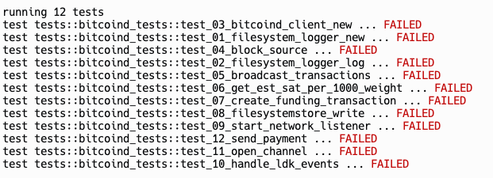

#  Testing
As we continue through this workshop, we'll build our intuition of how Lightning works by implementing various funcitons. To provide a better learning experience, each function has a test associated with it. If your implementation is correct, you should see that you've passed the test for that function.

To run the tests, you will click the green "Run" button at the top of this Repl.

  

Once you click it, a **Console** tab should open (if it wasn't open already), and you will see the result of the tests. If you do this now, you should see that all tests are failing! This makes sense, since we have not yet implemented any functions.

  

