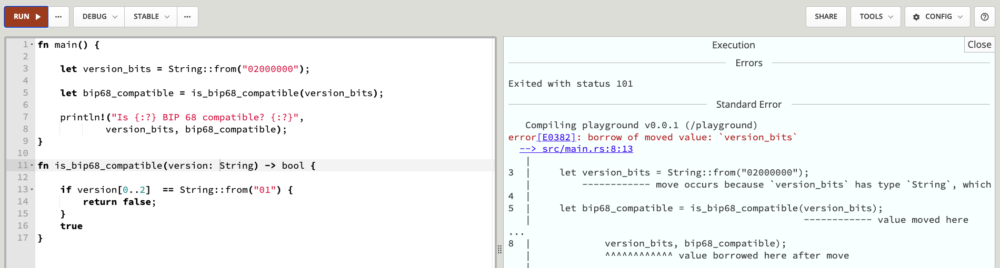
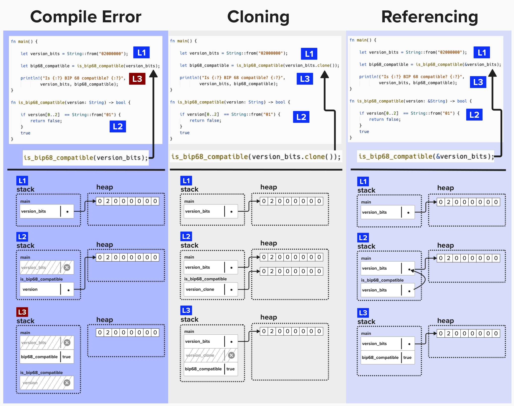

# Rust Crash Course

Let's be honest. You won't learn Rust in this "crash course". However, that's okay. The goal of this section is to help you build an *intuition* of how Rust works so that you can more easily move through the exercises in Programming Lightning. However, if you have the time (or ambition) to learn Rust beforehand, this free, self-paced online course will be of immeasurable value to you: [The Bitcoiner's Intro to Rust](https://btcdemy.thinkific.com/).

# Why Rust?
Rust is a beautiful programming language. Its unique approach to memory management through the ownership model (which we’ll learn about shortly!) and strong type system allow developers to write memory-safe code that’s also fast. For these reasons, Rust is often a preferred language for systems programming, where we need to be efficient and precise to optimize our program for specific use cases.

Programming a Lightning node involves managing complex tasks like channel management, data storage, and communication with other nodes on the network. This is exactly the kind of situation where systems programming shines. So, now that we’ve covered *why* we’re using Rust, let’s dig into *how* to use Rust.

# Grokking Rust
As chapter 4, covering ownership, of the famous [Rust Book](https://rust-book.cs.brown.edu/ch04-01-what-is-ownership.html) will tell you, **"Safety is the absence of undefined behavior"**. This phrase deeply captures the motivation of the Rust programming language.

More specifically, Rust's goal is to compile efficient binaries that require as few **runtime** checks as possible. This isn't *just* to be annoying to newbie devs, it's crucial for lower-level languages that have direct access to memory. For example, a 2019 [study by Microsoft](https://msrc.microsoft.com/blog/2019/07/a-proactive-approach-to-more-secure-code/) found that ~70% of vulnerabilities stem from memory-safety issues.

Below is a brief example to illustrate this point. If you tried to compile this, Rust would provide an error at compile-time, whereas you would have to wait until run time in a language such as Python, which would raise a  `NameError` exception in this scenario.

```rust
fn main() {
    read(x); // oh no! x isn't defined!
    let x = true;
}
```

# Declaring a Variable
To build our intuition for Rust and, ultimately, how we'll go about architecting our Lightning node, let's start by declaring a simple variable.

Imagine we declare the variable `tx_version` to hold the transaction version number. As a reminder, versions indicate the following:
- Version 1: Basic transaction, Pre-BIP 68, which enabled relative locktimes (OP_CHECKSEQUENCEVERIFY)
- Version 2: Post-BIP 68, so it supports OP_CHECKSEQUENCEVERIFY.
- Version 3: Post-BIP 431, which enabled Topologically Restricted Until Confirmation (TRUC) transactions.

Rust is a **statically typed** language, meaning every variable, parameter, and return value ***must*** be declared at compile time. This is a crucial feature that allows Rust's compiler to catch type-related errors *before* runtime, ensuring *type safety* and *memory safety*. Since the bitcoin protocol specifies that the version field is 4 bytes, we'll use a 32-bit integer type to represent this field. 

```rust
let tx_version: u32 = 2;
```

There are a few things you may notice here:
1) We use the `let` keyword to declare a variable.
2) We specify that `tx_version` will be an unsigned 32-bit integer.
3) We place a semicolon after the `2`. In Rust, semicolons are required after statements, like variable assignments, to signal their completion.

# Types
Rust offers a variety of types to represent data, divided into **primitive types** (basic building blocks) and **compound types** (combinations of other types).

## Primitive Types
Primitive types are the simplest types in Rust. These are built into the language itself, and they are what you'd likely expect.
- **Numbers**:
    - **Unsigned Integers**: `u8`, `u16`, `u32`, `u64`, etc.
    - **Signed Integers**: `i8`, `i16`, `i32`, `i64`, etc.
    - **Floting Points**: `f32`, `f64`
- **Boolean**: `bool`
- **Characters**: Rust's `char` type is the most primitive alphabetic type. It's not the same as a `String` type within Rust - nor is it the same as a "string" in a language like Python. We'll cover Strings in more detail later.

## Compound Types
Compound types combine multiple values into one type.
#### Tuples
Group a fixed number of values, which can have different types. For example, you could store a public key’s x-coordinate and whether its y-coordinate is even (true) or odd (false).
```rust
let pubkey_info: (u64, bool) = (123456789..., true);
```
#### Arrays
Hold a fixed number of elements of the ***same*** type. For example, an array of **tx output amounts** might be:
```rust
let outputs_amounts: [u64; 32] = [50_000, 75_000];`
```

#### Structs
Structs are where things get interesting! Structs are custom types, and they can be arbitrarily complex. For example, if we're creating a bitcoin application, we're probably going to be creating many scriptPubKeys, so we should create a `struct` to define this type. To do that, let's create a new type, called `Script`, which holds a vector of bytes (unisgned 8-bit integers).

```rust
pub struct Script(Vec<u8>);
```

# Ownership
Ownership is a core concept within Rust that enables Rust to achieve memory safety. This crash course is not going to make you an expert in Rust ownership, but, hopefully, it helps provide you with the *intuition* to understand ownership so that it doesn't get in the way during Programming Lightning.

#### Principles of Ownership
Rust's ownership model can, generally, be distilled to these principles:
- Each value has one single owner.
- When the owner goes out of scope, the value is dropped.
- There can only be ***one*** **mutable reference** or ***multiple*** **immutable references** at a time.

### Learn By Example
Imagine we have the following functions...
- `main`: This function starts by defining a `String`, which is equal to an 8-bit sequence, describing a bitcoin transaction's version. It then passes the string to another function, `is_bip68_compatible`, which will return `true` if the version signals that it is compatible with BIP-68. In other words, it will return `true` if the version is 2 or 3. It will then print the result to the console.
- `is_bip68_compatible`: This function checks if the version is equal to 1. If so, that means it's not BIP-68 compatible, so it will return `false`.
```rust
fn main() {

    let version_bits = String::from("02000000");

    let bip68_compatible = is_bip68_compatible(version_bits);

    println!("Is {:?} BIP 68 compatible? {:?}",
            version_bits, bip68_compatible);
}

fn is_bip68_compatible(version: String) -> bool {

    if version[0..2]  == String::from("01") {
        return false;
    }
    true
}
```

### ⚡️ Ownership Error Exercise!
For this exercise, we'll use [Rust Playground](https://play.rust-lang.org/), as it will make it easier to work with this function. Try pasting in the above code and running it. You should see an error, like in the below picture! ***HINT: Click the [Rust Playground](https://play.rust-lang.org/) link***.

<p align="center" style="width: 50%; max-width: 300px;">
  
</p>

The issue with this code is that `version_bits` is moved into the `is_bip68_compatible` function, which takes ownership of the `String`. When `println!` later tries to use `version_bits`, it’s no longer valid, causing a "borrow of moved value" error. Rust’s ownership rules prevent using a value after it’s been moved!

### Fixing Our Code
Th image below demonstrates this common Rust ownership error and two solutions. You'll notice that there are numbers in each column. These numbers are meant to represent **frames**. A frame is a mapping from variables to values within a single scope, such as a function.
- **Left**: The code fails because `version_bits` is dropped from the scope of the main function when it moves into `is_bip68_compatible`, making it unavailable for later use in the `println!` statement.
- **Middle**: Using `.clone()` creates a new variable which copies the data from `version_bits`. Since we keep the original `version_bits` in scope, we're we're able to use it in the `println!` statement. However, this approach comes at the cost of using extra memory!
- **Right**: Passing a reference (`&version_bits`) avoids moving ownership. In this case, the variable that is passed into `is_bip68_compatible` points to the same memory location as the original variable, which is far more memory-efficient. Referencing is generally preferred over cloning for performance, though cloning may be simpler or needed in some cases. For example, if `is_bip68_compatible` wanted to alter the state of `version_bits`, it would need to take ownership of it.

<p align="center" style="width: 50%; max-width: 300px;">
  
</p>

## `TxOut` & `TxIn` Struct
Let's start to piece together some of the things we've covered so far! This will help us hit the ground running when we start the workshop. ***Pro Tip: Feel free to code along in [Rust Playground](https://play.rust-lang.org/)***.

Below are **structs** called `TxIn` and `TxOut` . Remember, a struct is a custom type, and these struct are meant to represent the inputs and outputs of a bitcoin transaction.

The `TxIn` struct will have the following fields:
- `previous_output`: A `String` representing the previous Tx ID and output number for this input. In reality, we would create another struct for this data type to further break these components apart.
- `script_sig`: A fields of type `Script`, which we defined earlier.
- `sequence`: A `u32`, sequence number, which signals to miners which of two conflicting transactions should be preferred.
- `witness`:  An array of byte-arrays, representing witness data.

The `TxOut` will have the following two fields:
- `amount`: A `u64` field to hold the amount of bitcoins being locked to this script.
- `script`: A fields of type `Script`, which we defined earlier. This will hold the **scriptPubKey** for this output.

```rust
struct Script(pub Vec<u8>);

struct TxIn {
    pub previous_output: String,
    pub script_sig: Script,
    pub sequence: u32,
    pub witness: Vec<Vec<u8>>,
}

struct TxOut{
    pub amount: u64,
    pub script: Script,
}
```

# Implementing Functions For Structs
One neat thing about Rust is that you can add behavior to structs. This is done by implementing methods and associated functions using an `impl` block. 
- **Methods** are functions that operate on an instance of the struct, often using the `self` parameter to access the struct’s data.
- **Associated functions**, on the other hand, are not tied to an instance and are called on the struct type itself (e.g., constructors). We'll learn more about these shortly.


### Implementing `sum_outputs` method on Transaction Struct
Remember our `TxOut` and `TxIn` structs? Using those, we can now define a new struct for a `Transaction`. Furthermore, we can define a new method on this `Transaction` struct that will be able to access data that is internal to the struct. For this example, we'll add a `sum_outputs` function that sums the output amounts for each `TxOut` and returns the total.

If you're unfamiliar with functions in Rust, here is a quick explainer on their syntax... Functions are declared using the `fn` keyword, followed by the function name, parameters, and return type. The function body is enclosed in curly braces, and the last expression is implicitly returned without a `return` keyword, as long as it matches the declared return type.

```rust
struct Transaction {
    pub version: u8,
    pub lock_time: u32,
    pub input: Vec<TxIn>,
    pub output: Vec<TxOut>,
}

impl Transaction {
    fn sum_outputs(self) -> u64 {
            let mut total = 0;
                for tx_out in self.output {
                    total += tx_out.amount;
                }
            total
      }
}
```

## ⚡️ Try Running The Code
If you've been following along in [Rust Playground](https://play.rust-lang.org/), good for you! If not, then no worries! Below is all of the code we just reviewed. If you want to test it our yourself, go ahead and copy/past this into Rust Playground. I've also added some fake data so that you can see the `sum_outputs` function live for yourself!

```rust
struct Script(pub Vec<u8>);

struct TxIn {
    pub previous_output: String,
    pub script_sig: Script,
    pub sequence: u32,
    pub witness: Vec<Vec<u8>>,
}

struct TxOut {
    pub amount: u64,
    pub script: Script,
}

struct Transaction {
    pub version: u8,
    pub lock_time: u32,
    pub input: Vec<TxIn>,
    pub output: Vec<TxOut>,
}

impl Transaction {
    fn sum_outputs(self) -> u64 {
        let mut total = 0;
        for tx_out in self.output {
            total += tx_out.amount;
        }
        total
    }
}

fn main() {
    let transaction = Transaction {
        version: 2,
        lock_time: 0,
        input: vec![TxIn {
            previous_output: String::from("abcd1234:0"),
            script_sig: Script(vec![0x01, 0x02]),
            sequence: 0xffffffff,
            witness: vec![vec![0x03, 0x04], vec![0x05]],
        }],
        output: vec![
            TxOut {
                amount: 100_000_000, // 1 BTC in satoshis
                script: Script(vec![0x00, 0x01]),
            },
            TxOut {
                amount: 50_000_000, // 0.5 BTC in satoshis
                script: Script(vec![0x02, 0x03]),
            },
        ],
    };

    let total_output = transaction.sum_outputs();
    println!("Total output amount: {} satoshis", total_output);
}
```