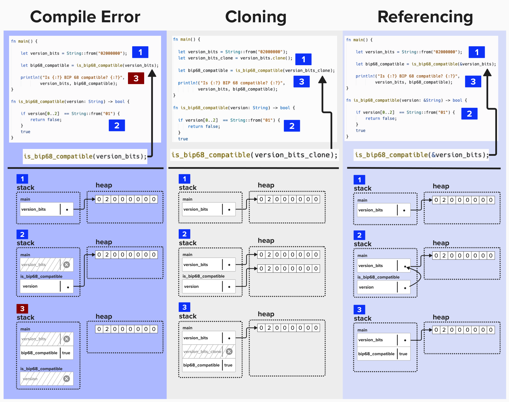

# Rust Crash Course

Let's be honest. You won't learn Rust in this "crash course". However, that's okay. The goal of this section is to help you build enough of an *intuition* as to how Rust works so that you can more easily move through the exercises in Programming Lightning. However, if you have the time (or ambition) to learn Rust beforehand, this free, self-paced online course will be of immeasurable value to you: [The Bitcoiner's Intro to Rust](https://btcdemy.thinkific.com/).

# Why Rust?
First and foremost, Rust is beautiful programming language. It can also be a massive pain, especially if you come from a higher-level programming background, such as Python. This is because Rust provides much more control over lower-level primatives such as memory management and concurrency. For these reasons, Rust is often a prefered langauge for systems programming, where we need to be efficient and precise so that our program is optimized for our use-case.

Programming a node in the Lightning network invovles orchestrating various complex components to handle tasks such as networking, data storage, and communication with other nodes on the network. This is precicely the type of situation where deliberate systems programming makes a big difference. So, now that we've covered *why* we're using Rust, let's dig into *how* to use Rust.

# Grokking Rust
As chapter 4, covering ownership, of the famous [Rust Book](https://rust-book.cs.brown.edu/ch04-01-what-is-ownership.html) will tell you, **"Safety is the Absence of Undefined Behavior"**. This phrase deeply captures the motivation of the Rust programming language.

More specifically, Rust's goal is to compile efficient binaries that require as few **runtime** checks as possible. This isn't *just* to be annoying to newbie devs, it's actually crucial for lower-level languages that have direct access to memory. For example, a 2019 [study by Microsoft](https://msrc.microsoft.com/blog/2019/07/a-proactive-approach-to-more-secure-code/) found that ~70% of vulnerabilities stem from memory-safety issues.

Below is a brief example to illustrate this point. If you tried to compile this, Rust would provide an error at compile-time, whereas you would have to wait until runntime in a language such as Python, which would raise a  `NameError` exception in this scenario.
```rust
fn main() {
    read(x); // oh no! x isn't defined!
    let x = true;
}
```

# Declaring a Variable
To build our intuition for Rust and, ultimately, how we'll go about architecting our Lightning node, let's start by declaring a simple variable.

Imagine we declare the variable `tx_version` to hold the transaction version number. As a reminder, versions indicate the following:
- Version 1: Pre-BIP 68, which enabled relative locktimes (OP_CSV)
- Version 2: Post-BIP 68, supports OP_CSV.
- Version 3: Post-BIP 431, which enabled Topologically Restricted Until Confirmation (TRUC) transactions.

Rust is a **statically typed** language, meaning every variable, parameter, and return value *must* be declared at compile time. This is a crucial feature that allows Rust's compiler to catch type-related errors *before* runtime, ensuring *type safety* and *memory safety*. Since the bitcoin protocol specifies that the version field is 4 bytes, we'll use a 32-bit integer type to represent this field. 

```rust
let tx_version: u32 = 2;
```

There are a few things you may notice here:
1) We use the `let` keyword to declare a variable.
2) We specify that `tx_version` will be an unsigned 32-bit integer.
3) We place a semicolon after the `2`. In Rust, semicolons are required after statements, like variable assignments, to signal their completion.

# Types
Rust offers a variety of types to represent data, divided into **primitive types** (basic building blocks) and **compound types** (combinations of other types).

## Primitive Types
Primitive types are the simplest types in Rust. These are built into the language itself, and they are what you'd likely expect.
- **Numbers**:
    - **Unsigned Integers**: `u8`, `u16`, `u32`, `u64`, etc.
    - **Signed Integers**: `i8`, `i16`, `i32`, `i64`, etc.
    - **Floting Points**: `f32`, `f64`
- **Boolean**: `bool`
- **Characters**: Rust's `char` type is the most primitive alphabetic type. It's not the same as a `String` type within Rust - nor is it the same as a "string" in a language like Python. We'll cover Strings in more detail later.

## Compound Types
Compound types combine multiple values into one type.
#### Tuples
Group a fixed number of values, which can have different types. For example, you could store a public key’s x-coordinate and whether its y-coordinate is even (true) or odd (false).
```rust
let pubkey_info: (u64, bool) = (123456789..., true);
```
#### Arrays
Hold a fixed number of elements of the ***same*** type. For example, an array of **tx output amounts** might be:
```rust
let outputs_amounts: [u64; 32] = [50_000, 75_000];`
```

#### Structs
Structs are where things get interesting! Structs are custom types, and they can be arbitrarily complex. For example, if we're creating a bitcoin application, we're probably going to be creating many scriptPubKeys, so we should create a `struct` to define this type. To do that, let's create a new type, called `Script`, which holds a vector of bytes (unisgned 8-bit integers).

```rust
pub struct Script(Vec<u8>);
```

# Ownership
Ownership is a core concept within Rust that enables Rust to achieve memory safety. This crash course is not going to make you an expert in Rust ownership, but, hopefully, it helps provide you with the *intuition* to understand ownership so that it doesn't get in the way during Programming Lightning.

#### Principles of Ownership
Rust's ownership model can, generally, be distilled to these principles:
- Each value has one single owner.
- When the owner goes out of scope, the value is dropped.
- There can only be one mutable reference or multiple immutable references at a time.

### Learn By Example
Imagine we have the following functions...
- `main`: This function starts by defining a `String`, which is equal to an 8-bit sequence, describing a bitcoin transaction's version. It then passes the string to another function, `is_bip68_compatible`, which will return `true` if the version signals that it is compatible with BIP-68. In other words, it will return `true` if the version is 2 or 3. It will then print to the console the result.
- `is_bip68_compatible`: This function checks if the version is equal to 1. If so, that means it's not BIP-68 compatible, so it will return `false`.
```rust
fn main() {

    let version_bits = String::from("02000000");

    let bip68_compatible = is_bip68_compatible(version_bits);

    println!("Is {:?} BIP 68 compatible? {:?}",
            version_bits, bip68_compatible);
}

fn is_bip68_compatible(version: String) -> bool {

    if version[0..2]  == String::from("01") {
        return false;
    }
    true
}
```

### ⚡️ Ownership Error Exercise!
For this exercise, we'll use [Rust Playground](https://play.rust-lang.org/), as it will make it easier to work with this function. Try pasting in the above code and running it. You should see an error, like in the below picture!

<p align="center" style="width: 50%; max-width: 300px;">
  
</p>

The issue with this code is that `version_bits` is moved into the `is_bip68_compatible` function, which takes ownership of the `String`. When `println!` later tries to use `version_bits`, it’s no longer valid, causing a "borrow of moved value" error. Rust’s ownership rules prevent using a value after it’s been moved!

### ⚡️ Fixing Our Code
Th image below demonstrates this common Rust ownership error and two solutions.
- **Left**: The code fails because `version_bits` is moved into `is_bip68_compatible`, making it unavailable for later use in `println!`.
- **Middle**: Using `.clone()` creates a copy of `version_bits`, preserving the original for future use, *but at the cost of extra memory*!
- **Right**: Passing a reference (`&version_bits`) avoids moving ownership, allowing `version_bits` to remain accessible while being more memory-efficient. Referencing is generally preferred over cloning for performance, though cloning may be simpler in some cases.

<p align="center" style="width: 50%; max-width: 300px;">
  
</p>

## ⚡️ Implement `TxOut` Struct
For the next two exercises, we'll start to piece together some of the things we've covered so far! Head over to `src/intro/exercises.rs`. In this file, you should see an empty struct, called `TxOut`.

`TxOut` is meant to represent the outputs in a bitcoin transaction. This struct should have the following two fields:
- `amount`: A `u64` field to hold the amount of bitcoins being locked to this script.
- `script`: A fields of type `Script`, which we defined earlier. This will hold the **scriptPubKey** for this output.

NOTE: You must add `pub` in front of both the `struct` and each field (see example below). This will ensure that other parts of our codebase (the tests, for example) will be able to import and use this struct.

```rust
pub struct TxOut{
  // amount: u64
  // script: Script
}
```

**You should be good-to-go! Try implementing the `new` constructor in `src/filesystem_logger.rs`!** Click `Run` at the top of the Replit when you're done to see if the test `tests::filesystem_logger_tests::test_logger_creation ...` passes.

<p align="center" style="width: 50%; max-width: 300px;">
  
</p>

<details> <summary> Click for an example!</summary>

Below is an example (modified from **rust-bitcoin**) for how we could implement a similar structure, called `TxIn`, to represent the inputs to a transaction. Some of these fields have structs we have not defined thus far, such as `OutPoint`, but it should still provide a food overview.

```rust
pub struct TxIn {
    /// The reference to the previous output that is being used as an input.
    pub previous_output: OutPoint,
    /// The script which pushes values on the stack which will cause
    /// the referenced output's script to be accepted.
    pub script_sig: Script,
    /// The sequence number, which suggests to miners which of two
    /// conflicting transactions should be preferred, or 0xFFFFFFFF
    /// to ignore this feature. This is generally never used since
    /// the miner behavior cannot be enforced.
    pub sequence: u32,
    /// Witness data: an array of byte-arrays.
    /// Note that this field is *not* (de)serialized with the rest of the `TxIn` in
    /// Encodable/Decodable, as it is (de)serialized at the end of the full
    /// Transaction. It *is* (de)serialized with the rest of the `TxIn` in other
    /// (de)serialization routines.
    pub witness: Witness,
}
```
</details>

# Functions
In Rust, functions are declared using the `fn` keyword, followed by the function name, parameters, and return type. The function body is enclosed in curly braces, and the last expression is implicitly returned without a `return` keyword, as long as it matches the declared return type.

```rust
fn add_one(number: u64) -> u64 {
    number + 1
}
```

### ⚡️ Complete sum_outputs Function
For this exercise, we'll build on the `TxOut` struct from the earlier exercise to add the total amount of bitcoin from each output and return the sum. As you can see, this function takes a vector of `TxOut` objects as an input and returns a `u64` integer.

```rust
pub fn sum_outputs(outputs: Vec<TxOut>) -> u64 {
    // Step 1. Create a variable to track sum
    
    // Step 2. Iterate over each TxOut in outputs.
        // Step 3. Add to sum

    // Step 4. Return total
}
```


<details> <summary> Step 1: Create a Variable to Track Sum </summary>
Initialize a mutable `u64` variable to store the running total of the output values.

```rust
let mut total: u64 = 0;
```
- `let mut total: u64` declares a mutable variable of type `u64`, as Bitcoin transaction output values (`TxOut.value`) are represented as `u64` (satoshis).
- Initialize to `0` to start with an empty sum.
- `mut` is required because the variable will be updated in the loop.

</details>

<details> <summary> Step 2: Iterate Over Each TxOut </summary>
Create a loop to iterate over each `TxOut` in the `outputs` vector.

```rust
for output in outputs {
    // Add to sum
}
```
- `for output in outputs` iterates over the `Vec<TxOut>`, binding each element to the variable `output` (type `TxOut`).
- This loop processes each transaction output sequentially.
- The `outputs` vector is consumed (moved) into the loop, as it’s passed by value; if you need to reuse `outputs`, consider passing by reference (`&Vec<TxOut>`).

</details>

<details> <summary> Step 3: Add to Sum </summary>
Add the `value` field of each `TxOut` to the running total.

```rust
total += output.value;
```
- `output.value` accesses the `value` field of the `TxOut` struct, which is a `u64` representing the output’s amount in satoshis.
- `+=` adds `output.value` to `total`, updating the running sum.
- Since both `total` and `output.value` are `u64`, the addition is safe (Bitcoin ensures output values are non-negative).

</details>

<details> <summary> Step 4: Return Total </summary>
Return the final sum of all output values.

```rust
total
```
- `total` is the `u64` variable containing the sum of all `TxOut.value` fields.
- As the last expression in the function, it is implicitly returned (Rust’s return syntax omits `return` for the final expression).
- The return type matches the function’s signature (`u64`).

</details>


# Implementing Functions For Structs
One neat thing about Rust is that you can add behavior to structs. This is done by implementing methods and associated functions using an `impl` block. 
- **Methods** are functions that operate on an instance of the struct, often using the `self` parameter to access the struct’s data.
- **Associated functions**, on the other hand, are not tied to an instance and are called on the struct type itself (e.g., constructors). We'll learn more about these shortly.

### ⚡️ Implement `sum_outputs` method on Transaction Struct
For the final exercise of this section, let's take the `sum_outputs` from the prior exercise and implement it on our `Transaction` struct.

```rust
pub struct Transaction {
    pub version: u8,
    pub lock_time: u32,
    pub input: Vec<TxIn>,
    pub output: Vec<TxOut>,
}

impl Transaction {
      pub fn sum_outputs(self) -> u64 {
            let mut total = 0;
                for tx_out in self.output {
                    total += tx_out.amount;
                }
            total
      }
}
```