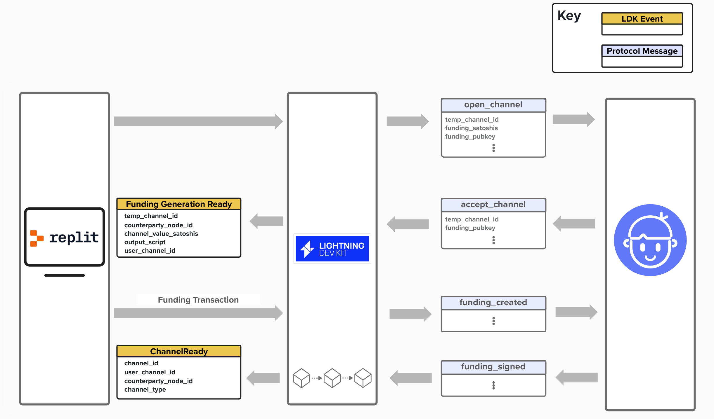

# Implementing Lightning

## Basis Of Lightning Technology (BOLT)
At it's core, Lightning is a fairness protocol that enables trustless exchanges of value without a third party. We got a taste of this fairness protocol in the "Intro to Payment Channels" section, where we learned how multiple parties can route payments to each other. While we reviewed a lot, we still left out many details!

All of the details explaining how Lightning works are described in the **Basis Of Lightning Technology** (**BOLT**) protocol specifications. Since Lightning is decentralized, there is no central authority dictating how Lightning must evolve or distributing the sole application client on which Lightning runs. For example, X (formerly, Twitter) is only accessible via the app or website. You cannot create a new application that integrated with X without their permission.

Lightning is different. It's an open protocol. Anyone is free to build a Lightning app and join the party, which is why we need very public and explicit documentation for how Lightning works.


## Lightning Development Kit
It would be a massive undertaking to attempt to implement the entire functionality specified in the BOLTs in order to operate a node on the Lightning network. There are a few of out-of-the-box implementations available to you if all you would like to do is operate a node, however, if you want to customize the behavior of how they work you either need to fork and then maintain the project or write plugins that would alter the default behavior. Regardless of the path you take they all are still delivered as a binary and need to be run and controlled over various RPC interfaces.

The **Lightning Development Kit** (**LDK**) takes a different approach. LDK is a library that implements the Lightning network protocol but gives you the ability to integrate it directly into your application in exactly the fashion that best suits your needs.

It exposes a broad but extremely powerful set of objects and events for you to utilize when customizing your users' Lightning experience.  

<p align="center" style="width: 50%; max-width: 300px;">
  
</p>

LDK enables you to choose your own data storage, wallet, networking stack and blockchain monitoring. In the diagram above the boxes with dotted borders are LDK's modules — these must be configured with either default or custom implementations that you provide.

## Traits 
LDK is able to provide a high degree of customization by exposing traits that the developer must implement. As we learned in an earlier section, a trait is used to define functionality that any instance of that trait type must implement. Below are a few traits that we will be either implementing or using LDK's default in this workshop.
<p align="center" style="width: 50%; max-width: 300px;">
  
</p>

1) **BlockSource**
   - Interface for retrieving block header, transactions, other metadata associated with a block.

<details>
  <summary>
    Click here see the BlockSource trait
</summary>

```rust
pub trait BlockSource: Sync + Send {
    // Required methods
    fn get_header<'a>(
        &'a self,
        header_hash: &'a BlockHash,
        height_hint: Option<u32>,
    ) -> AsyncBlockSourceResult<'a, BlockHeaderData>;

    fn get_block<'a>(
        &'a self,
        header_hash: &'a BlockHash,
    ) -> AsyncBlockSourceResult<'a, BlockData>;

    fn get_best_block<'a>(
        &'a self,
    ) -> AsyncBlockSourceResult<'_, (BlockHash, Option<u32>)>;
}
```
</details>


2) **FeeEstimator**
   - Interface for retrieving feerate information for various confirmation targets.

<details>
  <summary>
    Click here see the FeeEstimator trait
</summary>

```rust
pub trait FeeEstimator {
    // Required method
    fn get_est_sat_per_1000_weight(
        &self,
        confirmation_target: ConfirmationTarget,
    ) -> u32;
}
```

</details>

3) **BroadcasterInterface**
   - Interface for sending transactions to the bitcoin network

<details>
  <summary>
    Click here see the BroadcasterInterface trait
</summary>

```rust
pub trait BroadcasterInterface {
    // Required method
    fn broadcast_transactions(&self, txs: &[&Transaction]);
}
```

</details>

4) **NodeSigner**
   - Interface to handle cryptographic opperations at the node level, such as signing gossip messages and invoices.

<details>
  <summary>
    Click here see the NodeSigner trait
</summary>

```rust
pub trait NodeSigner {
    // Required methods
    fn get_inbound_payment_key(&self) -> ExpandedKey;
    fn get_node_id(&self, recipient: Recipient) -> Result<PublicKey, ()>;
    fn ecdh(
        &self,
        recipient: Recipient,
        other_key: &PublicKey,
        tweak: Option<&Scalar>,
    ) -> Result<SharedSecret, ()>;
    fn sign_invoice(
        &self,
        invoice: &RawBolt11Invoice,
        recipient: Recipient,
    ) -> Result<RecoverableSignature, ()>;
    fn sign_bolt12_invoice(
        &self,
        invoice: &UnsignedBolt12Invoice,
    ) -> Result<Signature, ()>;
    fn sign_gossip_message(
        &self,
        msg: UnsignedGossipMessage<'_>,
    ) -> Result<Signature, ()>;
}
```

</details>

5) **KVStore**
   - Interface for persisting data to a filesystem, SQL database, or any other key-value storage solution.

<details>
  <summary>
    Click here see the KVStore trait
</summary>

```rust
pub trait KVStore {
    // Required methods
    fn read(
        &self,
        primary_namespace: &str,
        secondary_namespace: &str,
        key: &str,
    ) -> Result<Vec<u8>, Error>;
    fn write(
        &self,
        primary_namespace: &str,
        secondary_namespace: &str,
        key: &str,
        buf: &[u8],
    ) -> Result<(), Error>;
    fn remove(
        &self,
        primary_namespace: &str,
        secondary_namespace: &str,
        key: &str,
        lazy: bool,
    ) -> Result<(), Error>;
    fn list(
        &self,
        primary_namespace: &str,
        secondary_namespace: &str,
    ) -> Result<Vec<String>, Error>;
}
```

</details>

## LDK Components
Once we've implemented all of the **traits** or leveraged default implementations that LDK provides, we will have to initiliaze the core LDK components. Two important components are listed below.

1) **ChannelManager**
   - Manages channel state (e.g., opening, closing, and updating channels). It exposes dozens of methods that developers can use to open channels, make payments, and close channels.
   - This handles the majority of the logic required for operating channels on the lightning network.

2) **PeerManager**
   - Handles all of the peer-to-peer protocol messaging layer.
   - Flexible enough to allow you to bring your own networking stack. You just have to provide LDK with raw TCP/IP socket data and the library will handle the rest for you.
   - LDK does provide a default implementation should your needs not require a custom networking layer. 

## Events
LDK uses an event-driven architecture which allows for asynchronous result notification. For example you perform actions like making payments without waiting for the result and are later made aware via an event if the payment was successful or not.

Below is an incomplete example of what some of the events in LDK look like. For brevity, only the first two event's parameters are shown, but each event will provide some additional information that our node can then use to react accordingly.

```rust
pub enum Event {
  FundingGenerationReady {
    temporary_channel_id, // temporary channel id of channel requesting to be opened
    counterparty_node_id, // node id of counterparty requesting to open channel
    channel_value_satoshis, // channel value
    output_script, // the script to be used in the TX output
    ..
  },
  OpenChannelRequest {
    temporary_channel_id, // temporary channel id of channel requesting to be opened
    counterparty_node_id, // node id of counterparty requesting to open channel
    funding_satoshis, // channel value
    ..
  },
  ChannelPending {..},
  ChannelReady {..},
  PaymentSent {..},
  PaymentFailed {..},
  PaymentPathSuccessful {..},
  PaymentPathFailed {..},
  ProbeSuccessful {..},
  ProbeFailed {..},
  PendingHTLCsForwardable {..},
  HTLCIntercepted {..},
  PaymentForwarded {..},
  DiscardFunding {..},
}
```
To help bring the concept of LDK's event-driven architcture a little closer to home, let's review the below example.
1. Imagine you interact with your node via a mobile device, and you click a button to open a channel with a peer.
2. Under the hood, LDK will send an `open_channel` message to the peer and begin the channel creation process.
3. If the peer accepts, LDK will send a `FundingGenerationReady` event to you. As we'll soon see, we have to "plug in" our on-chain wallet interface to LDK, since LDK does not come with an on-chain wallet implementation. Therefore, we'll have to create a funding transaction, using the information provided by our peer, and hand that back to LDK.
4. Once LDK receives our funding tranaction, it will forward it to our peer.
5. If the channel open is successful, LDK will notify us when the channel is ready via a `ChannelReady` event.

In this way, LDK is able to process many events asynchronously, notifying us as events occur that may need our attention.

<p align="center" style="width: 50%; max-width: 300px;">
  
</p>


## File Structure
In hopes of peicing this all together and providing a visual aid for what we'll be implementing today, take a look at the diagram below. On the left, you'll see all of the files in this repls `./src/` folder. We won't be working with every file in this folder, but there are a few important ones that we'll be making changes to. Those files are highlighted in blue.

On the right, you'll see those same "important" files next to the specific component that we'll be implementing in that file. For example, the block retrieval, transaction broadcasting, fee estimation, and on-chain wallet operations will mostly be implemented in `bitcoind_client.rs`.

<p align="center" style="width: 50%; max-width: 300px;">
  
</p>
