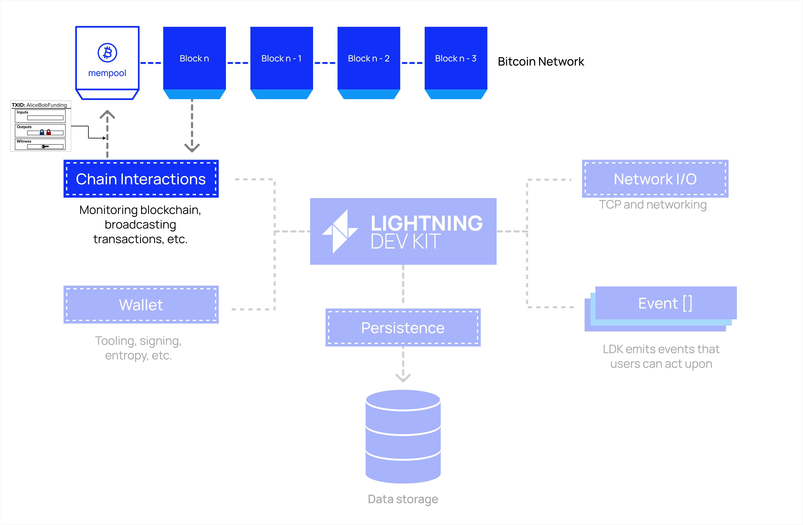
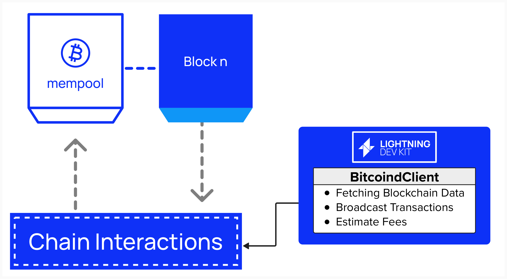

# Connecting To The Bitcoin Blockchain

Before we can get to complex Lightning Network functionality, let's begin by connecting our node to the bitcoin blockchain. After all, as we learned in the intro section, we'll start our Lightning journey by mining a funding transaction in the Bitcoin blockchain.

<p align="center" style="width: 50%; max-width: 300px;">
  
</p>

#### Question: What tasks or functions will our Lightning node need to perform when interacting with the bitcoin blockchain?

<details>
  <summary>
    Answer
</summary>

The backbone of Lightning is a fairness protocol. Two parties agree to exchange bitcoin transactions off-chain, but transactions can be published to the chain if a party needs to enforce the fairness protocol.

There are many answers to this question. Below are a few:
- Broadcasting transactions
  - Channel funding
  - Channel closing (force-close or cooporative closures)
- Monitoring blocks and transactions
  - Identify when funding transaction is mined (with ***x*** confirmations)
  - Spot if channel party attempts to publish an old state
- Fee Estimation
  - For example, using bitcoin Core's RPC `getmempoolinfo`
- UTXO Management
    - Fetching UTXOs for funding transaction or fee-bumping

</details>


## Lightning Node Blockchain Interfaces

As we just learned, a Lightning node will need to perform a variety of on-chain operations, which can broadly be bucketed into the following categories:
- Fetching Blockchain Data
- Broadcasting Transactions
- Estimating Fees

We'll cover these one-by-one in the next few sections!

## Connecting to Bitcoin

First, we'll need to decide how we're going to interact with the bitcoin blockchain. There are a few different ways to do this, and LDK provides support for various architectural approaches. One approach is to run bitcoin Core (or any bitcoin implementation) yourself and fetch data via an HTTP or RPC call to your node. If you completed the intro section of this workshop, you've already gotten some hands-on experience with this, as we published transactions and fetched blockchain data from the bitcoin Core instance running in the background of this Repl via the command line. If you didn't complete the workshop (or, even if you did!), copy the below command and paste it in the **Shell**. This command is communicating with our Repl's bitcoin Core instance and making an RPC call to get the latest block hash.

#### Our Repl's Bitcoin Core (Regtest)
```
bcli getbestblockhash
```

That said, fetching or broadcasting data via bitcoin Core may not always be possible or preferred. For example, if you're running a node on a resource constrained machine, such as a mobile device, you may want to use an Esplora or Electrum server, which provide HTTP and RPC interfaces, respectively, to interact with bitcoin. For a quick hands-on example of how an Esplora API would work, open up a new webpage and try typing the below into the search bar. This will call an Esplora endpoint, hosted by Blockstream, that returns the hash of the latest block.

#### Esplora API (Mainnet)
```
https://blockstream.info/api/blocks/tip/hash
```

Remember, our Repl is running our own Regtest network, but the Esplora API is fetching live data from bitcoin Mainnet, so these block hashes will be different! For this workshop, we'll interface with bitcoin via the bitcoin Core instance that we have running in the background of our Repl.


### Defining Our Bitcoin Interface

Let's get to work! We'll start by defining a `struct` in Rust called `BitcoindClient`.  Our `BitcoindClient` will act as the central hub for all interactions with bitcoin Core. Since bitcoin Core also implements a wallet, we'll update our `bitcoindClient` later on to act as our on-chain wallet. By isoloating these functionalities within the `bitcoindClient`, we keep our code modular, maintainable, and aligned with LDK’s architecture.

<p align="center" style="width: 50%; max-width: 300px;">
  
</p>

If you open `src/bitcoind_client.rs`, you'll see the `BitcoindClient` `struct` is defined for you. It will store important information that is relevant to our bitcoin Core RPC connection. Most of the fields you see below should be, more-or-less, self-explanatory, but it's worth decribing two for additional clarity:
- `bitcoind_rpc_client`: This is an `RpcClient` type, which is an implementation of a bitcoin Core RPC interface that is made available via the `lightning_block_sync::rpc` module. Since we're running bitcoin Core in the background of this workbook, this will be a helpful way for us interact with our node.
- `handle`: This field is of type `tokio::runtime::Handle`, which is part of the Tokio asychnronous runtime in Rust. If you're unfamiliar with Tokio, it's a popular async runtime which handles the scheduling and execution of tasks, such as making RPC calls to bitcoin Core.

```rust
pub struct BitcoindClient {
    pub(crate) bitcoind_rpc_client: Arc<RpcClient>,
    network: Network,
    host: String,
    port: u16,
    rpc_user: String,
    rpc_password: String,
    fees: Arc<HashMap<ConfirmationTarget, AtomicU32>>,
    handle: tokio::runtime::Handle,
    logger: Arc<FilesystemLogger>,
}
```

<details>
  <summary>
    For the curious learner, click here to learn more about `Arc`
</summary>
    
You probably noticed that the RpcClient inside our `BitcoindClient` is wrapped in an `Arc`. If you’re used to higher-level languages like Python, this might be new to you. While you don’t need to fully understand `Arc` for this workshop, it’s worth digging into if you want to understand the nuances of running an efficient Lightning Node.

`Arc` stands for **Atomic Reference Counting**, and it’s part of Rust’s standard library (`std::sync::Arc`). To see why we use it, let’s zoom out to our Lightning node. Once it’s running, different parts of the node will need to use the `RpcClient` — our connection to bitcoin — for things like estimating fees, broadcasting transactions, or fetching blockchain data. These tasks often happen at the same time (concurrently), and we need a way to share the `RpcClient` safely across them.

That’s where thread safety comes in. Thread safety means our program can handle multiple tasks (like threads or async operations) accessing shared data without causing problems. Imagine if two tasks tried to use the `RpcClient` at once in a messy way—one updating some internal state while another reads it. Without care, this could lead to a data race, where the data gets corrupted or the program behaves unpredictably.

`Arc` solves this by creating a thread-safe reference to the `RpcClient`. It lets multiple components borrow the same `RpcClient` without duplicating it, and it keeps track of how many parts of the program are using it. When everyone’s done, `Arc` automatically cleans up the `RpcClient`. This way, our node can juggle all its tasks - like fee estimation and transaction broadcasting - without tripping over itself.

</details>

## ⚡️ Implement the `new` constructor For Our `BitcoindClient`

Now that we've defined the structure for our `BitcoindClient`, let's start implementing some functionality!

The first function we'll implement is the `new` **constructor**. Just like the `new` constructor we implemented for our Logger, this will help us initialize a new instance of this type so that we can hand it off to LDK various LDK components that will need access to the blockchain, such as fee estimation and transaction broadcasting functionality.

Our `new` constructor will define the RPC endpoint to our Repl's bitcoin Core and then return an instance of `BitcoindClient`. You can see the overall structure and flow of the function below.

```rust
impl BitcoindClient {
    pub(crate) async fn new(
        host: String, port: u16, rpc_user: String,
        rpc_password: String, network: Network,
    ) -> std::io::Result<Self> {

        // Step 1: Construct the HTTP Endpoint

        // Step 2: Encode RPC Credentials

        // Step 3: Initialize the RPC Client

        // Step 4: Initialize Fee Estimates

        // Step 5: Construct the BitcoindClient

        // Step 6: Start Fee Estimate Polling

        // Step 7: Return the Client
    }
}
```

To do this, we'll have to complete the following steps:
<details> <summary> Step 1: Construct the HTTP Endpoint </summary>
  
Create an HTTP endpoint for the `bitcoind` RPC client using the provided `host` and `port`. This endpoint defines the network location for RPC requests.

```rust
let http_endpoint = HttpEndpoint::for_host(host.clone()).with_port(port);
```
- `HttpEndpoint::for_host(host.clone())` creates an endpoint for the specified `host` (e.g., `"127.0.0.1"`).
- `.with_port(port)` sets the port number.
- Cloning `host` ensures the original `host` string can be stored in the `bitcoindClient` struct later.

</details>

<details> <summary> Step 2: Encode RPC Credentials </summary>
  
Encode the RPC username and password into a Base64 string for HTTP Basic Authentication, as required by `bitcoind`.

```rust
let rpc_credentials = base64::encode(format!("{}:{}", rpc_user.clone(), rpc_password.clone()));
```
- `format!("{}:{}", rpc_user.clone(), rpc_password.clone())` creates a string in the format `"user:pass"`.
- `base64::encode` converts the string to Base64.
- Cloning `rpc_user` and `rpc_password` ensures they can be stored in the `BitcoindClient` struct.

</details>

<details> <summary> Step 3: Initialize the RPC Client </summary>
  
Create an RPC client using the encoded credentials and HTTP endpoint. This client will handle all communication with our bitcoin node.

```rust
let bitcoind_rpc_client = RpcClient::new(&rpc_credentials, http_endpoint)?;
```
- `RpcClient::new(&rpc_credentials, http_endpoint)` initializes a new RPC client with the provided credentials and endpoint.
- The `?` operator propagates any errors (e.g., invalid endpoint or credentials) as a `std::io::Error`.

</details>

<details> <summary> Step 4: Initialize Fee Estimates </summary>
  
Create a `HashMap` to store fee estimates for different `ConfirmationTarget` variants, using `AtomicU32` for thread-safe fee values. We'll discuss fees and `ConfirmationTarget` variants in more depth shortly. For now, it's simply important to note that we're kick-starting our node with default values, which will be updated in Step 6.

```rust
let mut fees: HashMap<ConfirmationTarget, AtomicU32> = HashMap::new();
fees.insert(ConfirmationTarget::MaximumFeeEstimate, AtomicU32::new(50000));
fees.insert(ConfirmationTarget::UrgentOnChainSweep, AtomicU32::new(5000));
fees.insert(
    ConfirmationTarget::MinAllowedAnchorChannelRemoteFee,
    AtomicU32::new(MIN_FEERATE),
);
fees.insert(
    ConfirmationTarget::MinAllowedNonAnchorChannelRemoteFee,
    AtomicU32::new(MIN_FEERATE),
);
fees.insert(ConfirmationTarget::AnchorChannelFee, AtomicU32::new(MIN_FEERATE));
fees.insert(ConfirmationTarget::NonAnchorChannelFee, AtomicU32::new(2000));
fees.insert(ConfirmationTarget::ChannelCloseMinimum, AtomicU32::new(MIN_FEERATE));
fees.insert(ConfirmationTarget::OutputSpendingFee, AtomicU32::new(MIN_FEERATE));
```
- `HashMap<ConfirmationTarget, AtomicU32>` maps confirmation targets to fee rates (in satoshis per kiloweight).
- `AtomicU32::new` initializes each fee rate as a thread-safe 32-bit unsigned integer.
- `MIN_FEERATE` is a constant, defined in `bitcoind_client.rs`, representing the minimum acceptable fee rate.
- Fees are set to defaults (e.g., 50,000 for `MaximumFeeEstimate`, 2,000 for `NonAnchorChannelFee`).

</details>

<details> <summary> Step 5: Construct the BitcoindClient </summary>
  
Construct the `BitcoindClient` instance with all initialized fields, wrapping shared resources in `Arc` for thread-safe access.

```rust
let client = Self {
    bitcoind_rpc_client: Arc::new(bitcoind_rpc_client),
    host,
    port,
    rpc_user,
    rpc_password,
    network,
    fees: Arc::new(fees),
    handle: handle.clone(),
    logger,
};
```
- `Arc::new(bitcoind_rpc_client)` wraps the RPC client for thread-safe sharing.
- `Arc::new(fees)` wraps the fee map for thread-safe access.
- `handle.clone()` ensures the runtime handle is available for spawning tasks.

</details>

<details> <summary> Step 6: Start Fee Estimate Polling </summary>
  
Start a background task to periodically poll `bitcoind` for updated fee estimates, using the `poll_for_fee_estimates` method, which is provided for you as part of the `BitcoindClient` `struct`.

```rust
BitcoindClient::poll_for_fee_estimates(
    client.fees.clone(),
    client.bitcoind_rpc_client.clone(),
    handle,
);
```
- `client.fees.clone()` and `client.bitcoind_rpc_client.clone()` provide thread-safe references.
- `handle` is the main runtime handle for spawning the task.
- This ensures fee estimates remain current without blocking the constructor.

</details>

<details> <summary> Step 7: Return the Client </summary>
  
Return the constructed `BitcoindClient` wrapped in an `Ok` variant of `std::io::Result`.

```rust
Ok(client)
```
- `Ok(client)` indicates successful initialization.
- Any errors (e.g., from `RpcClient::new`) would have been propagated earlier via the `?` operator.

</details>

**You should be good-to-go! Try implementing the `new` constructor in ```src/bitcoind_client.rs```**! Click `Run` at the top of the Replit when you're done to see if the test `tests::bitcoind_tests::test_bitcoind_client_creation ...` passes.

<p align="center" style="width: 50%; max-width: 300px;">
  
</p>