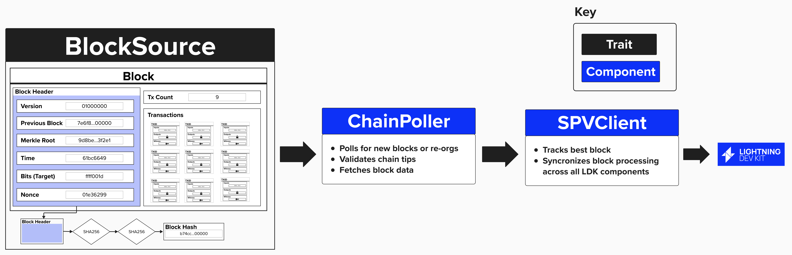

# Fetching Blockchain Data

Regardless of how your Lightning node retrieves data from the Bitcoin blockchain (ex: Bitcoin Core, Esplora, Electrum, etc.), it's going to need to be notified when new transactions are mined. This way, it can ensure that our counterparty is not attempting to cheat us by publishing an old channel-state.

From an LDK perspective, there are different architectural approaches that are required, depending on if we are sourcing our blockchain data from a **block-oriented** interface (ex: Bitcoin Core) or a **transaction-oriented** interface (ex: Esplora, Electrum).

### Block-Oriented Interace
If we're conntecting our node to a block-centric interface, we will need to implement the `BlockSource` trait. This trait defines methods to fetch the following information from a given block source.
1) Block Height
2) Block Data (Header + Transactions)
3) Block Hash

Once we've implemented a `BlockSource`, we can pass that information to the below components, which LDK provides. These components will take care of processing new blocks and inform LDK of any new transactions so that LDK can act accordingly.
- `ChainPoller`: The `ChainPoller` takes a `BlockSource` as an input and contains functionality to validate new blocks.
- `SpvClient`: The `SpvClient` takes a `ChainPoller` as an input, along with the various LDK components that need to be notified of new blocks, and ensures proper orchestration across all components in LDK.


<p align="center" style="width: 50%; max-width: 300px;">
  
</p>

### Transaction-Oriented Interace
(to-do!)

## Updating Our BitcoinClient
Since our Lightning node will connect the the bitcoin core node running in the background of our Repl, we'll be retrieving block-oriented data. Therefore, we'll need to implment the `BlockSouce` interface!

The `BlockSource` interface, with its required methods, can be seen below. As we learned earlier, these functions will be called privately within the `ChainPoller`, which is subsequently passed into our `SpvClient`.

```rust
pub trait BlockSource: Sync + Send {
    fn get_header<'a>(
        &'a self,
        header_hash: &'a BlockHash,
        height_hint: Option<u32>,
    ) -> AsyncBlockSourceResult<'a, BlockHeaderData>;

    fn get_block<'a>(
        &'a self,
        header_hash: &'a BlockHash,
    ) -> AsyncBlockSourceResult<'a, BlockData>;

    fn get_best_block<'a>(
        &'a self,
    ) -> AsyncBlockSourceResult<'_, (BlockHash, Option<u32>)>;
}
```

Since our Lightning node is retrieving blockchain data from Bitcoin Core, we'll complete these functions by fetching and returning the required data by querying Bitcoin Core's JSON RPC interface.

To keep things organized, we’ll encapsulate the `BlockSource` functionality inside our `BitcoinClient` struct. This way, all interactions with Bitcoin Core (fetching blocks, broadcasting transactions, etc.) live in one place.

In Rust, we define these behaviors using the `impl` keyword, which lets us attach methods to our `BitcoinClient`. 

```rust
impl BlockSource for BitcoinClient {
    fn get_header(header_hash: BlockHash, height_hint: Option<u32>) {
        // your implementation here
    }

    fn get_block(header_hash: BlockHash) {
        // your implementation here
    }

    fn get_best_block() {
        // your implementation here
    }
}
```

One this is completed, these functions will be available within the `BitcoinClient` structure. So, for example, you could obtain the best block's chain hash using:

```rust
let bitcoin_rpc_client = BitcoinClient::new(host, port, rpc_user, rpc_password, network).await.unwrap();
let best_block = bitcoin_rpc_client.get_best_block();
```


## ⚡️ Implement `BlockSource` For Our `BitcoinClient`
Complete the implementation of `BlockSource` for `BitcoinClient` in `src/bitcoin_client.rs`. You'll need to implement:

1. `get_block`: Fetches a complete block by its hash
2. `get_best_block`: Fetches information about the most recent block

As an example, `get_header` has been implemented for you!

```rust
impl BlockSource for BitcoinClient {
    fn get_header<'a>(
        &'a self, header_hash: &'a BlockHash, height_hint: Option<u32>,
    ) -> AsyncBlockSourceResult<'a, BlockHeaderData> {
        Box::pin(async move { 
            let header_hash = serde_json::json!(header_hash.to_string());
            Ok(self.bitcoind_rpc_client.call_method("getblockheader", &[header_hash]).await?)
        })
    }

    fn get_block<'a>(
        &'a self, header_hash: &'a BlockHash,
    ) -> AsyncBlockSourceResult<'a, BlockData> {
        Box::pin(async move {
            // Step 1: Convert block hash to JSON
            // Step 2: Set verbosity to raw block
            // Step 3: Make RPC call and wrap result
        })
    }

    fn get_best_block(&self) -> AsyncBlockSourceResult<(BlockHash, Option<u32>)> {
        Box::pin(async move { 
            // Step 4: Make RPC call to get blockchain info
        })
    }
}
```

Below, you’ll find step-by-step guidance to assist in completing the `get_block` and `get_best_block` methods.

<details>
<summary>Step 1: Convert Block Hash to JSON</summary>

For the `get_block` method, convert the `header_hash` (`BlockHash`) to a JSON string to prepare for the RPC call.

```rust
let header_hash = serde_json::json!(header_hash.to_string());
```
- `header_hash.to_string()` converts the `BlockHash` to a hex string (e.g., `"000000000000000000076a914...`").
- `serde_json::json!(...)` wraps the hex string in a JSON value, as required by the `bitcoind_rpc_client`.


</details>

<details>
<summary>Step 2: Set Verbosity to Raw Block</summary>

Specify the verbosity level for the `getblock` RPC call to retrieve the full block in raw (hex) format.

```rust
let verbosity = serde_json::json!(0);
```
- `serde_json::json!(0)` creates a JSON value representing `0`, which tells `getblock` to return the block as a raw hex string.
- The `getblock` RPC requires a verbosity parameter: `0` for raw block data, which is needed to construct a `BlockData::FullBlock`.

</details>

<details>
<summary>Step 3: Make RPC Call and Wrap Result</summary>

Call the `getblock` RPC method with the block hash and verbosity, wrapping the result in `BlockData::FullBlock`.

```rust
Ok(BlockData::FullBlock(self.bitcoind_rpc_client.call_method("getblock", &[header_hash, verbosity]).await?))
```
- `self.bitcoind_rpc_client.call_method("getblock", &[header_hash, verbosity])` makes an async RPC call to `getblock`, passing the hash and verbosity as arguments.
- `.await` resolves the async call, returning a `Result` containing the block data.
- `?` propagates any errors (e.g., network issues).
- `BlockData::FullBlock(...)` wraps the result, as `get_block` expects `AsyncBlockSourceResult<BlockData>`.
- `Ok(...)` wraps the result in the `Result` type required by the return signature.

</details>

<details>
<summary>Step 4: Make RPC Call to Get Blockchain Info</summary>

For the `get_best_block` method, call the `getblockchaininfo` RPC method to fetch information about the blockchain, including the best block.

```rust
Ok(self.bitcoind_rpc_client.call_method("getblockchaininfo", &[]).await?)
```
- `self.bitcoind_rpc_client.call_method("getblockchaininfo", &[])` makes an async RPC call to `getblockchaininfo` with no arguments.
- `.await` resolves the call, returning a `Result` containing a JSON object with blockchain details.
- `?` propagates errors (e.g., RPC connection failure).
- `Ok(...)` prepares the result for the expected return type `AsyncBlockSourceResult<(BlockHash, Option<u32>)>`.

</details>