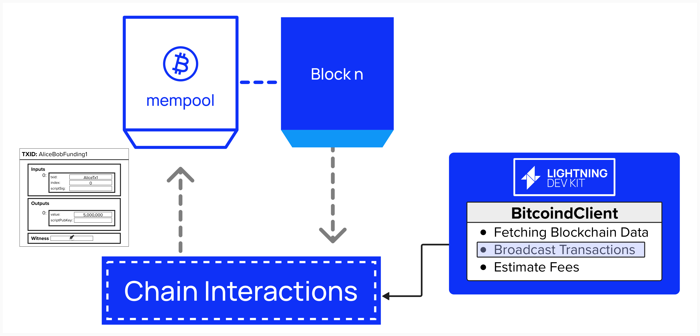

# Broadcasting Transactions To Chain

Great, we've implemented the functionality to retrieve information from the Bitcoin blockchain. However, we still don't have a way to broadcast new transactions to the network. Without that capability, we'll have a pretty hard time opening Lightning channels!

<p align="center" style="width: 50%; max-width: 300px;">
  
</p>

## BroadcasterInterface
As we discussed previously, LDK provides interfaces which define methods that need to be implemented by the developer. `BroadcasterInterface` is one such interface, and it provides one method, `broadcast_transactions`. Here, again, we see the modularity and customizability of LDK. The developer can implement their preferred method for broadcasting transactions, and LDK will leverage that internally whenever it needs to broadcast a transaction for us.

For this workshop, we'll configure LDK to broadcast transactions using Bitcoin Core's `sendrawtransaction` method. If a developer did not have access to Bitcoin Core, they could, for example, use Esplora's [POST /tx](https://github.com/blockstream/esplora/blob/master/API.md#post-tx) endpoint instead.

```rust
pub trait BroadcasterInterface {
    // Required method
    fn broadcast_transactions(&self, txs: &[&Transaction]);
}
```

The `broadcast_transactions` method takes one or more `Transaction` types and broadcasts them to the chain. We saw the `Transaction` structure earlier in this workshop, but, as a reminder, this is what it looks like.

```rust
pub struct Transaction {
    pub version: Version,
    pub lock_time: LockTime,
    pub input: Vec<TxIn>,
    pub output: Vec<TxOut>,
}
```

## ⚡️ Implement `BroadcasterInterface` On Our `BitcoinClient`
To enable our Lightning node to broadcast transactions, we need to implement the `BroadcasterInterface` trait. Since we’ve already defined a `BitcoinClient` structure to manage our RPC connection to Bitcoin Core, we’ll extend its functionality by implementing the `BroadcasterInterface` trait for it.

We can do that by using the below notation:

```rust
impl BroadcasterInterface for BitcoindClient {
    fn broadcast_transactions(&self, txs: &[&Transaction]) {
        // Step 1: Serialize transactions to hexadecimal

        // Step 2: Iterate over serialized transactions

            // Step 3: Clone Arc-wrapped fields for async task

            // Step 4: Spawn an async task to broadcast the transaction

                // Step 5: Prepare JSON argument for RPC call

                // Step 6: Make the async RPC call to sendrawtransaction

                    // Step 7: Log success

                    // Step 8: Log failure
}
```
<details> <summary> Step 1: Serialize Transactions to Hexadecimal </summary>

The `txs` parameter is a slice of references to `Transaction` objects (`&[&Transaction]`). Each transaction must be serialized into its raw hexadecimal format, as required by the `sendrawtransaction` RPC method. Use `encode::serialize_hex` to convert each transaction into a hex string.

```rust
let txn = txs.iter().map(|tx| encode::serialize_hex(tx)).collect::<Vec<_>>();
```
- `txs.iter()` iterates over the slice of transaction references.
- `encode::serialize_hex(tx)` serializes the transaction into a hexadecimal string (e.g., `"01000000..."`).
- `collect::<Vec<_>>()` gathers the hex strings into a `Vec<String>`.

</details>

<details> <summary> Step 2: Iterate Over Serialized Transactions </summary>

Iterate over the serialized transaction hex strings to process each one individually. This allows you to broadcast each transaction in a separate asynchronous task.

```rust
for tx in txn {
    // Process each transaction
}
```
- `txn` is the `Vec<String>` containing the serialized transaction hex strings.
- The `for` loop ensures each transaction is handled independently, which is important for spawning async tasks.

</details>

<details> <summary> Step 3: Clone Arc-Wrapped Fields </summary>

Since the broadcasting will occur in an asynchronous task, you need to clone the `Arc`-wrapped `bitcoind_rpc_client` and `logger` fields to ensure thread-safe access. These fields are shared across tasks, and `Arc` (Atomic Reference Counting) ensures safe sharing.

```rust
let bitcoind_rpc_client = Arc::clone(&self.bitcoind_rpc_client);
let logger = Arc::clone(&self.logger);
```
- `Arc::clone` increments the reference count for each field, ensuring the underlying objects remain valid in the async task.
- These clones are moved into the `async` block, allowing the task to use them independently.

</details>

<details> <summary> Step 4: Spawn an Async Task </summary>

Use the `self.handle` to spawn an asynchronous task for each transaction. As a reminder, the handle is a reference to the Tokio asynchronous runtime. This ensures that RPC calls are non-blocking and can run concurrently, improving performance for broadcasting multiple transactions.

```rust
self.handle.spawn(async move {
    // Async task logic
});
```
- `self.handle.spawn` schedules the async task on the runtime (e.g., a Tokio runtime).
- The `async move` block moves the cloned `bitcoind_rpc_client`, `logger`, and `tx` into the task, ensuring they are owned by the task.

</details>

<details> <summary> Step 5: Prepare JSON Argument for RPC Call </summary>

The `sendrawtransaction` RPC method expects the transaction hex string as a JSON string. Use `serde_json::json!` to wrap the transaction hex in a JSON value.

```rust
let tx_json = serde_json::json!(tx);
```
- `serde_json::json!(tx)` converts the transaction hex string (`tx`) into a JSON value.

</details>

<details> <summary> Step 6: Make the Async RPC Call </summary>

Call the `sendrawtransaction` method on the `bitcoind_rpc_client` asynchronously, passing the JSON-encoded transaction hex. Use `await` to wait for the RPC response.

```rust
match bitcoind_rpc_client
    .call_method::<serde_json::Value>("sendrawtransaction", &[tx_json])
    .await
{
    // Handle result
}
```
- `call_method::<serde_json::Value>` makes the RPC call, expecting a JSON response.
- The `&[tx_json]` slice contains the JSON-encoded transaction hex as the sole argument.
- `.await` suspends the task until the RPC call completes, returning a `Result<serde_json::Value, Error>`.
- The `match` expression handles the success or failure of the RPC call.

</details>

<details> <summary> Step 7: Log Success </summary>

If the RPC call succeeds, log a success message using the `logger`. Include the RPC result for debugging purposes.

```rust
Ok(result) => {
    log_info!(logger, "Successfully broadcasted transaction: {:?}", result);
}
```
- `log_info!(logger, ...)` logs an info-level message using the LDK logger.

</details>

<details> <summary> Step 8: Log Failure </summary>

If the RPC call fails, log an error message with the error details to aid in debugging.

```rust
Err(e) => {
    log_error!(logger, "Failed to broadcast transaction: {:?}", e);
}
```
- `log_error!(logger, ...)` logs an error-level message using the LDK logger.
- The error `e` contains details about the failure (e.g., network issues).

</details>

**You should be good-to-go! Try implementing the `new` constructor in ```src/bitcoind_client.rs```**! Click `Run` at the top of the Replit when you're done to see if the test `tests::programming_lightning::test_05_broadcast_transactions ...` passes.