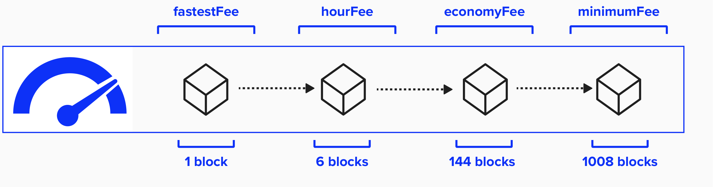
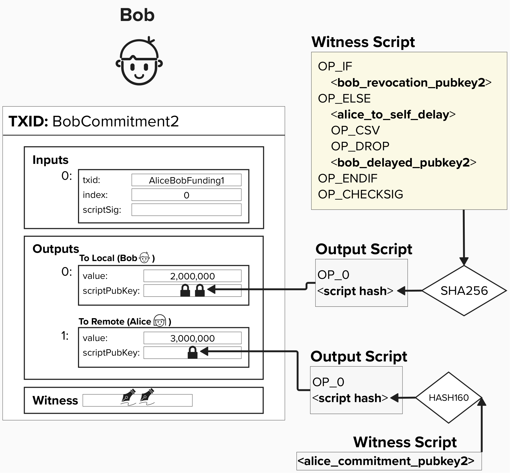
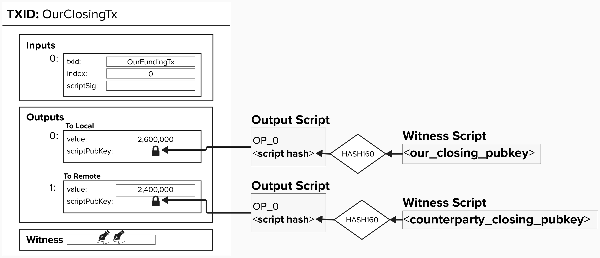
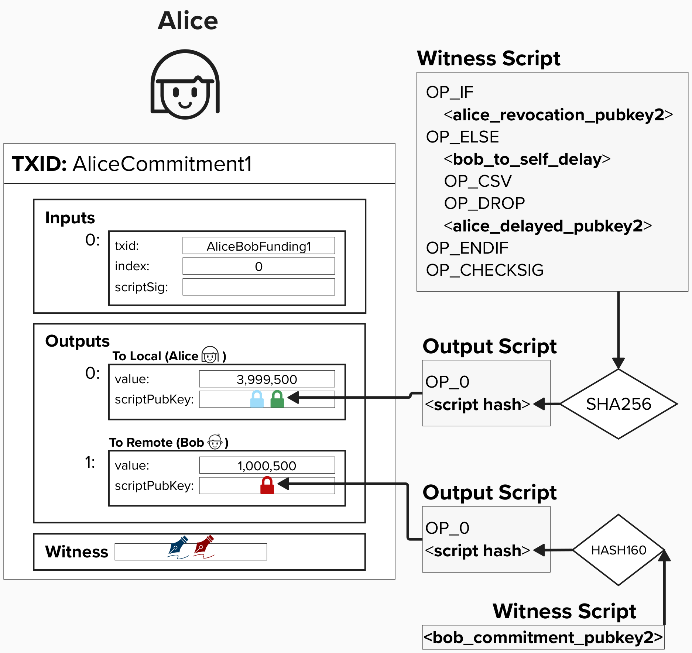
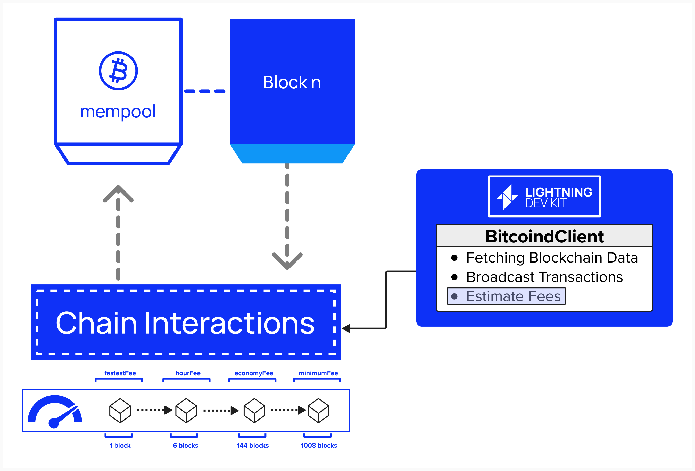

# Fee Estimation

Awesome - we now have a way to broadcast transaction to the Bitcoin blockchain. However, how does our node know which fee to set when broadcasting these transactions? This functionality is vital, as fees will impact how quickly a transaction is included in a block, which is very important in a time-sensitive system such as Lightning.

<p align="center" style="width: 50%; max-width: 300px;">
  
</p>


Below are a few situations in which our Lightning node will seek to broadcast a transaction to chain. See if you can identify which feerate to use in each scenario. Click the dropdowns after you've made your guess!

<details>
  <summary>Broadcasting A Punishment Transaction</summary>

If you're broadcasting a punishment transaction, this means your channel party is trying to cheat you. That's no fun! However, you should have the **revocation key**, meaning you can steal any outputs that have spending paths to your counterparty. You just need to make sure your transaction reaches the mempool and is mined *before* your counterparty publishes a transaction claiming their balance. Luckily, their spending path is timelocked by a relative delay, so you should have sufficient time to publish your punishment tranasction. Nonetheless, you should probably set a pretty **high fee** to ensure your transaction is mined relatively soon (a few blocks).

For example, in the below diagram, imagine you're Alice. Bob is attempting to publish an old channel state, however, he must wait `alice_to_self_delay` blocks before he can claim his balance. Remember, `alice_to_self_delay` is the relative delay that you, Alice, specified when setting up the channel with Bob. This means you have `alice_to_self_delay` blocks to create a new transaction and claim those funds with the revocation keys.

<p align="center" style="width: 50%; max-width: 300px;">
  
</p>

</details>

<details>
  <summary>Broadcasting Cooperative Channel Close</summary>

If you recall, when we close a channel cooperatively, both parties will close any pending HTLCs and create two **Pay-To-Witness-Public-Key** outputs - one for each party. Both outputs will simply send the respecitve balance to each channel party's public key, with no alternative spending paths. Therefore, it's safe to choose a low enough fee such that your transaction will enter the mempool and be mined eventually.

<p align="center" style="width: 50%; max-width: 300px;">
  
</p>

</details>

<details>
  <summary>Creating (Not Broadcasting) A Commitment Transaction That Does NOT Support Anchor Outputs</summary>
  
This one is a little tricky, since we have not discussed anchor outputs. Take a look at the below commitment transaction. **If Alice has to force-close her channel with Bob by publishing this transaction, would she be able to increase the fees later?**

<p align="center" style="width: 50%; max-width: 300px;">
  
</p>

<details>
  <summary>Answer</summary>

No!

One may assume that Alice could just create a new transaction that spends from her `to_local` output and broadcast it with a higher fee, thus utilizing the **Child-Pays-For-Parent** fee-bumping mechanism. However, the issue is that Alice's commitment transaction is locked with a relative CSV timelock. Since the CSV timelock does not *start* until the commitment transaction is mined, Alice's new transaction will not be accepted my the mempool. This is due to a mempool policy (not consensus policy) that mempools should not accept transactions that are not immediately eligble to be included in a block. Therefore, the only way to fee-bump this transaction would be for Bob to create a new high-fee transaction, spending from his P2PKH output.

Therefore, when determing the fee for commitment transactions, it's recommened to set a fee that is relatively conservative - such as a 12 block target.

</details>

</details>


## The FeeEstimator
You're probably starting to notice a pattern! For foundational Lightning functionality, LDK will often provide an interface that must be implemented by the developer. Fee estimation is no exception! To retrieve fees, which are used internally when constructing transaction, LDK exposes `FeeEstimator` trait (seen below).

You'll notice that it has one required method, `get_est_sat_per_1000_weight`. This method is utilized internally throughout LDK to fetch feerate information when performing actions such as opening lightning channels, closing lightning channels, or sweeping funds on-chain. You'll also notice that the `get_est_sat_per_1000_weight` has one required input: a `ConfirmationTarget`.

```rust
pub trait FeeEstimator {
  /// Gets estimated satoshis of fee required per 1000 Weight-Units.
  fn get_est_sat_per_1000_weight(&self, confirmation_target: ConfirmationTarget) -> u32;
}
```

## The ConfirmationTarget
Remember how we decided which type of feerate to use in certain situation? LDK does something very similar. Specifically, LDK defines eight different types of feerate conditions, similar to what we did above when we decided which feerate to use various scenarios. The `ConfirmationTarget` choices are listed below with a brief explanation, but a detailed description of each `ConfirmationTarget` can be found [here](https://docs.rs/lightning/latest/lightning/chain/chaininterface/enum.ConfirmationTarget.html#).

| ConfirmationTarget                      | Description                                                                      |Number of Blocks                                                                      |
|----------------------------------------|----------------------------------------------------------------------------------| :----: |
| MaximumFeeEstimate                     | The most aggressive (i.e. highest) feerate estimate available.| 1 |
| UrgentOnChainSweep                     | We have some funds available on chain which we need to spend prior to some expiry time at which point our counterparty may be able to steal them.        | 6 |
| MinAllowedAnchorChannelRemoteFee       | This is the lowest feerate we will allow our channel counterparty to have in an anchor channel in order to close the channel if a channel party goes away.      | 1008 |
| MinAllowedNonAnchorChannelRemoteFee    | MinAllowedNonAnchorChannelRemoteFee   | 144 |
| AnchorChannelFee                       | This is the feerate on the transaction which we (or our counterparty) will broadcast in order to close the channel if a channel party goes away.                  | 144 |
| NonAnchorChannelFee                    | This feerate represents the fee we pick now, which must be sufficient to enter a block at an arbitrary time in the future.    | 12 |
| ChannelCloseMinimum                    | When cooperatively closing a channel, this is the minimum feerate we will accept. Recommended at least within a day or so worth of blocks.   | 144 |
| OutputSpendingFee                      | The feerate used to claim on-chain funds when there is no particular urgency to do so.                        | 12 |


## ⚡️ Implement `FeeEstimator` On Our `BitcoinClient`
As we've already done with the `BlockSource` and `BroadcasterInterface`, let's implement the FeeEstimator trait on our `BitcoinClient`. 

<p align="center" style="width: 50%; max-width: 300px;">
  
</p>

If you recall from our earlier exercise when we completed the `new` constructor for the `BitcoindClient`, we started a polling process to continually fetch the latest feerates by calling `poll_for_fee_estimates`.

If you search within that same file (`bitcoind_client.rs`), you'll see the function `poll_for_fee_estimates` defined. 

```rust
BitcoindClient::poll_for_fee_estimates(
    client.fees.clone(),
    client.bitcoind_rpc_client.clone(),
    handle,
);
```

#### Take a moment to review the code for the above function and see what it's doing. If you want a description to help you understand, click below.

<details>
  <summary>Explanation of poll_for_fee_estimates</summary>

The `poll_for_fee_estimates` function spawns an asynchronous task that runs an infinite loop to periodically fetch fee estimates from our Bitcoin Core node. The function wil poll the minimum feerate along with the feerates for the following block targets: 144, 18, 6, 2. These estimates are stored in a shared `HashMap` for various `ConfirmationTarget` values, updated every 60 seconds to ensure accurate fee rates.

</details>


```rust
impl FeeEstimator for BitcoindClientExercise {
    fn get_est_sat_per_1000_weight(&self, confirmation_target: ConfirmationTarget) -> u32 {
      // Step 1: Fetch feerate from `self.fees`, an internal HashMap mapping ConfirmationTarget to fee rate in satoshis per 1000 weight units.
    }
}
```
<details>
  <summary>A Note On "per_1000_weight"</summary>

It's worth noting that Bitcoin Core's RPC command `estimatesmartfee` actually returns fees in BTC/KvB, which needs to converted to satoshis/KW. For this exercise, we abstract away that nuance, but, in reality, you can convert BTC/KvB to satoshis/KW by multiplying by 100,000,000 and then dividing by 4. This will give you the virtual-bytes into weight units.

</details>

<details>
  <summary>Step 1</summary>

 To complete `get_est_sat_per_1000_weight`, we'll need to retrieve the feerate from the `self.fees` HashMap, which maps `ConfirmationTarget` keys to feerates. The fees are stored as `AtomicU32` values to ensure thread-safe atomic operations.

 ```rust
self.fees.get(&confirmation_target).unwrap().load(Ordering::Acquire)
 ```
- `self.fees.get(&confirmation_target)` returns an `Option<&AtomicU32>`, where the resulting value will either be the feerate (`&AtomicU32`) or `None` if the key does not exist. `.unwrap()` assumes the key exists, extracting the `&AtomicU32` or panicking if `None` is returned.
- `.load(Ordering::Acquire)` atomically reads the feerate (in satoshis per 1000 weight units) from the `AtomicU32`, ensuring thread-safe access

Remember, thread-safe access is required because the `BitcoindClient` will be shared with multiple LDK components, so we'll need to ensure they don't get in the way of eachother during normal operations.

</details>

**You should be good-to-go! Try implementing the `new` constructor in ```src/bitcoind_client.rs```**! Click `Run` at the top of the Replit when you're done to see if the test `tests::programming_lightning::test_06_get_est_sat_per_1000_weight ...` passes.


### Questions: Think through the below questions and see if you can come up with an answer to each one. When you're ready, click to see more information.

1) What are the drawbacks of ***only*** retrieving fee estimates from Bitcoin Core RPC?
2) What are alternative methods for retrieving fees?
   
<details>
  <summary>Answer</summary>

A popular approach is to fetch this information using a tiered methodology. This will help ensure that, if there is a failure in retrieving fees from one method, another method can serve as a backup and ensure that normal node operations are not impacted. For example, one approach to populating fees is the following:
- If mempool.space successfully returns fee estimates, use those.
- Otherwise, fetch fee estimates from your local mempool
- If both of the above fail, use hard-coded fall-back fees, mapped to each ```ConfirmationTarget```.

Please note, if you're using a third-party fee estimator, there are a few things you should keep in mind:
- Third parties often rate-limit users such that they can only access a limited number of fee estimates within a given timeframe. If you require a certain service level agreement (SLA), it's recommended to run your own Bitcoin node or explore paid services with SLA guarantees, such as [mempool.space enterprise accounts](https://mempool.space/enterprise).
- Leveraging third-party providers may leave you more exposed to a griefing attack, where your fee estimator purposely overestimates the feerate, causing you to accept more dust HTLCs than you would otherwise.
- Third-party fee estimates may affect the propagation of your pre-signed transactions at any time and, therefore, endanger the safety of channel funds.

Running your own Bitcoin node can relieve some of these concerns, but it may require additional technical expertise and maintenance to operate properly. These trade-offs should be considered carefully when deciding how your application will retrieve fee estimates.

A savvy reader may have noticed that the above architecture is not very performant. LDK may generate a substantial number of fee-estimation calls in some cases. So, if we have to call an API every time we want a fee estimate, we'll add a significant amount of additional load to our application, and we may substantially slow HTLC handling. To ensure your application remains performant, you should pre-calculate and cache the fee estimates so that they can simply be retrieved when needed. Additionally, it's recommended to refresh fee estimates every 5-10 minutes so that your application has access to fresh freerates.


</details>