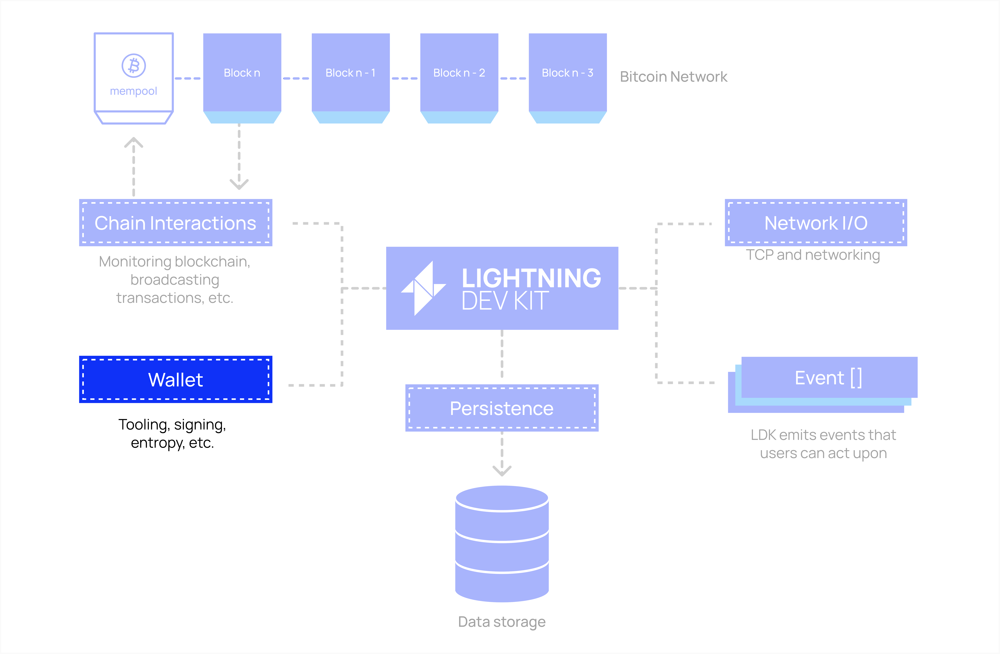
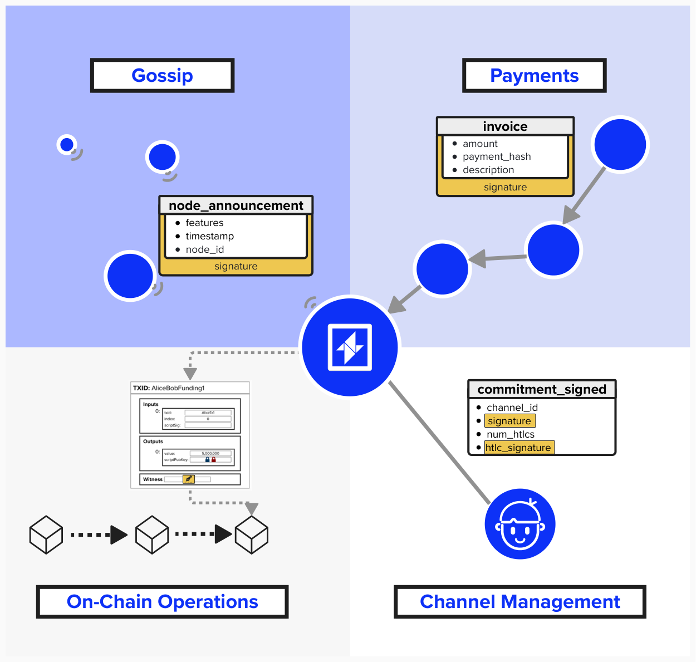

# Lightning Node Wallet

Great, we've now implemented a few interfaces that will enable our node to interact with the Bitcoin blockchain, accomplishing tasks such as broadcasting transactions and processing incoming blocks as they are mined.

Another crucial interface we will need to implement is our wallet. Once implemented, it will enable our node to perform a large variety of on-chain and off-chain tasks.


<p align="center" style="width: 50%; max-width: 300px;">
  
</p>

#### Question: What functionality will the wallet assist with for our node? Think of all the tasks a Lightning node has to perform that involve keys.

<details>
  <summary>
    Answer
</summary>

When it comes to building a Lightning node wallet, there is so much going on under the hood. While not an extensive coverage of all wallet functionaltiy, the below diagram does help contextualize a few situations where Lightning node will need to leverage keys. Let's review them, step by step.

1) **Gossip**: The Gossip Network is how nodes on the Lightning network communicate with eachother. For example, announcing their presence or informing the network that they have a new channel open and ready for use. When communicating this information, it's important that recipients of data can verify that the data came from the right person. Since every public node on the Lightning network advertises a public key to identify itself by, it can use the private key associated with this public key to sign messages, certifying that the message did, in fact, originate from them.
2) **Payments**: Before making a payment, you'd probably want to verify that it's going to the correct person, right? Of course! Within the Lightning network, payment invoices include signatures, produced by your Lightning node's off-chain wallet, to verify that the invoice originated from the right person.
3) **On-Chain Operations**: Recall our exercise from earlier where we reviewed force-closed two channels in the middle of routing a payment? All of those transactions needed to be broadcasted on-chain. Additionally, if those commitment transactions supported *anchor outputs*, we may have needed to bring additional UTXOs to add the necessary fees. This on-chain activity requires that our Lightning node have an integrated on-chain wallet. As we'll see, there are multiple ways we can go about that.
4) **Channel Management**: Channel Management includes the messages that are sent between nodes to communicate a change in state. For example, oppening a channel, adding a new HTLC, closing a channel, etc. When constructing new states, we're updating commitment transactions, which means we'll have to send a new signature to our peer for the commitment transaction. This signature, of course, is produced by our wallet.

<p align="center" style="width: 50%; max-width: 300px;">
  
</p>

</details>

## Implementing Our On-Chain Wallet

Now that we've reviewed why an on-chain wallet is so important, let's go ahead and implement one for our Lightning node. 

Bitcoin Core comes with wallet functionality, so let's configure our Lightning node to use Bitcoin Core's wallet for on-chain purposes. That said, since LDK is a modular API-driven Lightning implementation, developers have a lot of flexibility for how they'd like to integrate an on-chain wallet. For example, they could develop an on-chain wallet using Bitcoin Development Kit (BDK).

Since we're organizing our Bitcoin Core interfaces within the `BitcoinCore` structure we created, let's update that to add our new wallet functionality.

## ⚡️ Implement On-Chain Functionality For Our `BitcoinClient`

For this exercise, we'll implement on-chain transaction functionality within our `BitcoinClient`. This way, our Lightning node will be able to generate and broadcast an on-chain transaction when needed.

As we're building these functions, imagine we're creating a 2-of-2 funding transaction, as that would be an example of a transaction that our Lightning node will need to create **using our on-chain wallet**. Reminder, we need to use our on-chain wallet because that wallet will be signing (unlocking) the on-chain UTXO that is funding this channel.

### ⚡️ Implement `create_raw_transaction`

We'll start with creating a raw transaction. To do this, we'll use Bitcoin Core's `createrawtransaction` RPC command. As an input, this function will take a hashmap (dictionary) of `address`: `amount` outputs, describing where the funds are being sent. You can read more about the other arguments that this RPC command takes [here](https://developer.bitcoin.org/reference/rpc/createrawtransaction.html).

This function will return a `RawTx` type, which is a `String`. Note, this transaction is not yet ready to broadcast, as it doesn't have inputs or a signature yet!

```rust
pub async fn create_raw_transaction(&self, outputs: Vec<HashMap<String, f64>>) -> RawTx {
    // Step 1: Convert outputs to JSON

    // Step 2 & 3: Call createrawtransaction and return result
}
```
<details> <summary> Step 1: Convert Outputs to JSON </summary>

Serialize the `outputs` vector (containing hashmaps of address-amount pairs) into a JSON value for the RPC call.

```rust
let outputs_json = serde_json::json!(outputs);
```

- Use `serde_json::json!(outputs)` to convert `outputs` into a JSON array.
- This matches the expected format for `createrawtransaction`’s outputs parameter.

</details>

<details> <summary> Step 2: Call the RPC Method </summary>
    
Invoke the `createrawtransaction` RPC method asynchronously, passing an empty inputs array (`[]`) and the serialized outputs.

```rust
self.bitcoind_rpc_client
    .call_method::<RawTx>(
        "createrawtransaction",
        &vec![serde_json::json!([]), outputs_json],
    )
```

- Use `self.bitcoind_rpc_client.call_method::<RawTx>` to call `"createrawtransaction"`.
- Pass `&vec![serde_json::json!([]), outputs_json]` as arguments: an empty array for inputs and the outputs JSON.

</details>

<details> <summary> Step 3: Handle the Response </summary>

Await the RPC response and return the `RawTx` (a `String` containing the raw transaction hex).

```rust
self.bitcoind_rpc_client
    .call_method::<RawTx>(
        "createrawtransaction",
        &vec![serde_json::json!([]), outputs_json],
    )
    .await
    .unwrap()
```

- `.await` waits for the async RPC call to complete.
- `.unwrap()` assumes the call succeeds (in a production environment, handle errors properly).
- The result is the raw transaction hex string.

</details>

### ⚡️ Implement `fund_raw_transaction`

As mentioned above, once we get our transaction hex back from `create_raw_transaction`, we will need to find inputs to use. To accomplish this, we can use the RPC command `fund_raw_transaction`. This command will take a transaction (in the form of a hex string) and return a signed transaction - also in the form of a hex string. You can read more about it [here](https://developer.bitcoin.org/reference/rpc/fundrawtransaction.html?highlight=fundrawtransaction).

Another important thing to note is that this RPC command will add, at most, one change output to the outputs.

```rust
pub async fn fund_raw_transaction(&self, raw_tx: RawTx) -> FundedTx {
    // Step 1: Convert raw transaction to JSON

    // Step 2: Set RPC options
    
        // Convert fee rate from satoshis per KW to satoshis per vB

        // Disable RBF to prevent accidental fund loss

    // Step 3: Call fundrawtransaction and return result

}
```

<details> <summary> Step 1: Convert Raw Transaction to JSON </summary>

Serialize the `raw_tx` (a `RawTx` containing the transaction hex string) into a JSON value for the RPC call.

```rust
let raw_tx_json = serde_json::json!(raw_tx.0);
```

- Use `serde_json::json!(raw_tx.0)` to convert the hex string (accessed via `raw_tx.0`) into a JSON string.
- This matches the expected format for `fundrawtransaction`’s transaction parameter.

</details>

<details> <summary> Step 2: Set RPC Options </summary>
Create a JSON object specifying the fee rate and disabling Replace-By-Fee (RBF).

```rust
let options = serde_json::json!({
    "fee_rate": self
        .get_est_sat_per_1000_weight(ConfirmationTarget::NonAnchorChannelFee) as f64 / 250.0
});
```

- Calculate `fee_rate` by fetching the fee estimate for `ConfirmationTarget::NonAnchorChannelFee` (in satoshis per KW), converting to satoshis per vB: divide by 250 (since 1 vB = 4 WU, and 1000 WU = 1 KW).
- Use `serde_json::json!` to create the options object.

</details>

<details> <summary> Step 3: Call the RPC Method </summary>
    
Invoke `fundrawtransaction` asynchronously, passing the transaction JSON and options, and return the `FundedTx`.

```rust
self.bitcoind_rpc_client
    .call_method("fundrawtransaction", &[raw_tx_json, options])
    .await
    .unwrap()
```

- Use `self.bitcoind_rpc_client.call_method()` to call `"fundrawtransaction"`.
- Pass `&[raw_tx_json, options]` as arguments.
- `.await` waits for the RPC response, and `.unwrap()` assumes success (handle errors properly in production).
- The result is the funded transaction hex string.

</details>

### ⚡️ Implement `sign_raw_transaction_with_wallet`

Now that we have our transaction hex, complete with inputs and outputs, we're ready to add a signature. To do this, we'll need to call Bitcoin Core's RPC command `signrawtransactionwithwallet`. This command takes a transaction hex and returns a signed transaction, ready to be broadcasted.

```rust
pub async fn sign_raw_transaction_with_wallet(&self, tx_hex: String) -> SignedTx {
    // Step 1: Convert transaction hex to JSON

    // Step 2 & 3: Call signrawtransactionwithwallet and return result
}
```

<details> <summary> Step 1: Convert Transaction Hex to JSON </summary>

Serialize the `tx_hex` string (the raw transaction hex) into a JSON value for the RPC call.

```rust
let tx_hex_json = serde_json::json!(tx_hex);
```

- Use `serde_json::json!(tx_hex)` to convert the hex string into a JSON string.

</details>

<details> <summary> Step 2: Call the RPC Method </summary>

Invoke the `signrawtransactionwithwallet` RPC method asynchronously, passing the transaction hex JSON.

```rust
self.bitcoind_rpc_client
    .call_method("signrawtransactionwithwallet", &vec![tx_hex_json])
```

- Use `self.bitcoind_rpc_client.call_method()` to call `"signrawtransactionwithwallet"`.
- Pass `&vec![tx_hex_json]` as the sole argument (the transaction hex).

</details>

<details> <summary> Step 3: Handle the Response </summary>

Await the RPC response and return the `SignedTx` (a signed transaction hex string).

```rust
self.bitcoind_rpc_client
    .call_method("signrawtransactionwithwallet", &vec![tx_hex_json])
    .await
    .unwrap()
```

- `.await` waits for the async RPC call to complete.
- `.unwrap()` assumes the call succeeds (in production, handle errors properly).
- The result is the signed transaction hex string.

</details>

### ⚡️ Implement `send_raw_transaction`

We're almost there! Now, we'll implement `send_raw_transaction` so that our application can broadcast on-chain transactions.

At this point, you may be wondering: "Why do we need to implement `sign_raw_transaction_with_wallet`? Didn't we already implement a `BroadcastInterface`?".

Those would be great questions. In reality, LDK will broadcast the funding transaction for us (more on that later!). All we have to do is hand LDK the signed transaction. However, if we want to add additional broadcast functionality, then we will have this helper function available.

```rust
pub async fn send_raw_transaction(&self, raw_tx: RawTx) {
    // Step 1: Convert transaction hex to JSON

    // Step 2 & 3: Call sendrawtransaction

}
```

<details> <summary> Step 1: Convert Transaction Hex to JSON </summary>
    
As we did in the last exercise, let's serialize the `raw_tx` (a `RawTx` containing the transaction hex string) into a JSON value for the RPC call.

```rust
let raw_tx_json = serde_json::json!(raw_tx.0);
```

- Use `serde_json::json!(raw_tx.0)` to convert the hex string (accessed via `raw_tx.0`) into a JSON string.

</details>

<details> <summary> Step 2: Call the RPC Method </summary>
    
Invoke the `sendrawtransaction` RPC method asynchronously, passing the transaction hex JSON.

```rust
self.bitcoind_rpc_client
    .call_method::<Txid>("sendrawtransaction", &[raw_tx_json])
```

- Use `self.bitcoind_rpc_client.call_method()` to call `"sendrawtransaction"`.
- Pass `&[raw_tx_json]` as the sole argument (the transaction hex).

</details>

<details> <summary> Step 3: Handle the Response </summary>
    
Finally, just as we've done multiple times thus far, let's handle the result. In this case, `send_raw_transaction` does not return any value, so we will discard the result by adding a `;` to the end of the last statement.

```rust
self.bitcoind_rpc_client
    .call_method::<Txid>("sendrawtransaction", &[raw_tx_json])
    .await
    .unwrap();
```

- `.await` waits for the async RPC call to complete.
- `.unwrap()` assumes the call succeeds (in production, handle errors properly).
- The `Txid` (transaction ID) is received but not used, as the method’s purpose is to broadcast. Therefore, we place a `;` after `unwrap()`, ensuring we don't return a value.

</details>