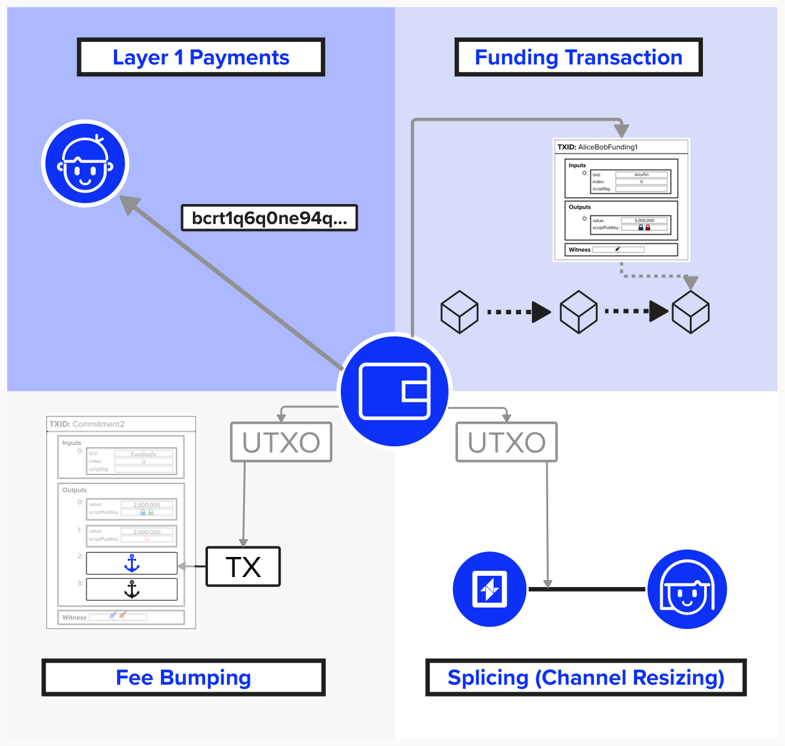
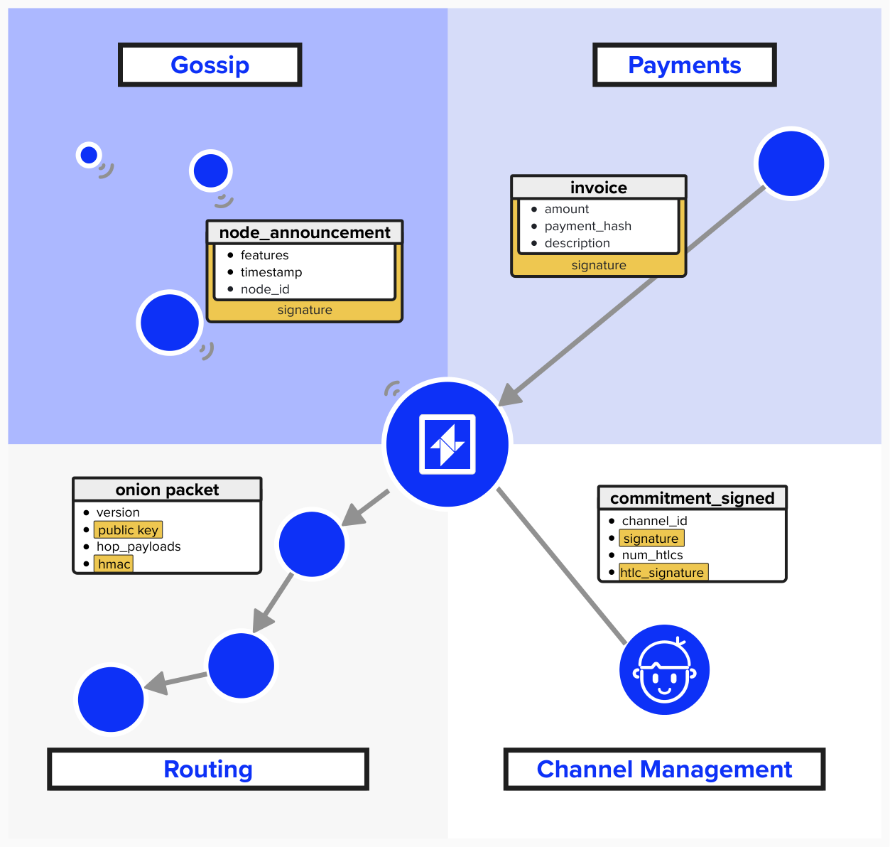
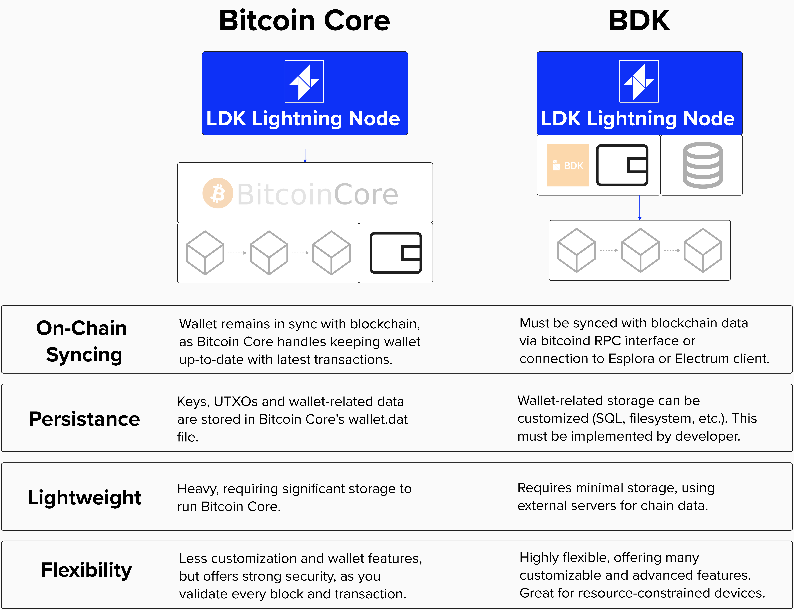

# Lightning Node Wallet

Great, we've now implemented a few interfaces that will enable our node to interact with the Bitcoin blockchain, accomplishing tasks such as broadcasting transactions and processing incoming blocks as they are mined.

Another crucial interface we will need to implement is our wallet. Once implemented, it will enable our node to perform a large variety of on-chain and off-chain tasks.


<p align="center" style="width: 50%; max-width: 300px;">
  
</p>

#### Question: What functionality will the wallet assist with for our node? Think of all the tasks a Lightning node has to perform that involve keys.

<details>
  <summary>
    Answer
</summary>

When it comes to building a Lightning node wallet, it's helpful to differentiate between on-chain and off-chain wallet use cases.

#### On-Chain
For obvious reasons, we often think of Lightning as a "Layer 2" protocol, leading us to forget how tighly knit it is with Bitcoin's "Layer 1" blockchain. The below diagram sheds some light on various scenarious where having an on-chain wallet handy will help make for a more robust Lightning node.

<p align="center" style="width: 50%; max-width: 300px;">
  
</p>

1) **Layer 1 Payments**: One major reason to have an integrated on-chain wallet is so that your Lightning node can support sending and recieving bitcoin on-chain (Layer 1).
2) **Funding Transaction**: If you plan on opening channels yourself, you'll need to fund the channel, meaning you'll need on-chain bitcoin handy!
3) **Fee Bumping**: There are various scenarious where you may need to bump the fees on a transaction to ensure it gets confirmed in the blockchain. For example, perhaps fees have spiked after you broadcasted a punishment transaction and you need to increase fees ASAP. Additionally, newer Lightning channel versions support anchor outputs and even zero-fee commitments, meaning that you'll need to have fresh UTXOs available so that you can add fees whenever you want to broadcast these commitment transactions.
4) **Splicing (Channel Resizing)**: Splicing allows for channel partners to negotiate a new on-chain funding output for their channel. There are two main benefits that this provides. First, channel parties can increase or decrease the funds in their channel. Second, this change only requires one on-chain transaction (confirming the new 2-of-2 output). Without splicing, the channel partners would have had to close their channel and reopen it, which is two on-chain transactions. Not to mention that they would need to restablish any other channels they had.


#### Off-Chain
While not an extensive coverage of all wallet functionaltiy, the below diagram does help contextualize a few situations where Lightning node will need to leverage keys. Let's review them, step by step.

<p align="center" style="width: 50%; max-width: 300px;">
  
</p>

1) **Gossip**: The Gossip Network is how nodes on the Lightning network communicate with eachother. For example, announcing their presence or informing the network that they have a new channel open and ready for use. When communicating this information, it's important that recipients of data can verify that the data came from the right person. Since every public node on the Lightning network advertises a public key to identify itself by, it can use the private key associated with this public key to sign messages, certifying that the message did, in fact, originate from them.
2) **Payments**: Before making a payment, you'd probably want to verify that it's going to the correct person, right? Of course! Within the Lightning network, payment invoices include signatures, produced by your Lightning node's off-chain wallet, to verify that the invoice originated from the right person.
3) **On-Chain Operations**: Recall our exercise from earlier where we reviewed force-closed two channels in the middle of routing a payment? All of those transactions needed to be broadcasted on-chain. Additionally, if those commitment transactions supported *anchor outputs*, we may have needed to bring additional UTXOs to add the necessary fees. This on-chain activity requires that our Lightning node have an integrated on-chain wallet. As we'll see, there are multiple ways we can go about that.
4) **Channel Management**: Channel Management includes the messages that are sent between nodes to communicate a change in state. For example, oppening a channel, adding a new HTLC, closing a channel, etc. When constructing new states, we're updating commitment transactions, which means we'll have to send a new signature to our peer for the commitment transaction. This signature, of course, is produced by our wallet.

</details>

## Implementing Our On-Chain Wallet

Now that we've reviewed why an on-chain wallet is important, let's go ahead and implement one for our Lightning node!

Since LDK is a modular API-driven Lightning implementation, developers have a lot of flexibility when deciding how they'd like to integrate an on-chain wallet. We're already connected to Bitcoin Core, so we could use the wallet implementation that's provided via Core. On the other hand, if we wanted more customizability, we could use the Bitcoin Development Kit (BDK). Let's take a moment to review the differences between these two approaches.

<p align="center" style="width: 50%; max-width: 300px;">
  
</p>

### Bitcoin Core

Since we already have a connection to Bitcoin Core, it would be relatively simple to integrate Bitcoin Core's wallet functionality into our Lightning Node. All we would have to do is build a few new functions that interface with the following Bitcoin Core RPC commands: `createrawtransaction`, `fundrawtransaction`, and `signrawtransactionwithwallet`. This would be very similar to some of the previous exercises we completed in this workbook. If you'd like to see an example of this, check out [LDK Sample](https://github.com/lightningdevkit/ldk-sample), which this workshop is heavily based off.

Another reason that leveraging Bitcoin Core as an on-chain wallet is relatively simple is that Bitcoin Core will ensure that our wallet is always up-to-date, monitoring the blockchain to see if we have any new UTXOs that we can spend from. Additionally, it will handle data persitance for us. That said, running Bitcoin Core is pretty resource-intensive, plus we could get more advanced wallet functionality if we use other solutions, such as the Bitcoin Development Kit.

### Bitcoin Development Kit

The Bitcoin Development Kit (BDK) is very similar to the Lightning Development Kit, in that it provides lightweight, highly customizable wallets with robust support for descriptors and miniscirpt. However, with this flexibilty and functionality comes a little extra complexity. For instance, we'll need to configure a BDK wallet to periodically sync with a block source (full node, simple payment verification node, Esplora server, or Electrum server), and we'll need to configure the data persistance ourselves.

From a Lightning node perspective, one great benefit of using BDK as our wallet is that we can use a single seed for our entire application. We'll cover this in depth in the next section, but the idea is that our Lightning keys will simply be a hardened derivation path from the seed that we use to instantiate our on-chain wallet! Cool, eh?

## Implement On-Chain Functionality With BDK

For this exercise, we won't implement the entire BDK functionality ourselves. Instead, we'll start with a brief code review, examining the important pieces that relate to our Lightning node. As we review the code, we'll see that an important piece is missing - the ability to create and sign a transaction - so we'll go ahead and complete this function!

## Code Review
Before we jump into a coding exercise, let's dig into the BDK code and see what's going on!

#### General Architecture
Let's begin by reviewing the general architecture for our wallet! Most of it can be found in `src/onchain_wallet/rs`. In this file, you'll find the `OnChainWallet` struct, which encapsulates the functionality we'll need to bridge our on-chain wallet with LDK. Our wallet will use BIP84 descriptors for SegWit v0 addresses, stores data in a SQLite database for persistence, and connect to the blockchain via an Esplora API client.

<details> <summary> Click to see code </summary>

```rust
/// On-chain Bitcoin wallet with BDK
/// 
/// This struct wraps a BDK wallet and provides the functionality used in Lightning
/// operations like funding channels, sweeping outputs, and managing on-chain funds.
/// It implements LDK traits (ChangeDestinationSource, WalletSource) to integrate with an LDK Lightning node.
///
/// Generic parameters:
/// - B: Broadcaster for sending transactions to the Bitcoin network
/// - E: Fee estimator for calculating appropriate transaction fees  
/// - L: Logger for recording wallet operations

pub(crate) struct OnChainWallet<B: Deref, E: Deref, L: Deref>
where
    B::Target: BroadcasterInterface,
    E::Target: FeeEstimator,
    L::Target: Logger,
{
    /// The underlying BDK wallet, protected by a mutex for thread safety
    inner: Mutex<PersistedWallet<Connection>>,
    /// Esplora client for blockchain data (blocks, transactions, UTXOs)
    client: Arc<BlockingClient>,
    /// Path to the SQLite database file storing wallet data
    path_to_db: String,
    /// Transaction broadcaster (BitcoindClient)
    broadcaster: B,
    /// Fee estimator (BitcoindClient)
    fee_estimator: E,
    /// Logger for recording operations and errors
    logger: L,
}
```
</details>


#### Build A Wallet
The `OnChainWallet` provides a `new_from_seed()` method, which will build a BDK wallet from a single 32-byte seed. Using this seed, we derive a master extended private key and create BIP84 descriptions, which define how to generate SegWit addresses. We'll create one for "External" use (receiving funds) and one for "Internal" use (change addresses). In this function, we'll first attempt to load a wallet, if it exists. If it doesn't we'll go ahead and create a fresh one with the provided descriptors.

<details> <summary> Click to see code </summary>

```rust
{
	/// Creates a new on-chain wallet from a seed phrase
	/// 
	/// This method encapsulates all the BDK wallet construction logic,
	/// including descriptor creation, database setup, and blockchain client initialization.
	/// 
	/// # Arguments
	/// * `keys_seed` - 32-byte seed for deriving wallet keys
	/// * `network` - Bitcoin network (mainnet, testnet, regtest, signet)
	/// * `path_to_db` - Path to SQLite database file for wallet persistence
	/// * `fee_estimator` - Component for estimating transaction fees
	/// * `broadcaster` - Component for broadcasting transactions
	/// * `logger` - Component for logging operations
	/// 
	/// # Returns
	/// Configured OnChainWallet ready for Lightning operations
	pub(crate) fn new_from_seed(
		keys_seed: &[u8], network: BitcoinNetwork,
		path_to_db: &str, fee_estimator: E, broadcaster: B, logger: L,
	) -> Self {

		// Derive the master extended private key from the seed
		let xprv = bitcoin::bip32::Xpriv::new_master(network, &keys_seed).unwrap();
		// External keychain: for receiving payments and change outputs
		let descriptor = Bip84(xprv, KeychainKind::External);
		// Internal keychain: for change addresses (not shown to users)
		let change_descriptor = Bip84(xprv, KeychainKind::Internal);

		// Open SQLite database connection for wallet persistence
		let mut conn = ::bdk_wallet::rusqlite::Connection::open(path_to_db).unwrap();

		// Try to load existing wallet from database
		let wallet_opt = BdkWallet::load()
			.descriptor(KeychainKind::External, Some(descriptor.clone()))
			.descriptor(KeychainKind::Internal, Some(change_descriptor.clone()))
			.extract_keys()
			.check_network(network)
			.load_wallet(&mut conn)
			.map_err(|e| {
				log_error!(logger, "Failed to load BDK wallet: {:?}", e);
			})
			.unwrap();

		// Create new wallet if none exists, otherwise use loaded wallet
		let bdk_wallet = match wallet_opt {
			Some(wallet) => wallet,
			None => BdkWallet::create(descriptor, change_descriptor)
				.network(network)
				.create_wallet(&mut conn)
				.map_err(|e| {
					log_error!(logger, "Failed to set up wallet: {}", e);
				})
				.unwrap(),
		};

		// Wrap BDK wallet in mutex for thread-safe access
		let inner = Mutex::new(bdk_wallet);

        // see Sync + Scan Blockchain for info on the next section
	}
```
</details>

#### Sync + Scan Blockchain
Remember, our BDK wallet needs a way to source blockchain data so it can keep its UTXO set up-to-date and accurately estimate balances. Using BDK, we have the option to connect to the blockchain via a local Bitcoin Core instance, Esplora server, or Electrum server. For this workshop, we'll connect to the blockchain using an Esplora server. Therefore, we'll use the `esplora_client` crate to build an Esplora Client. When the wallet is first created, we'll call the `full_scan()` function, which performs a complete historical scan - checking the blockchain for any transactions involving our addresses.

Once our wallet is up-and-running, we can then call `sync_wallet()`, which will check for new activity periodically (since the last sync).


<details> <summary> Click to see code </summary>

#### Full Scan
```rust
/// Performs a full blockchain scan to discover wallet transactions
/// 
/// This scans the entire blockchain history for transactions belonging to this wallet.
/// Should only be called during initial setup or wallet recovery.
pub fn full_scan(&self) -> anyhow::Result<(), Box<dyn std::error::Error>> {
    let mut wallet = self.inner.lock().unwrap(); 
    let mut db = Connection::open(self.path_to_db.clone()).unwrap();

    let request = wallet.start_full_scan().inspect({
        let mut stdout = std::io::stdout();
        let mut once = BTreeSet::<KeychainKind>::new();
        move |keychain, spk_i, _| {
                if once.insert(keychain) {
                        //print!("\nScanning keychain [{keychain:?}] ");
                }
                if spk_i % 5 == 0 {
                        //print!(" {spk_i:<3}");
                }
                stdout.flush().expect("must flush")
        }
    });

    let update = self.client.full_scan(request, STOP_GAP, PARALLEL_REQUESTS)?;
    wallet.apply_update(update)?;
    wallet.persist(&mut db)?;
    Ok(())

}
```

#### Sync
```rust
/// Synchronizes wallet with latest blockchain state
/// 
/// This is more efficient than full_scan as it only checks for new transactions
/// since the last sync. Should be called regularly to keep wallet up-to-date.
pub fn sync_wallet(&self) -> anyhow::Result<(), Box<dyn std::error::Error>> {
    let mut wallet = self.inner.lock().unwrap();
    let mut db = Connection::open(self.path_to_db.clone()).unwrap();

    let mut printed = 0;
    let sync_request = wallet
            .start_sync_with_revealed_spks()
            .inspect(move |_, sync_progress| {
                    let progress_percent =
                            (100 * sync_progress.consumed()) as f32 / sync_progress.total() as f32;
                    let progress_percent = progress_percent.round() as u32;
                    if progress_percent % 5 == 0 && progress_percent > printed {
                            std::io::stdout().flush().expect("must flush");
                            printed = progress_percent;
                    }
            });
    let sync_update = self.client.sync(sync_request, PARALLEL_REQUESTS)?;

    wallet.apply_update(sync_update)?;
    wallet.persist(&mut db)?;

    Ok(())
}
```
</details>

#### Create a Transaction
The Lightning Development Kit purposefully does not handle your on-chain wallet for you - this is why we're building our own! This is because LDK wants to remain maximally flexible and make it easier to integrate Lightning into any application. If LDK did handle on-chain wallet functionality, we'd have to manage two separate private key systems (LDK's and our application's), and we'd have to send funds to LDK so that it can open a channel for us. 

What this architectural approach means for us is that we'll need a way to **build transactions** so that we can **hand them to LDK for broadcast**. This is the exercise you'll be completing shortly!


<details> <summary> Click to see code </summary>

This is the exercise you'll be completing!
    
```rust
/// Creates a Bitcoin transaction with the specified outputs
/// 
/// This method handles the complete transaction creation process:
/// selecting UTXOs, calculating fees, and signing the transaction.
pub fn create_transaction(&self, outputs: Vec<HashMap<ScriptBuf, u64>>,
                        confirmation_target: ConfirmationTarget) -> Transaction {

}
```
</details>

#### Plug Into LDK (WalletSource and ChangeDestinationSource)
As we learned earlier, our Lightning node will require the ability to fetch UTXOs for fee bumping, generate change scripts, and more. To provide that functinoality to LDK, we'll have to implement two traits, `WalletSource` and `ChangeDestinationSource`, which LDK provides for us. These traits accomplish:
- **Fee Bumping**: When `Event::BumpTransaction` fires, LDK's `BumpTransactionEventHandler` uses your `WalletSource` to find UTXOs and create fee-bumping transactions
- **Output Sweeping**: When channels close, `ChangeDestinationSource` ensures swept funds go to fresh addresses

<details> <summary> Click to see code </summary>

This is the exercise you'll be completing!

```rust
/// Implementation of LDK's WalletSource trait
impl<B, E, L> WalletSource for OnChainWallet<B, E, L>
where
	B: Deref<Target: BroadcasterInterface>,
	E: Deref<Target: FeeEstimator>,
	L: Deref<Target: Logger>,
{
	fn list_confirmed_utxos(&self) -> Result<Vec<Utxo>, ()> {
		let wallet = self.inner.lock().unwrap();

		let utxos: Vec<Utxo> = wallet
			.list_unspent()
			.filter(|utxo| utxo.chain_position.is_confirmed())
			.filter_map(|utxo| {
				let outpoint = OutPoint { txid: utxo.outpoint.txid, vout: utxo.outpoint.vout };
				let value = bitcoin::Amount::from_sat(utxo.txout.value.to_sat());
				let address =
					Address::from_script(&utxo.txout.script_pubkey, Network::Regtest).ok()?;

				match address.witness_program() {
					Some(prog) if prog.is_p2wpkh() => {
						WPubkeyHash::from_slice(prog.program().as_bytes())
							.map(|wpkh| Utxo::new_v0_p2wpkh(outpoint, value, &wpkh))
							.ok()
					},
					Some(prog) if prog.is_p2tr() => {
						XOnlyPublicKey::from_slice(prog.program().as_bytes())
							.map(|_| Utxo {
								outpoint,
								output: TxOut { value, script_pubkey: utxo.txout.script_pubkey },
								satisfaction_weight: 1 * WITNESS_SCALE_FACTOR as u64 + // empty script_sig
                                1 + // witness items
                                1 + // schnorr sig len
                                64, // schnorr sig
							})
							.ok()
					},
					_ => None,
				}
			})
			.collect();

		Ok(utxos)
	}

	fn get_change_script(&self) -> Result<ScriptBuf, ()> {
		let mut locked_wallet = self.inner.lock().unwrap();

		let address_info = locked_wallet.reveal_next_address(KeychainKind::External);

		Ok(address_info.address.script_pubkey())
	}

	fn sign_psbt(&self, tx: Psbt) -> Result<Transaction, ()> {
		let wallet = self.inner.lock().unwrap();

		let sign_options = SignOptions { trust_witness_utxo: true, ..Default::default() };

		let mut psbt = tx;

		wallet.sign(&mut psbt, sign_options).unwrap();

		let signed_tx: Transaction = psbt.extract_tx().unwrap();

		Ok(signed_tx)
	}
}

// Implementation of LDK's ChangeDestinationSource trait
impl<B, E, L> ChangeDestinationSource for OnChainWallet<B, E, L>
where
	B: Deref<Target: BroadcasterInterface>,
	E: Deref<Target: FeeEstimator>,
	L: Deref<Target: Logger>,
{
	fn get_change_destination_script(&self) -> Result<ScriptBuf, ()> {
		let mut locked_wallet = self.inner.lock().unwrap();

		let address_info = locked_wallet.reveal_next_address(KeychainKind::External);

		Ok(address_info.address.script_pubkey())
	}
}

```
</details>


### ⚡️ Implement `create_funding_transaction`

For this exercise, jump back into `src/onchain_wallet.rs`!

As mentioned above, to work with LDK, we'll need a way to generate a transaction and hand it over to LDK. Let's work on adding this functionality by completing the `create_transaction` function. This function will take an output script, amount, confirmation target, and locktime, then return a fully signed transaction ready for LDK to use.

As we'll see later, this function is called during `Event::FundingGenerationReady` when LDK needs to fund a new Lightning channel. LDK provides the output script (2-of-2 multisig) and amount, and we provide the funding transaction.


```rust
	pub fn create_funding_transaction(&self,
									output_script: ScriptBuf,
									amount: Amount,
									confirmation_target: ConfirmationTarget,
									locktime: LockTime) -> Transaction {
		
		// Step 1: Get Lock on Wallet

		// Step 2: Create Tx Builder

		// Step 3: Get Fees

		// Step 4: Add Output

		// Step 5: Build PSBT

		// Step 6: Sign Tx

		// Step 7: Return Tx

	}
```

<details> <summary>Step 1: Get Lock on Wallet</summary>
	
First, we need to get exclusive access to the BDK wallet since we'll be modifying its state by building a transaction. By locking it, we ensure that another part of our application cannot modify its state at the same time. On a similar note, since we're modifying the wallet, we need to make this a `mut` variable.

```rust
let mut wallet = self.inner.lock().unwrap();
```
- Use `self.inner.lock().unwrap()` to get a mutable reference to the BDK wallet
- The `lock()` ensures thread-safe access to the wallet
  
</details>

<details> <summary> Step 2: Create Tx Builder</summary>
	
Next, we'll initialize BDK's transaction builder, which provides a simple API for constructing Bitcoin transactions.

```rust
let mut tx_builder = wallet.build_tx();
```
- Use `wallet.build_tx()` to create a new transaction builder instance
- This builder will handle UTXO selection, fee calculation, and change output creation

</details>

<details> <summary> Step 3: Get Fees</summary>
	
Now, we need to calculate the appropriate fee rate for this transaction based on how quickly we want it to confirm. Since our wallet has access to the `FeeEstimator` method `get_est_sat_per_1000_weight` that we created earlier, we can use that to fetch the fee rate for the provided `ConfirmationTarget`. We'll need to cast this as a `u64` so that we can pass it into `from_sat_per_kwu` method the `FeeRate` struct provides.
	
```rust
let fee_rate = self.fee_estimator.get_est_sat_per_1000_weight(confirmation_target) as u64;
let fees = FeeRate::from_sat_per_kwu(fee_rate);
```
- `self.fee_estimator.get_est_sat_per_1000_weight()` to get the fee rate in satoshis per 1000 weight units
- Convert to BDK's FeeRate using `from_sat_per_kwu()` (kiloweigtht units)

</details>

<details> <summary> Step 4: Add Output and Configure Transaction</summary>

Next, we'll use the TX Builder API to add the funding output and configure the transaction with our fee rate and locktime.

```rust
tx_builder.add_recipient(output_script, amount).fee_rate(fees).nlocktime(locktime);
```
- `add_recipient(output_script, amount)` will add the channel funding output
- Chain `fee_rate(fees)` to set the transaction fee rate
- Chain `nlocktime(locktime)` to set when the transaction can be included in a block

</details>

<details> <summary> Step 5: Build PSBT</summary>

We'll build the transaction into a PSBT (Partially Signed Bitcoin Transaction). You can use the Tx Builder API to do this.

```rust
let mut psbt = tx_builder.finish().unwrap();
```
- Use `tx_builder.finish()` to build the PSBT with UTXO selection and change calculation

</details>


<details> <summary> Step 6: Sign PSBT</summary>

Now that we have the PSBT, let's sign it with our wallet! BDK has various signature options you can configure, which you can read about [here](https://docs.rs/bdk/latest/bdk/wallet/signer/struct.SignOptions.html). For this exercise, we can use the defaults.

```rust
let sign_options = SignOptions::default();
wallet.sign(&mut psbt, sign_options).unwrap();
```
- Create default `SignOptions`
- Use `wallet.sign()` to add signatures for all inputs the wallet can sign

</details>

<details> <summary> Step 7: Extract and Return Transaction</summary>

Finally, let's extract the signed transaction and return it. Remember, if the last variable in a function does not have a semi colon (`;`) after it, Rust will return it by default.

```rust
let tx: Transaction = psbt.extract_tx().unwrap();
tx
```
- Use `psbt.extract_tx()` to get the final signed Bitcoin transaction

</details>

**You should be good-to-go! Try implementing the `new` constructor in ```src/onchain_wallet.rs```**! Click `Run` at the top of the Replit when you're done to see if the test `tests::programming_lightning::test_07_create_funding_transaction ...` passes.