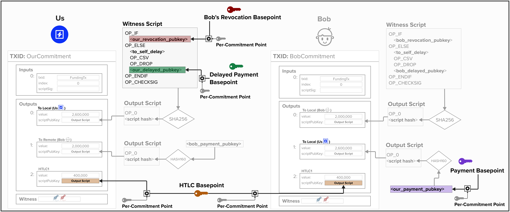
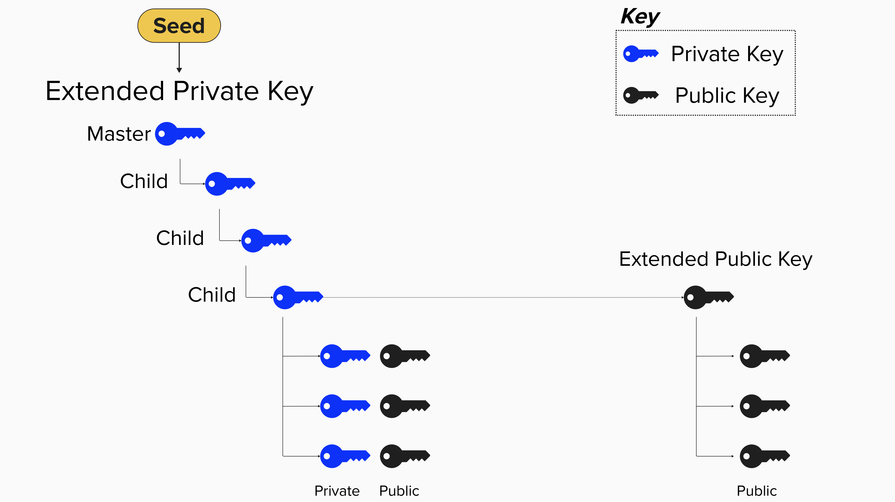
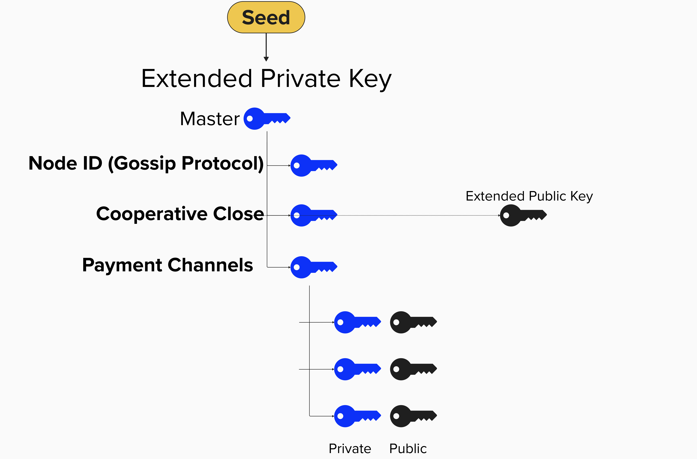
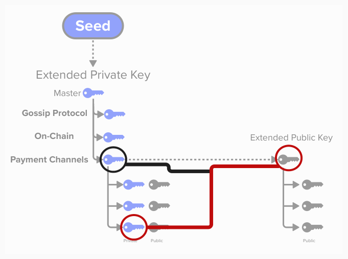
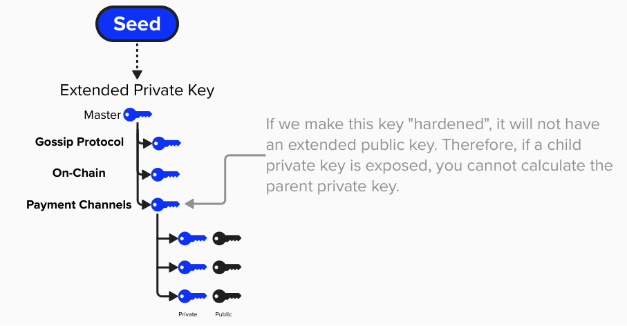
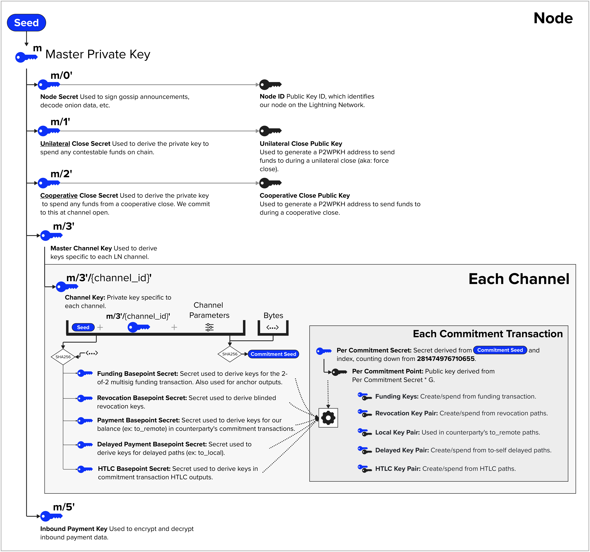

# Off-Chain Lightning Wallet

Okay, things are about to get *funky*.

As you may have heard, the Lightning network makes use of many different keys. To help build our intuition as to what these keys are, let's start by reviewing how they are used.

## Signatures
The beauty of cryptography is that it enables you to *prove* that you know something without revealing that thing. Take a look at the below diagram to see a few different scenarious within the Lightning Network where we will use signatures to prove something.

- **Gossip**: Each node in the Lightning Network is identified via a public key. Since the public key is known by all, we can sign messages with associated private key, enabling others to verify that we produced certain messages. A great example of this is the `channel_announcement` message, which announces public Lightning channel to the network.
- **Payments**: Similar to gossip messages, we can use our node's private key to sign payment invoices. This helps payers validate invoices, ensuring they were indeed created by the node they intend to pay.
- **On-Chain Operations**: When opening or closing channels, we will need to generate signatures for the funding or closing transactions.
- **Channel Management**: Since each Lightning channel states involves creating a new commitment transaction, we will need to be able to produce a new signature for that commitment transaction.

<p align="center" style="width: 50%; max-width: 300px;">
  
</p>


## Public Keys
In addition to signatures, we'll need to make use of many public keys. We already reviewed the fact that we use one public key to identify our node on the Lightning Network. In addition to this key, we'll need to generate new public keys for each Lightning channel. Specifically, for each channel, our node will derive a series of **basepoints** (points on elliptic curve) and **basepoint secrets** (256-bit scalars). We call them **"basepoints"** because these cryptographic primitives are used to create the public/private keys that we place in our Bitcoin transactions, but we do *not* place these primitives themselves within the transaction.  Below is a list of the basepoints and basepoint secrets used in the Lightning Network:
- **Revocation Basepoint + Secret**: Basepoint/Secret used to derive revocation keys.
- **Payment Basepoint + Secret**: Basepoint/Secret used to derive keys for our balance (ex: to_remote) in counterparty's commitment transactions.
- **Delayed Payment Basepoint + Secret**: Secret used to derive keys for delayed paths (ex: to_local).
- **HTLC Basepoint + Secret**: Secret used to derive keys in commitment transaction HTLC outputs.
- **Commitment Seed**: The commitment seed, while not a basepoint, is  a cryptographic primitive that is used in combination to create a new basepoint/secret key pair for each state.

Take a look at the below diagram to see how these **basepoints** relate to the output scripts used in commitment transactions. Note, for simplicity, the HTLC output script is not shown. Also, it's worth noting that `our_revocation_pubkey` will also incorporate **Bob's Revocation Basepoint** and our **Per Commitment Point**, which is derived from the payment channel's **Commitment Seed**.

<p align="center" style="width: 50%; max-width: 300px;">
  
</p>


## BIP 32

So, now that we've reviewed how we will **use** private and public keys in the Lightning Network, let's discuss how we can generate them. To properly understand this, we'll need to start by reviewing **Bitcoin Improvement Proposal (BIP) 32**

BIP 32  describes a **hierarchical deterministic** (HD) wallet structure which introduces the following characteristics to key management:
- **Single Source**: All public and private keys can be derived from a single seed phrase. As long as this single seed phrase is safely secured, you can re-derive the entire wallet.
- **Hierarchical**: All keys and addresses can be organized in a tree structure.
- **Deterministic**: All keys and addresses are generated the same exact way. Each time you restore you wallet from your seed, you'll get the exact same result.

<p align="center" style="width: 50%; max-width: 300px;">
  
</p>

#### Question: In the above diagram, you'll notice there is an "Extended Public Key". What is this key and why is it special?

<details>
  <summary>
    Answer
</summary>

The **Extended Public Key** is special in that it provides the ability to generate an entire tree of public keys *without needing access to the private keys*. Therefore, it's safe to share this key with a third-party, because they cannot derive any private keys from it.

For a real-world example, imagine you run an online website that sells bitcoin socks. To preserve your financial privacy, you would like your website to generate a new bitcoin address for each invoice. One solution would be to create a new private and public key pair for each invoice. This would work, but it would be a pretty complex, inefficient, and error-prone solution.

A better solution would be to initialize an HD wallet with a seed phrase. This is all you need to save. Then, you can derive an extended public key and put that on your website server. The extended public key will be able to derive a new address for each invoice without a private key. Therefore, you can keep the private keys secure and separate from your website server. 

</details>

### Derivation Paths
Another useful property of HD wallets is that you can create unique derivation paths that act as different "accounts" or "use cases" for your keys. For example, in the context of the Lightning Network, we can create new child private keys for the following tasks:
- **Gossip Protocol**: Sign gossip announcements, decode onion data, etc.
- **On-Chain**: Derive private and public keys which can be used to generate outputs that spend from payment channels that are closing such that we now unilaterally control those outputs.
- **Payment Channel**: Derive all of the public and private keys we need to operate a payment channel (ex: revocation key, htlc key, delayed key, etc.). Furthermore, each channel will have its own child key from this derivation path.
<p align="center" style="width: 50%; max-width: 300px;">
  
</p>

### On-Chain / Off-Chain Integrations

<p align="center" style="width: 50%; max-width: 300px;">
  
</p>

#### Question: Imagine the above derivation paths are "normal child private keys". Is there a problem with that derivation construction? Instead, should any of these child private keys be "hardened" keys?
<details>
  <summary>
    Answer
</summary>

Yes, there is a big problem! Every ***normal*** child private key has an associated *extended public key* which can create a series of public keys for this private key. These public keys can be generated independently of the child private keys, which makes it safe to expose this to the public. 
  
However, if any child private key were to be accidentally leaked ***and*** the extended public key were known, then a bad actor could calculate the parent private key and, therefore, derive all child private keys at this level. This would mean that all of our channels would be at risk of being drained.

<p align="center" style="width: 50%; max-width: 300px;">
  
</p>

If, instead, we generate ***hardened*** child private keys, then there will be no associated extended public key. Therefore, if we leak one of our child private keys, only the funds on that specific channel are at risk. The rest of our channels are safe. To protect our LDK node and ensure that any private key leaks are isolated, LDK will derive hardened private keys in most situations.
<p align="center" style="width: 50%; max-width: 300px;">
  
</p>

</details>

Okay, now that we've reviewed BIP 32 and seen how we can create an organized tree of public and private keys, let's see how we can put this theory into practice.

Below is a *mostly* accurate diagram of how LDK organizes Lightning keys for it's default `KeyManger` implementation, which we'll learn about shortly. Some details are abstracted away because the *exact implementation* isn't really important from a learning perspective. For example, the basepoint secrets fall into this category. The overall architecture is described below:

- **Seed**: We kick-start out Lightning wallet by providing a seed. This is just a 32-byte (very large) random number.
- **Hardened Derivation Paths**: From our seed, we create multiple **hardened extended public/private key pairs** for various Lightning operations. Remember, it's important to create hardened devivation paths so that, if we leak private key information for one of the derivation paths, the rest of our Lightning keys are not at risk.
- **Channel Keys**: Okay, this is where the diagram should be taken with a grain of salt (and maybe shot of tequila!). The channel keys (ex: funding basepoint, revocation basepoint, payment basepoint, etc.) in LDK are not, *exactly* created this way. However, this is the *essence* of how they are created. Specifically, each Lightning channel will have its own hardened child private key at the path `m/3'/{channel_id}'` where m is the root of the derivation path. LDK then takes the SHA256 of the channel key along with other information (seed, channel parameters, some additional bytes text) in a **deterministic** way such that you can recreate all of these keys as long as you persist the right information.
- **Commitment Transaction Keys**: So, as you can see, each channel will have its own **basepoints** (public and private keys). Additionally, each commitment transaction will have its own unique keys, which are used for the various scripts we reviewed earlier. These are also produced deterministically, so you can re-generate all of these keys, as long as you persist the right information.

<p align="center" style="width: 50%; max-width: 300px;">
  
</p>

### A Note On BOLT vs Implementations
Since the Lightning network is decentralized, there is no single authority that decides how things are done. Instead, there is an open-source protocol that everyone abides by. This protocol is described in Basis of Lightning Technology (BOLT) documentation. For example, [BOLT 3, Bitcoin Transaction and Script Formats](https://github.com/lightning/bolts/blob/master/03-transactions.md), describes how keys should be derived for commitment transactions. For example, below is the protocol for deriving any of the following public keys (`localpubkey`, `local_htlcpubkey`, `remote_htlcpubkey`, `local_delayedpubkey`, `remote_delayedpubkey`):

```
pubkey = basepoint + SHA256(per_commitment_point || basepoint) * G
```

Notably, the BOLT does ***not*** describe how one should derive the **basepoints** themselves. This is up to the Lightning Implementation to decide. For example, as we saw above, LDK's default `KeyManager` implementation will take the SHA256 of various pieces of data and use that as the entropy needed to create a basepoint. Other implementations are free to choose differently. 


#### Question: Imagine you're running a lightning node. What information needs to be backed up so that you're able to re-derive all of your keys and continue operating your node if it goes offline?

<details>
  <summary>
    Answer
</summary>

(to-do!)

</details>