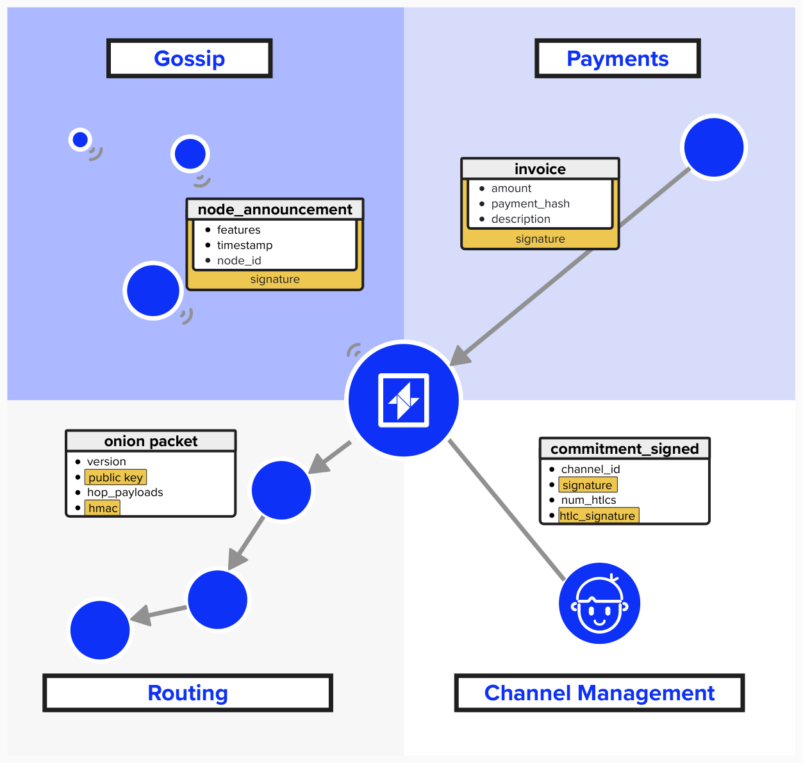
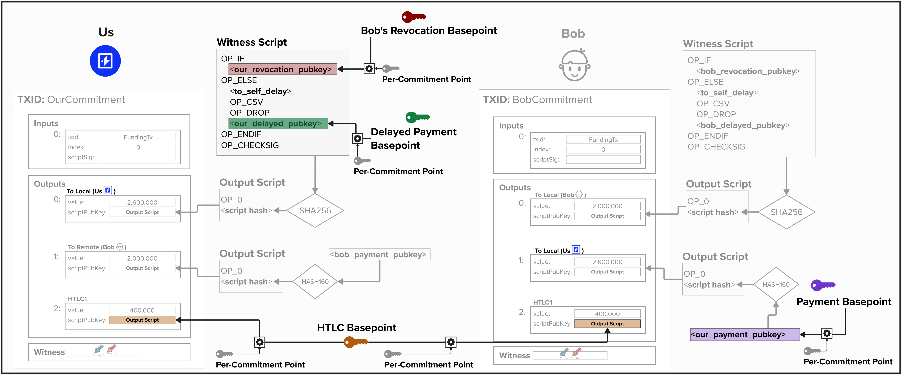
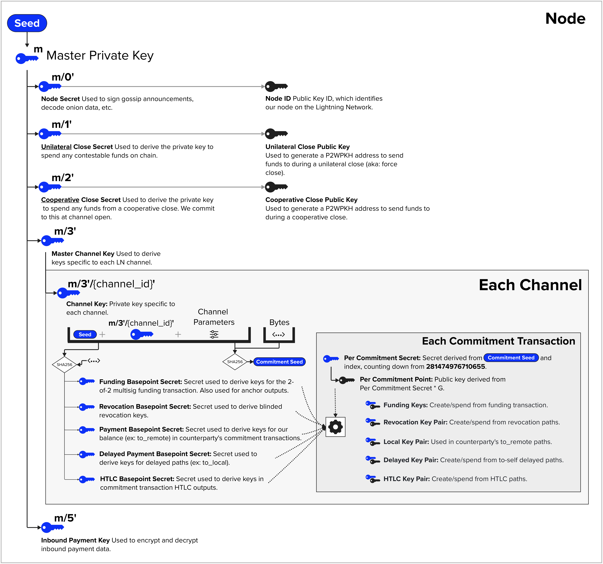

# Off-Chain Lightning Wallet

Okay, things are about to get *funky*.

As you may have heard, the Lightning network makes use of many different keys. To help build our intuition as to what these keys are, let's start by reviewing how they are used.

## Signatures + Verification
The beauty of cryptography is that it enables you to *prove* that you know something without revealing that thing. Take a look at the below diagram to see a few different scenarious within the Lightning Network where we will use signatures to prove or verify something.

- **Gossip**: Each node in the Lightning Network is identified via a public key. Since the public key is known by all, we can sign messages with associated private key, enabling others to verify that we produced certain messages. A great example of this is the `channel_announcement` message, which announces public Lightning channel to the network.
- **Payments**: Similar to gossip messages, we can use our node's private key to sign payment invoices. This helps payers validate invoices, ensuring they were indeed created by the node they intend to pay.
- **Routing**: When routing payments across the Lightning Network, we'll use our off-chain wallet to generate Hash-Based Message Authentication Codes (HMACs) to enable the recipients of the onion payloads to verify the integrity of the message.
- **Channel Management**: Since each Lightning channel states involves creating a new commitment transaction, we will need to be able to produce a new signature for each commitment transaction.

<p align="center" style="width: 50%; max-width: 300px;">
  
</p>


## Public Keys
In addition to signatures, we'll need to make use of many public keys. We already reviewed the fact that we use one public key to identify our node on the Lightning Network. In addition to this key, we'll need to generate new public keys for each Lightning channel. Specifically, for each channel, our node will derive a series of **basepoints** (points on elliptic curve) and **basepoint secrets** (256-bit scalars). We call them **"basepoints"** because these cryptographic primitives are used to create the public/private keys that we place in our Bitcoin transactions, but we do *not* place these primitives themselves within the transaction.  Below is a list of the basepoints and basepoint secrets used in the Lightning Network:
- **Revocation Basepoint + Secret**: Basepoint/Secret used to derive revocation keys.
- **Payment Basepoint + Secret**: Basepoint/Secret used to derive keys for our balance (ex: to_remote) in counterparty's commitment transactions.
- **Delayed Payment Basepoint + Secret**: Secret used to derive keys for delayed paths (ex: to_local).
- **HTLC Basepoint + Secret**: Secret used to derive keys in commitment transaction HTLC outputs.
- **Commitment Seed**: The commitment seed, while not a basepoint, is  a cryptographic primitive that is used in combination to create a new basepoint/secret key pair for each state.

Take a look at the below diagram to see how these **basepoints** relate to the output scripts used in commitment transactions. Note, for simplicity, the HTLC output script is not shown. Also, it's worth noting that `our_revocation_pubkey` will also incorporate **Bob's Revocation Basepoint** and our **Per Commitment Point**, which is derived from the payment channel's **Commitment Seed**.

<p align="center" style="width: 50%; max-width: 300px;">
  
</p>


## BIP 32

So, now that we've reviewed how we will **use** private and public keys in the Lightning Network, let's discuss how we can generate them. To properly understand this, we'll need to start by reviewing **Bitcoin Improvement Proposal (BIP) 32**. To do this, we'll use our on-chain BDK wallet as a guide. 

BIP 32  describes a **hierarchical deterministic** (HD) wallet structure which introduces the following characteristics to key management:
- **Single Source**: All public and private keys can be derived from a single seed phrase. As long as this single seed phrase is safely secured, you can re-derive the entire wallet.
- **Hierarchical**: All keys and addresses can be organized in a tree structure.
- **Deterministic**: All keys and addresses are generated the same exact way. Each time you restore you wallet from your seed, you'll get the exact same result.

### Derivation Paths
Since we initialized our wallet with [BIP84](https://github.com/bitcoin/bips/blob/master/bip-0084.mediawiki) descriptors, it will have the following derivation scheme:

```
m / purpose' / coin_type' / account' / change / address_index
```

Here is how to interpret the above scheme:
- `m`: This is the master extended key for the wallet.
- `/`: Whenever you see this, we are deriving a new child key.
- `purpose'`: The purpose specifies the BIP that the wallet structure supports (ex: BIP84 = P2WPKH). Since there is a `'`, we know this path is hardened.
- `coin_type'`: This represents the cryptocurrency that we're derving keys for. A coin type path was included because it's useful so that hardware wallets can support multiple cryptocurrencies using a single seed. For example, `0` is Bitcoin, `1` is Bitcoin (Not mainint, so testnet, regtest, etc.), `2` is Litecoin. You can see the list [here](https://github.com/satoshilabs/slips/blob/master/slip-0044.md).
- `account'`: This allows wallet users to create separate "accounts" to separate their funds.
- `change`: This field separates into a **receiving** (`0`) index and **change** (`1`) index such that users can generate separate addresses, depending on if they are receiving payments or generating change addresses. NOTE: these are **normal children**, meaning they will have corresponding **extended public keys** which can derive child public keys without needing to know the private key.

<p align="center" style="width: 50%; max-width: 300px;">
  
</p>

#### Question: In the above diagram, you'll notice there is an "Extended Private Key" and "Extended Public Key". What are these?

<details>
  <summary>
    Answer
</summary>

**Extended Private Keys** provide the ability to generate a sequence of private/public key pairs, each capable of producing their own children, forming a tree structure. 

The **Extended Public Key** is special in that it provides the ability to generate an entire tree of public keys *without needing access to the private keys*. Therefore, it's safe to share this key with a third-party, because they cannot derive any private keys from it.

For a real-world example, imagine you run an online website that sells hand made tea sets. To preserve your financial privacy, you would like your website to generate a new bitcoin address for each invoice. One solution would be to create a new private and public key pair for each invoice. This would work, but it would be a pretty complex and error-prone solution.

A better solution would be to initialize an HD wallet with a seed phrase. This is all you need to save. Then, you can derive an extended public key and put that on your website server. The extended public key will be able to derive a new address for each invoice without a private key. Therefore, you can keep the private keys secure and separate from your website server. 

</details>

### BIP32 And Our Lightning Keys
As we saw earlier, our Lightning node is going use keys for a variety of purposes. Since HD wallets allow us to separate keys into groups, you could imagine us creating the following wallet structure.
- **Gossip Protocol**: Sign gossip announcements, decode onion data, etc.
- **On-Chain**: Derive private and public keys which can be used to generate outputs that spend from payment channels that are closing such that we now unilaterally control those outputs.
- **Payment Channel**: Derive all of the public and private keys we need to operate a payment channel (ex: revocation key, htlc key, delayed key, etc.). Furthermore, each channel will have its own child key from this derivation path.
<p align="center" style="width: 50%; max-width: 300px;">
  
</p>

#### Initializing Our Lightning Wallet
LDK comes with a default implmentation, `KeysManager`, which handles the key management and cryptographic operations for our off-chain Lightning needs. To initialize it, all we have to do is pass in a 32 byte seed.

To generate our seed, we have a few options. Below are two:
  1. We could always create a new seed for our Lightning application. That said, this wouldn't be ideal, as we'd now have to keep track of two seeds.
  2. Another option is to use 32 bytes from a child key from our BIP32 on-chain wallet. This way, we would only have to remember one seed for our entire application.

<p align="center" style="width: 50%; max-width: 300px;">
  
</p>

#### Question: What security risk is exposed when using the "normal" child key from the receive derivation path?

<details>
  <summary>
    Answer
</summary>

If we used the ***normal*** child private key as the entropy to seed our off-chain wallet, we'd be putting our on-chain funds at risk! This is because every ***normal*** child private key has an associated **extended public key** which can create a series of public keys for this private key *without requiring knowledge of the private key*. This can be quite useful in situations where you want to provide a 3rd party or public server with the ability to generate receive address on your behalf, but you don't want them to know the private key. 

The big security issue here is that, if any child private key were to be accidentally leaked ***and*** the extended public key were known, then a bad actor could calculate the parent private key and, therefore, **derive all child private keys at this level**. If this happened, all of our on-chain receieve addresses would be vulnerable and could be drained. 

<p align="center" style="width: 50%; max-width: 300px;">
  
</p>

To mitigate this risk, it's recommended to use a ***hardened*** child private key at an entirely different index. For example, `535`.

</details>

### On-Chain / Off-Chain Integrations
Now that we've seen, at a high level, what our off-chain wallet will be responsible for, let's see how we can responsibly integrate our on-chain and off-chain wallet.

First, we'll create a **hardened child key** at index `m/535'`, safely separating our off-chain wallet from our on-chain one.

<p align="center" style="width: 50%; max-width: 300px;">
  
</p>

Next, we can use the private key from the hardened child key as the seed to generate a new HD wallet, which will be responsible for all of the keys used for our Lightning node. 

Below is a *mostly* accurate diagram of how LDK organizes Lightning keys for its default `KeyManger` implementation. Some details are abstracted away because the *exact implementation* isn't really important from a learning perspective. For example, the basepoint secrets fall into this category. The overall architecture is described below:

- **Seed**: We kick-start out Lightning wallet by providing a seed.
- **Hardened Derivation Paths**: From our seed, we create multiple **hardened extended public/private key pairs** for various Lightning operations. 
- **Channel Keys**: Okay, this is where the diagram should be taken with a grain of salt (and maybe shot of tequila!). The channel keys (ex: funding basepoint, revocation basepoint, payment basepoint, etc.) in LDK are not, *exactly* created this way. However, this is the *essence* of how they are created. Specifically, each Lightning channel will have its own hardened child private key at the path `m/3'/{channel_id}'`. LDK then takes the SHA256 of the channel key along with other information (seed, channel parameters, some additional bytes) in a **deterministic** way such that you can recreate all of these keys.
- **Commitment Transaction Keys**: Each channel will have its own **basepoints** (public and private keys). Additionally, each commitment transaction will have its own unique keys, which are used for the various scripts we reviewed earlier. These are also produced deterministically, so you can re-generate all of these keys.

<p align="center" style="width: 50%; max-width: 300px;">
  
</p>

## Code Review
Now that we've reviewed all this theory, let's see how we can put into practice!

Within `main.rs` you'll see the below code. It's brief, but it's powerful. In it, you can see that we begin by obtaining the extened private key with the same seed we used to generate our BDK wallet. We then derive the hardened child key at index 535, which we pass into our LDK `KeysManager` to initialize our off-chain keys.

```rust
// Generate master xprv from seed and network
let xprv = Xpriv::new_master(args.network, &keys_seed).unwrap();

// Set hardened index 535 (T9 for "LDK") for LDK-specific key
let ldk_child_number = ChildNumber::Hardened { index: 535 };

// Derive hardened child xprv at m/535' for LDK
let ldk_xprv = xprv.derive_priv(&secp, &ldk_child_number).expect("Your RNG is busted");

// Extract 32-byte private key from LDK xprv for KeysManager seed.
let ldk_seed: [u8; 32] = ldk_xprv.private_key.secret_bytes();

// Get current time since UNIX epoch for LDK KeysManager.
let cur = SystemTime::now().duration_since(SystemTime::UNIX_EPOCH).unwrap();

// Create LDK KeysManager with seed and timestamp, wrapped in Arc for thread safety.
let keys_manager = Arc::new(KeysManager::new(&ldk_seed, cur.as_secs(), cur.subsec_nanos()));
```

### A Note On BOLT vs Implementations
Since the Lightning network is decentralized, there is no single authority that decides how things are done. Instead, there is an open-source protocol that everyone abides by. This protocol is described in Basis of Lightning Technology (BOLT) documentation. For example, [BOLT 3, Bitcoin Transaction and Script Formats](https://github.com/lightning/bolts/blob/master/03-transactions.md), describes how keys should be derived for commitment transactions. For example, below is the protocol for deriving any of the following public keys (`localpubkey`, `local_htlcpubkey`, `remote_htlcpubkey`, `local_delayedpubkey`, `remote_delayedpubkey`):

```
pubkey = basepoint + SHA256(per_commitment_point || basepoint) * G
```

Notably, the BOLT does ***not*** describe how one should derive the **basepoints** themselves. This is up to the Lightning Implementation to decide. For example, as we saw above, LDK's default `KeyManager` implementation will take the SHA256 of various pieces of data and use that as the entropy needed to create a basepoint. Other implementations are free to choose differently. 


#### Question: Imagine you're running a lightning node. What information needs to be backed up so that you're able to re-derive all of your keys and continue operating your node if it goes offline?

<details>
  <summary>
    Answer
</summary>

(to-do!)

</details>