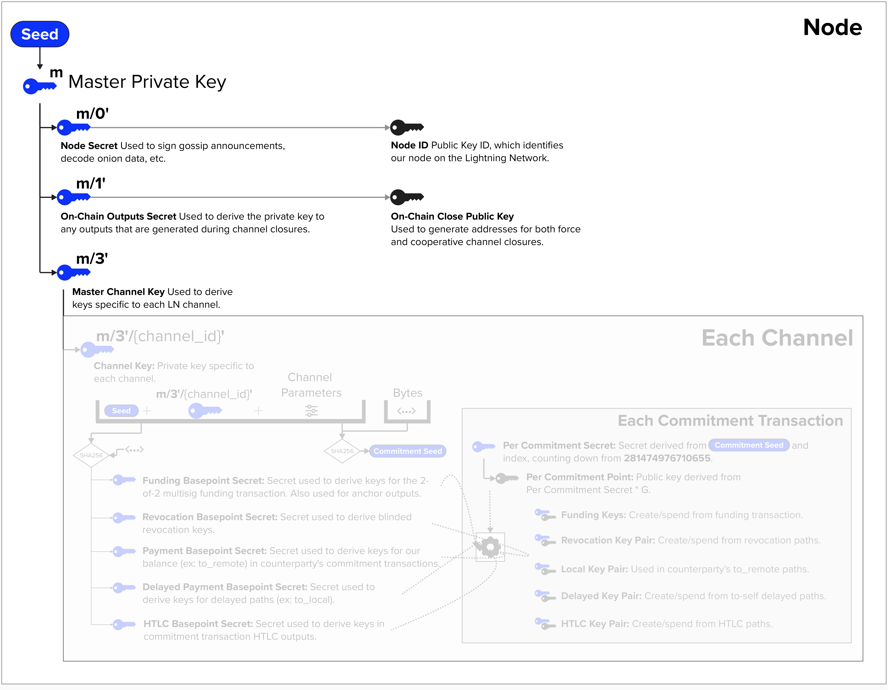
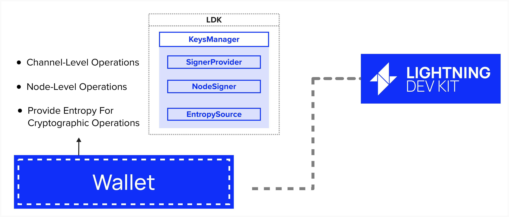

# Build A Key Manager

So, now that we have an idea of how a Lightning off-chain wallet might be organized, let's create a structure to hold these keys. Once created, we can add additional functions to conduct signing operations with the respective keys.

For this exercise, we'll create a `NodeKeysManager` struct which will contain the following fields:

```rust
pub struct NodeKeysManager {
    pub secp_ctx: Secp256k1<secp256k1::All>,
    pub node_secret: SecretKey,
    pub node_id: PublicKey,
    pub unilateral_close_pubkey: PublicKey,
    pub coop_close_pubkey: PublicKey,
    pub channel_master_key: Xpriv,
    pub inbound_payment_key: SecretKey,
    pub channel_child_index: u32,
    pub seed: [u8; 32],
}
```

To complete this exercise correctly, you'll need to create keys that have the same derrivation paths as the keys in LDK. As a reminder, you can find the derivation paths in the image below. We won't be implementing the keys that are shaded out, such as the channel-specific keys.

<p align="center" style="width: 50%; max-width: 300px;">
  
</p>


Additionally, you will need to implement the right type of key (ex: extended private key, private key, public key, extended public key). The correct expected types can be seen in the `NodeKeysManager` structure definition above.

## ⚡️ Implement the new constructor For Our NodeKeysManager

Head over to your exercises file, and let's implement the `new` constructor. Recall, a constructor is similar to a method, in that they're both functions, but a constructor is a special funtion that initializes a new instance of a type. This will take a 32-byte seed as in input and return a `NodeKeysManager` strucure that meets the above requirement types for each component.

```rust
impl NodeKeysManager {
    pub(crate) fn new(seed: [u8; 32]) -> NodeKeysManager {
        // Step 1: Create Secp256k1 context
        let secp_ctx = Secp256k1::new();

        // Step 2: Derive master private key

        // Step 3: Derive node secret key

        // Step 4: Derive destination key and convert to extended public key

        // Step 5: Compute node ID

        // Step 6: Derive channel master key
 
        // Step 7: Construct NodeKeysManager

    }
}
```
<details> <summary> Step 1: Create Secp256k1 Context </summary>

Initialize a `Secp256k1` context for cryptographic operations like key derivation and public key generation.

```rust
let secp_ctx = Secp256k1::new();
```
- `Secp256k1::new()` creates a new context with all capabilities enabled (`secp256k1::All`).
- This context is used for all subsequent cryptographic operations.

</details>

<details> <summary> Step 2: Derive Master Private Key </summary>
    
Generate a BIP-32 master private key from the provided 32-byte seed for the Regtest network.

```rust
let master_key = match Xpriv::new_master(Network::Regtest, seed) {
    Ok(key) => key,
    Err(_) => panic!("Your RNG is busted"),
};
```
- `Xpriv::new_master(Network::Regtest, seed)` derives the master extended private key.
- Panics on error (e.g., invalid seed); in production, return an error instead.

</details>

<details> <summary> Step 3: Derive Node Secret Key </summary>
    
Derive a private key at hardened index 0 to serve as the node’s secret key.

```rust
let node_secret = master_key
    .derive_priv(&secp_ctx, &ChildNumber::from_hardened_idx(0).unwrap())
    .expect("Your RNG is busted")
    .private_key;
```
- `ChildNumber::from_hardened_idx(0)` specifies the hardened derivation path `m/0'`.
- `.derive_priv` derives the child private key using the Secp256k1 context.
- `.private_key` extracts the raw `secp256k1::SecretKey`.
- Panics on error (in production, handle gracefully).

</details>

<details> <summary> Step 4: Derive Destination Key and Convert to Public Key </summary>
    
Derive a private key at hardened index 2 and convert it to an extended public key for destination scripts.

```rust
let destination_key = master_key
    .derive_priv(&secp_ctx, &ChildNumber::from_hardened_idx(2).unwrap())
    .expect("Your RNG is busted");
let destination_xpub = Xpub::from_priv(&secp_ctx, &destination_key);
```
- Derive at `m/2'` to get `destination_key` (an `Xpriv`).
- `Xpub::from_priv` converts the private key to an extended public key (`Xpub`).
- The public key is used for scripts like on-chain outputs.

</details>

<details> <summary> Step 5: Compute Node ID </summary>
    
Generate the node’s public key (node ID) from the node secret key.

```rust
let node_id = PublicKey::from_secret_key(&secp_ctx, &node_secret);
```
- `PublicKey::from_secret_key` computes the public key corresponding to `node_secret`.
- The `node_id` is used to identify the node in the Lightning network.

</details>

<details> <summary> Step 6: Derive Channel Master Key </summary>
    
Derive a private key at hardened index 3 to serve as the channel master key for channel-related operations.

```rust
let channel_master_key = master_key
    .derive_priv(&secp_ctx, &ChildNumber::from_hardened_idx(3).unwrap())
    .expect("Your RNG is busted");
```
- Derive at `m/3'` to get `channel_master_key` (an `Xpriv`).
- This key is used as the root for deriving channel-specific keys.
- Panics on error (in production, handle gracefully).

</details>

<details> <summary> Step 7: Construct NodeKeysManager </summary>
    
Construct the `NodeKeysManager` instance with all initialized fields.

```rust
NodeKeysManager {
    secp_ctx,
    node_secret,
    node_id,
    destination_xpub,
    channel_master_key,
    channel_child_index: 0,
    seed,
}
```
- `channel_child_index: Initialize channel index at 0.
- All fields are moved into the struct, ensuring the manager is fully initialized.

</details>

# LDK Key Management Interfaces

So, we've just implemented a `NodeKeysManager`, but, as you can see, it would be quite a lof of work to implement all of the functionality to sign gossip messages, invoices, transactions, etc.

To assist with this, LDK provides a simple default `KeysManager` implementation for handing cryptographic operations at both the node-level (ex: signing gossip messages) and the channel-level (ex: generating child keys for each Lightning channel and signing commitment transactions). The `KeysManager` can be initialized with a 32-byte seed, which is used as a BIP 32 extended key.

For those who wish to implement their own Key Management, the below LDK traits are available to you. Note that the `KeysManager` interface will implement these traits for you by default.

- `NodeSigner`: Handles node-level operations such as signing gossip messages/invoices and generating shared secrets for encrypting onion messages.
- `SignerProvider`: Creates channel-specific signers and derives channel-specific keys. 
- `EntropySource`: Provides cryptographically secure random numbers for signatures and key generation. Developers who wish to implement their own random number generator algorithms or other customizations can implement the `EntropySource` trait themselves.

<p align="center" style="width: 50%; max-width: 300px;">
  
</p>