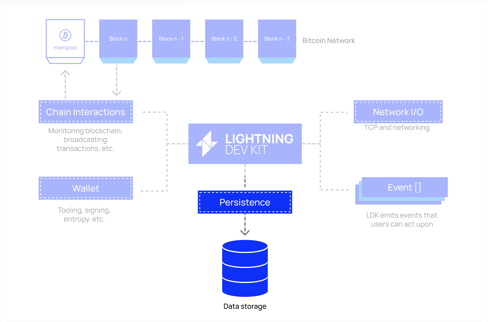
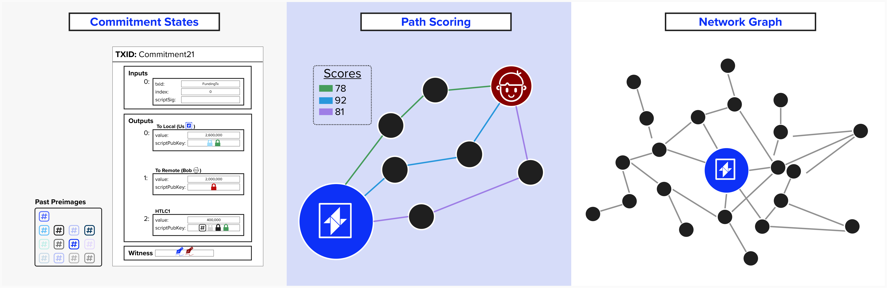
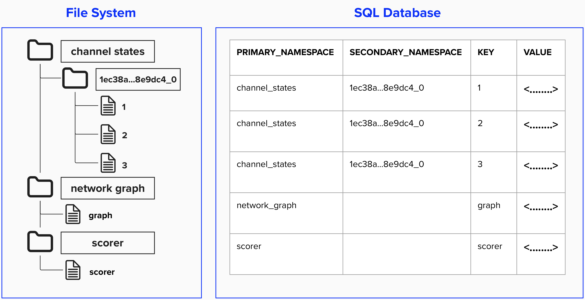
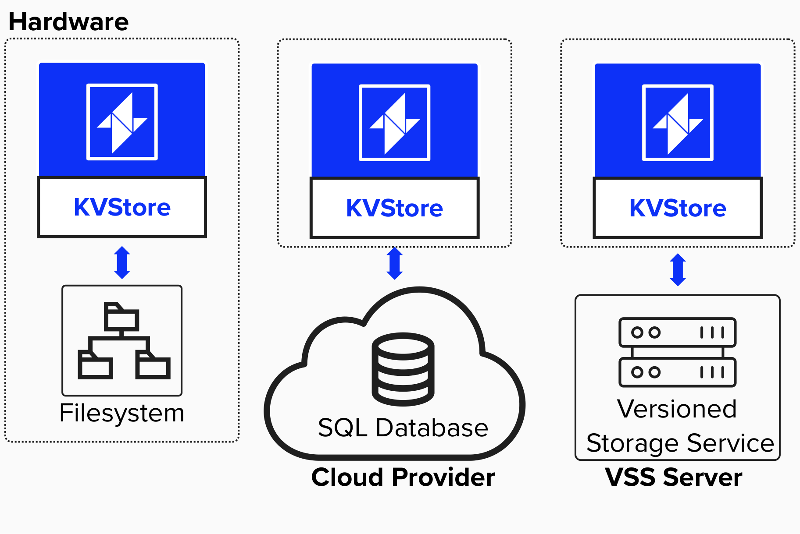
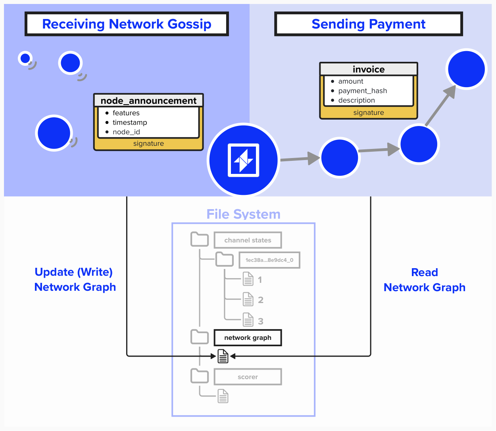
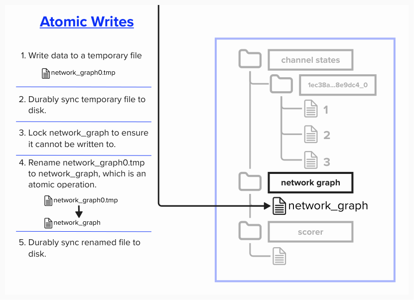

# Persisting Data

We're making great progress on building our node, however, we're missing an important step. If our node goes offline or crashes and we don't have data persisted, we're in BIG trouble.

<p align="center" style="width: 50%; max-width: 300px;">
  
</p>

#### Question: What information will we need to ensure we save so that our node can safely operate, even after a crash or shutdown?

<details>
  <summary>
    Answer
</summary>

<p align="center" style="width: 50%; max-width: 300px;">
  
</p>

To regenerate all of the transactions for each state, we're going to need to be able to rederive all of the keys. 

Since we're Alice in this example, we can rederive our keys with our seed, since everything after that is determininistically coded in our node's software. That said, we will need to know how many channel states our node has advanced, as each channel state will generate its own unique keys using the **per-commitment secret**. As long as we know the index of the current channel state, we will be able to rederive our channel keys.

In addition to payment related data, we'll have to store any route scoring and network graph information so that we can resume payment opperations immediately upon restarting our node.

</details>

## Implementing Our Storage

Hopefully, we now understand just how important data persistance is. If our node crashes and we don't have our data persisted, we may lose all of our funds.

Let's fix that by building data storage capabilities for our Lightning node. To do this, LDK provides a general `KVStore` (**Key-Value**) storage abstraction that can be connected to a variety of storage solutions such as Google Drive, iCloud, a local disk, or any key-value database. Each **key** will be unique, and it will serve as an identifier for some value (data) we are persisting. Under the hood, LDK will leverage our `KVStore` to persist channel state data, graph data, scoring data, and more.

<details>
	<summary>Click to see the KVStore Trait Definition</summary>
	
```rust
pub trait KVStore {
		// Required methods
		fn read(
				&self,
				primary_namespace: &str,
				secondary_namespace: &str,
				key: &str,
		) -> Result<Vec<u8>, Error>;
		fn write(
				&self,
				primary_namespace: &str,
				secondary_namespace: &str,
				key: &str,
				buf: &[u8],
		) -> Result<(), Error>;
		fn remove(
				&self,
				primary_namespace: &str,
				secondary_namespace: &str,
				key: &str,
				lazy: bool,
		) -> Result<(), Error>;
		fn list(
				&self,
				primary_namespace: &str,
				secondary_namespace: &str,
		) -> Result<Vec<String>, Error>;
}
```

</details>

Two major benefits of the **Key-Value** design choice are the following:
1) **Universal Interface**: A Key-Value storage abstraction provides a simple interface to read/write any type of data that needs to be persisted. As we saw in our motivating example, this can be channel states, network graphs, or scoring information (used for identifying the ideal route).
2) **Implementation Flexibility**: By abstracting our persistance into a Key-Value interface, it becomes easier to change the storage solution without having to re-design our Lightning node's architecture. For example, when migrating from a local file system to a SQL database, much of the migration code will be contained in the `KVStore` implementation.

### Organizing Our Data

We'll add some organization to our Key-Value storage by adding **primary** and **secondary namespaces**. These will help organize our storage into separate sections and avoid key collisions.

To show how **namespaces** and a **key-value** storage solution allows us to create a flexible persistance solution, look at the example storage solutions below.

One uses a **File System** to store data, while the other uses a **SQL Database**. Take a moment to compare the two solutions and verify that that are, in fact, storing the same data using the following strucutre:

```
primary_namespace / secondary_namespace / key / value
```

<p align="center" style="width: 50%; max-width: 100px;">
  
</p>

### Picking Our Solution
As you can imagine, there are a variety of storage solutions available to us when building our node. Of course, they each come with trade-offs. Let's take a moment to review a few before implementing a storage solution of our own.

<p align="center" style="width: 50%; max-width: 100px;">
	
</p>

#### Question: What are the pros/cons of storing all your data on a local file system running on the same hardware as your node? What happens if you lose your device?
<details>
	<summary>
		Answer
</summary>

One storage option that is available to us is to simply use our local file system to store data. A major pro here is that read/write will be quite fast, and we don't have to worry about network latency and setting up a storage solution on another server, which may increase architectural complexity.

That said, there are a few cons that make using a local file system non-ideal as the *primary* storage solution for robust, production-ready lightning nodes. The first is that you are entirely dependent on your hardware. If it breaks or you lose it, then you may be unable to access your funds. Remember, even if you have access to your seed, which allows you to regenerate all of your channel keys, you still need other information to reclaim your funds (ex: current commitment number, channel partner's public key and signatures, any preimage hashes used, etc.).

Another downside of using the local filesystem is that you'll have to implement atomic read/writes yourself (more on this soon!). This is absolutely vital in the context of Lightning, as you cannot agree to move to a new channel state unless you're sure you've durably persisted relavent data first. Otherwise, you run the risk of corrupting your Lightning node data, which can lead to losing your channel funds.

With all that said, you can certainly combine storage solutions. For example, perhaps you choose to store the network graph locally on the file system so that it's quick to read/write to.

</details>


#### Question: What are the pros/cons of storing your data in a remote SQL server? Are there any extra considerations you would make for privacy?
<details>
	<summary>
		Answer
</summary>

Storing data in a remote SQL server introduces its own set of pros and cons.

On the pro side, SQL is well-known for its ACID (Atomicity, Consistency, Isolation, and Durability) guarentees. This means you don't have to impliement the atomic write capabilities, which we need to do when writing to disk.

Another pro is that, by hosting the data remotely, we remove the risk of having our Lightning node hardware be a single-point of failure. That's a big win!

Now, let's briefly discuss some cons - especially as it relates to privacy. First, since we're storing data on a remote server, we'll probably want to encrypt it such that the remote server is unable to read it - especially since it's payment data. This means we'll have to implement extra functionality to encrypt the data on the client side before sending it to the server. We may also want to obfuscate the key (remember, we persist data using key-value pairs) such that a third party cannot learn usage data about our application.

From a security perspective, we'll want to implement some type of authorization such that only authorized clients can interact with our SQL server.

Another con of implementing a remote SQL server is that we'll have to take extra special care if we want multiple devices to share data and access to the database. This requires implementing *versioned* storage, where each piece of data has a version number that must match expected values during updates, preventing conflicting simultaneous changes from corrupting your data.

</details>


#### Question: What are the pros/cons of using a Versioned Storage Service (VSS)? If you're unfamiliar, you can take a moment to read about it [here](https://lightningdevkit.org/blog/announcing-vss/) before answering.
<details>
	<summary>
		Answer
</summary>

Version Storage Service (VSS) is specifically designed to alleviate many of the cons that Lightning developers experience when trying to build robust storage solutions.

VSS accomplishes this by providing many out-of-the-box features that developers can leverage to make their storage more secure, private, and robust so that it can support multiple devices accessing it. Below are a few of the features:
- **Client-Side Encryption**: VSS encrypts all data on the client side before sending it to the server, ensuring that unauthorized parties cannot read the data.
- **Key Obfuscation**: Recall, LDK data is persisted in a key-value manner. Client-side encryption will ensure that the `value` is encrypted, but it doesn't obscure the `key`. If this is left in plaintext, then a 3rd party could analyze usage patterns for our application. For instance, when new channels are created, LDK will save channel-specific data in under a `monitor` key. To preserve private, VSS will deterministically obfuscate this key so that all monitor is saved under something that appears random, such as `1Fas31...2MZak9`.
- **Versioned Updates**: This is a big one! To ensure multiple devices can access the storage safely while mitigating concurrent writes, VSS implements versioning. So for example, assume two mobile devices (A and B) attempt to write data to the storage at the same time. Before writing data, both devices think the VSS storage is a version 8. A's request reaches the VSS server first, incrementing the version to 9. However, when B's request arrives, it will fail because the VSS server is now at version 9, so device B will know that something has changed. It will then fetch any necessary data to ensure it can still perform the action, and try again with the updated version number.
- **Authorization**: VSS also supports JSON Web Token (JWT) and LNURL authorization, ensuring that only authorized devices can interact with the server.

You'll notice the list of pros here is quite long! This is because VSS was specifically designed to resolve many downsides of alternative storage solutions. That said, VSS is still in development, so it's earleir in its adoption cycle. Also, implementing VSS is more complex than a simple local SQL server or file system, but the trade-off is worth it to many developers who want robust security, privacy, and interoperability across devices.

</details>


## Implementing A File System Storage Solution

Great, at this point we've reviewed how LDK enables persistent storage and discussed a few of the options available to us. For this workshop, we're going to use our local file system to persist our Lightning node's data. Before digging into the code, let's use this as an opportunity to review some important properties that our storage solution needs to support.

### Concurrent storage
Imagine our Lightning node finds itself in a place where both of the below actions are happening at once:
1) We are receiving a `node_announcement`, informing us of a new node that has joined the network. In this case, we need to **write** data to our storage solution, updating the network graph.
2) We are sending a payment, so we need to **read** data from our network graph so that we can identify the best route for this payment.

<p align="center" style="width: 50%; max-width: 100px;">
  
</p>

#### Question: What could go wrong?
<details>
  <summary>
    Answer
</summary>

In the above scenario, we find ourselves seeking to write and read data from the same location concurrently. This can pose a variety of problems, such as:
1) **Data Race Conditions**: If the write operation has not fully completed when the read operation begins, we may read partially-updated data.
2) **Failed Updates**: This is not necessarily clear in the above graphic, but the **write** operation could fail, leaving the graph in an invalid state. We need to make sure that write operations are *atomic*, ensuring they either fail or succeed. This is vital for Lightning, as our node *must* ensure that data is persisted correctly before advancing channel state.

To mitigate these issues we'll implement a storage solution that ensures:
- No thread can write to the data while it's being read
- No thread can read to the data while it's being written
- Multiple threads can read from the data simultaneously

Together, these will ensure that our storage solution is thread-safe (preventing data races), concurrent, and memory safe.

</details>

### Atomic Operations
As we saw above, we have to be very careful when building our file system storage solution. If we find ourselves in a race condition or failed update, our node may lose data, which, in the context of the Lightning Network, can lead to a loss of funds.

To ensure that our data is properly updated, we'll make use of two important tools:
- **Locks**: When dealing with software that utilizes shared resources such as a storge solution, we need to make sure that multiple resources do not try to write to a given file at the same time or that a resource does not attempt to read from a file while it's being written to. To prevent this, we "lock" file. Below are two important locking types:
	- **Mutual Exclusion (Mutex)**: Only one thread can own a mutex at a time. If another thread attempts to aquire the mutex, it will be blocked until the mutex is released.
	- **Read-Write Lock**: This lock allows for either multiple concurrent readers OR on exclusive writer. 
- **Atomic Operations**: To ensure that our data updates either entirely succeed or fail, we'll make use of the following Unix standard for atomic file updates.
    - **Step 1. Temporary File**: Write data to a temporary file, ensuring the original file remains intact during the write.
    - **Step 2. Durably Persist**: Call `sync_all` on the temporary file, ensuring the data is durable before proceeding.
    - **Step 3. Atomic Rename**: The rename operation atomically replaces the old file with the new one, guaranteeing an all-or-nothing update.
    - **Step 4. Directory Sync**: Sync the parent directory to ensure the rename is reflected in the file system metadata.

<p align="center" style="width: 50%; max-width: 100px;">
  
</p>

## Implementing Thread-Safe Storage

Now that we understand both the structural requirements (key-value store with namespaces) and safety requirements (concurrent access protection) for our Lightning node's storage, let's build a `FilesystemStore` implementation that satisfies both! For this exercise, we'll use our Repl's internal file system.

We'll start by defining a `FilesystemStore` structure. As we reviewed earlier, we'll need to implement LDK's `KVStore` trait, which defines the crucial methods that we must implement so that LDK knows how to use our `FilesystemStore` to properly save our Lightning node's data.

Each field in the below struct serves a specific purpose. Don't worry if these seem confusing to you! We'll work through them together.
- `data_dir`: This is the base directory where all of our files will be stored. It's the type `PathBuf`, which is part of Rust's standard library, and it provides some useful methods for system paths such as `.parent()`, `.push()`, and `.file_name()`. You can read more about it [here](https://doc.rust-lang.org/std/path/struct.PathBuf.html).
- `tmp_file_counter`: Thread-safe counter for generating unique temporary file names during atomic writes, like `network_graph.0.tmp`. It's vital that this is thread-safe, as we need to ensure that, even if we have multiple threads accessing the FilesystemStore at the same time, we can still create a unique counter across all threads to avoid filename clashes.
- `gc_counter`: A thread-safe counter that tracks how many operations (like reads or writes) we’ve performed. It’s used to decide when to clean up unused resources, keeping our program memory-efficient. For example, after every 25 operations, we’ll remove locks that are no longer needed.
- `locks`: This field helps manage access to files so multiple threads can work safely at the same time. It’s a `Mutex` (a lock) protecting a `HashMap`, where each entry maps a file path (like `.ldk/network_graph`) to another lock (`RwLock`). This setup ensures threads don’t interfere with each other — multiple threads can read a file at once, but only one can write to it, keeping our data safe and consistent.

```rust
pub struct FilesystemStore {
	data_dir: PathBuf,
	tmp_file_counter: AtomicUsize,
	gc_counter: AtomicUsize,
	locks: Mutex<HashMap<PathBuf, Arc<RwLock<()>>>>,
}
```

Our `FileStore` already has a `new` constructor, which we've seen a few times now. If you look in `src/fs_store.rs`, you'll see a few other helper methods related to garabge collection and getting destination directory paths.

```rust
impl FilesystemStore {
	/// Constructs a new [`FilesystemStore`].
	pub fn new(data_dir: PathBuf) -> Self {
		let locks = Mutex::new(HashMap::new());
		let tmp_file_counter = AtomicUsize::new(0);
		let gc_counter = AtomicUsize::new(1);
		Self { data_dir, tmp_file_counter, gc_counter, locks }
	}
    
    ....
}
```

### ⚡️ Implement `write` for our `FilesystemStore`

For this exercise, let's implement the `write` function. This function will take the namespace and key information along with the data (value) to write to the provided location. To implement this correctly, we're going to have to piece together all of the information we learned above. For example, we'll need to perform atomic writes by creating a temporary data file, writing data to it, persisting that data, renaming the file, and then syncing our entire data directory. Additionally, we'll also have to lock the file we wish to edit before performing this update, ensuring that we don't run into any data races.

As you can see below, this function will return a `Result` type. This is important, as we will need to know if our write operation is successful or not so that we can act accordingly. From a Lightning context, we will want to program our Lightning node to *not* advance channel states unless updates are successfully persisted. The `Result` data type can help us do this.

```rust
impl KVStore for FilesystemStore {
	fn read(
		&self, primary_namespace: &str, secondary_namespace: &str, key: &str,
	) -> lightning::io::Result<Vec<u8>> {
		// not displayed, for simplicity
		// see src/fs_store.rs
	}

	fn write(
		&self, primary_namespace: &str, secondary_namespace: &str, key: &str, buf: &[u8],
	) -> lightning::io::Result<()> {
		
		// Validate that the namespace and key parameters meet LDK's storage requirements
		check_namespace_key_validity(primary_namespace, secondary_namespace, Some(key), "write")?;

		// Construct the full path where the file will ultimately live
		// Example: data_dir/primary/secondary/key
		let mut dest_file_path = self.get_dest_dir_path(primary_namespace, secondary_namespace)?;
		dest_file_path.push(key);

		// Get the parent directory path and handle potential errors
		// This is needed for creating directories and syncing later
		let parent_directory = dest_file_path.parent().ok_or_else(|| {
				let msg = format!("Could not retrieve parent directory of {}.", dest_file_path.display());
				std::io::Error::new(std::io::ErrorKind::InvalidInput, msg)
		})?;
		// Create all necessary directories in the path if they don't exist
		fs::create_dir_all(&parent_directory)?;

		// Step 1. Create a Temporary File Path

		// Step 2. Write Data to the Temporary File

		// Step 3. Lock the File for Safe Writing

		// Step 4. Rename the Temporary File Atomically

		// Step 5. Sync the Parent Directory

				Ok(())
		};

		// Clean up any unused locks periodically
		self.garbage_collect_locks();

		// Return the result
		res
	}

	fn remove(
		&self, primary_namespace: &str, secondary_namespace: &str, key: &str, lazy: bool,
	) -> lightning::io::Result<()> {
        // not displayed, for simplicity
        // see src/fs_store.rs
	}

	fn list(
		&self, primary_namespace: &str, secondary_namespace: &str,
	) -> lightning::io::Result<Vec<String>> {

        // not displayed, for simplicity
        // see src/fs_store.rs

	}
}

```
<details> <summary> Step 1: Create a Temporary File Path </summary>
	
To write our data safely (in an atomic way), we first write to a temporary file, then rename it to the final file. This ensures we don’t corrupt the original file if something goes wrong. We’ll create a unique temporary file path by cloning the `dest_file_path` and adding a `.tmp` extension with a counter from `tmp_file_counter`.

```rust
let mut tmp_file_path = dest_file_path.clone();
let tmp_file_ext = format!("{}.tmp", self.tmp_file_counter.fetch_add(1, Ordering::AcqRel));
tmp_file_path.set_extension(tmp_file_ext);
```

- `tmp_file_counter` is a thread-safe counter (AtomicUsize) that ensures each temporary file has a unique name (e.g., `network_graph.0.tmp`, `network_graph.1.tmp`).
- `fetch_add(1, Ordering::AcqRel)` safely increments the counter, even if multiple threads are writing at the same time.

</details>


</details> <details> <summary> Step 2: Write Data to the Temporary File </summary>
	
Now, we’ll create the temporary file, write our data to it, and ensure the data is safely on disk. We use `fs::File::create` to make the file, write the data with `write_all`, and then call `sync_all` to make sure the data is physically written to disk (not just in memory).

```rust
{
		let mut tmp_file = fs::File::create(&tmp_file_path)?;
		tmp_file.write_all(&buf)?;
		tmp_file.sync_all()?;
}
```
- The `{}` block ensures the file is closed automatically after we’re done (Rust’s way of managing resources).
- `mut` makes the `tmp_file` mutable because we’ll change its state by writing data.
- `write_all(&buf)` writes the data we passed to the `write` method (stored in `buf`).
- `sync_all()` (like `fsync` on `Unix`) ensures the data is durable on disk, so it won’t be lost if the system crashes.
- The `?` operator catches any errors and returns them if something goes wrong.

</details>

</details> <details> <summary> Step 3: Lock the File for Safe Writing </summary>
	
To prevent other threads from accessing the file while we’re updating it, we need to lock it. Our `FilesystemStore` has a `locks` field (a `Mutex` protecting a `HashMap` of file paths to locks). We’ll acquire a write lock for our `dest_file_path` to ensure exclusive access during the rename.

```rust
let res = {
let inner_lock_ref = {
		let mut outer_lock = self.locks.lock().unwrap();
		Arc::clone(&outer_lock.entry(dest_file_path.clone()).or_default())
};
let _guard = inner_lock_ref.write().unwrap();
// ... (next steps will go here)
```
- `self.locks.lock().unwrap()` locks the `Mutex`, letting us safely access the `HashMap` inside.
- `outer_lock.entry(dest_file_path.clone()).or_default()` gets or creates a lock for our file path.
- `Arc::clone` makes a thread-safe copy of the lock so we can use it.
- `inner_lock_ref.write().unwrap()` acquires a write lock, ensuring no other thread can read or write this file while we’re updating it.
- The `{}` blocks ensure we release the `Mutex` and hold the write lock only for the critical steps.

</details>

</details> <details> <summary> Step 4: Rename the Temporary File Atomically </summary>
	
Now that we have a lock, we can safely rename our temporary file (e.g., `network_graph.0.tmp`) to the final file (e.g., `network_graph`). This rename is an atomic operation, meaning it happens all at once, ensuring our file is either fully updated or unchanged.

```rust
fs::rename(&tmp_file_path, &dest_file_path)?;
```

- `fs::rename` replaces the old file with the new one instantly.
- The `?` operator catches any errors (e.g., if the rename fails due to file system issues).

</details>

</details> <details> <summary> Step 5: Sync the Parent Directory </summary>
	
To make sure the rename is fully saved to disk, we need to sync the parent directory (e.g., `.ldk`). This ensures the file system’s records are updated, so our new file is visible even if the system crashes.

```rust
let dir_file = fs::OpenOptions::new().read(true).open(&parent_directory)?;
dir_file.sync_all()?;
```

- `fs::OpenOptions::new().read(true).open(&parent_directory)` opens the parent directory for reading.
- `sync_all()` (like `fsync` on Unix) ensures the directory’s metadata is written to disk.
- The `?` operator catches any errors.

</details>


**You should be good-to-go! Try implementing the `new` constructor in ```src/filesystem_store.rs```**! Click `Run` at the top of the Replit when you're done to see if the test `tests::programming_lightning::test_08_filesystemstore_write ...` passes.