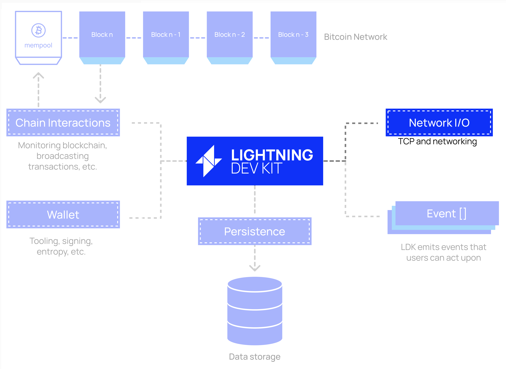
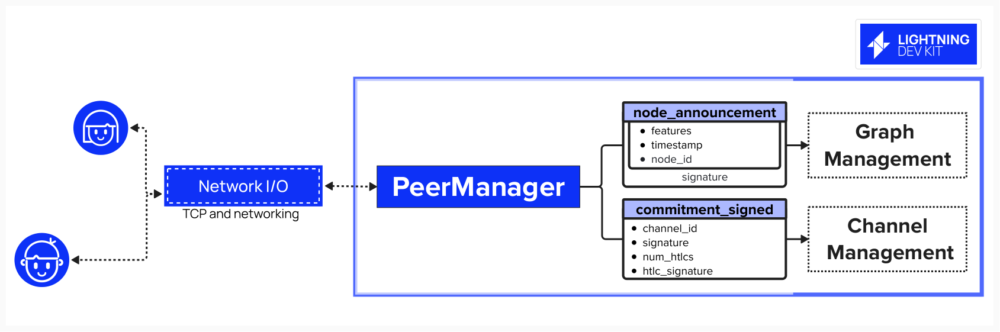
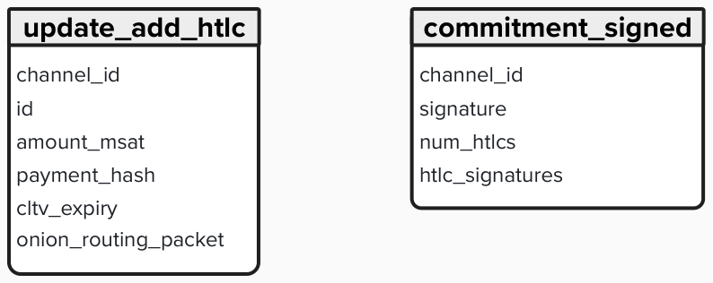
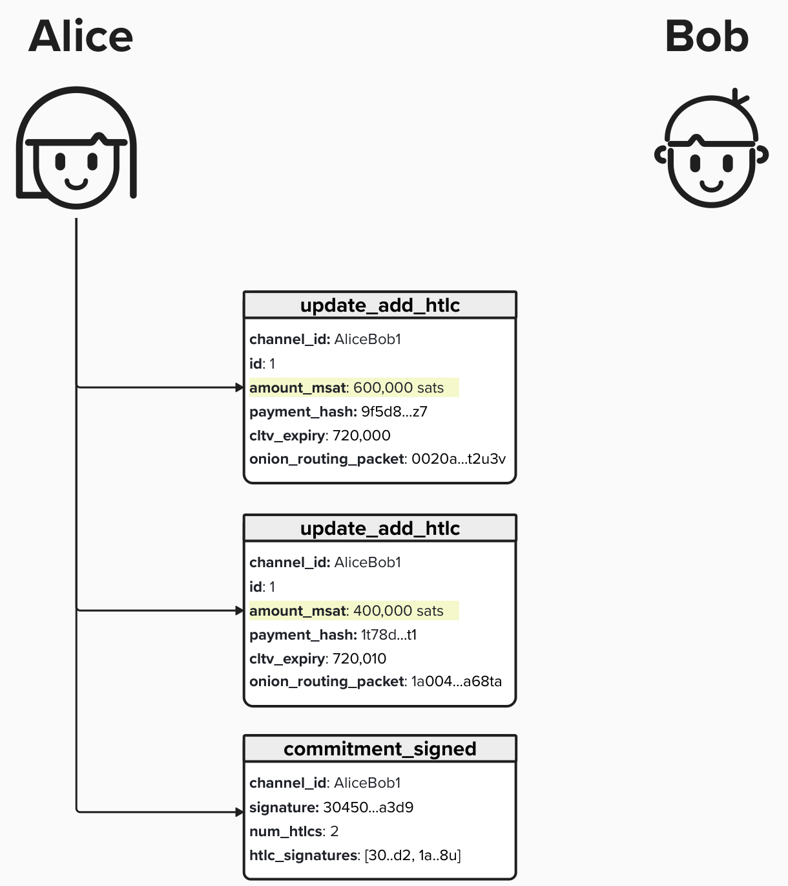
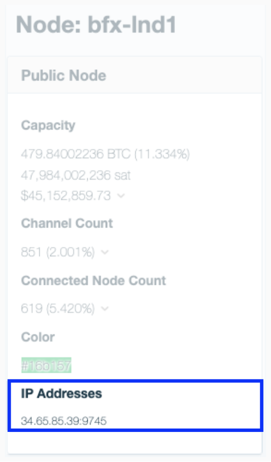
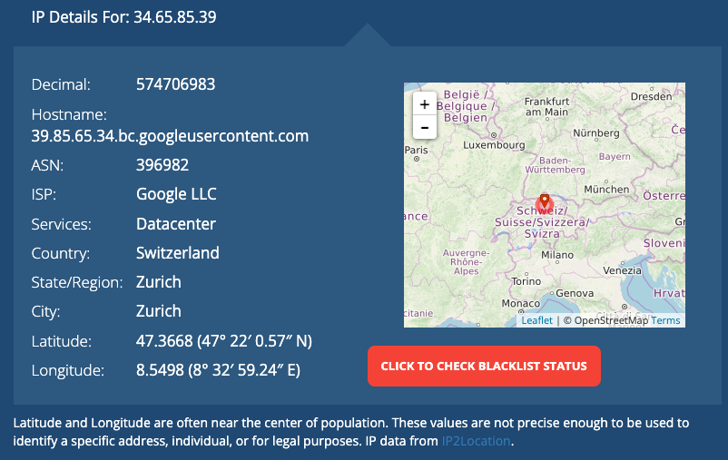

# Connect to Peers

To conenct to peers, we're going to need to implement the ability to conduct high performance input/output operations so that our program can exchange data with other nodes on the Lightning network.

In the spirit of modularity and customizability, LDK provides developers with the tools to bring their own networking stack, though a default TCP implementation is provided.

<p align="center" style="width: 50%; max-width: 300px;">
  
</p>

## Peer Manager
Before implementing our networking stack, let's begin by contextualize how LDK will interface with peers.

LDK provides a `PeerManager` structure to manage all peer connections that our Lightning node has. Additionally, it will be able to handle Lightning Network protocol (BOLT) messages and forward them to the appropriate internal LDK components for internal processing or actions. For example, gossip messages related to the network graph will processed by the `P2PGossipSync` while payment messages will be forwarded to the `ChannelManager`.

To connect our `PeerManager` to our networking stack, we'll have to implement the `SocketDescriptor` trait, which provides an interface for the `PeerManager` to commiciate with peers over our networking stack.

For the purposes of this workbook, we'll be using the default TCP networking stack that is provided by LDK in the `lightning-net-tokio` crate so that we can achieve high performance I/O operations.

<p align="center" style="width: 50%; max-width: 300px;">
  
</p>

## TCP (Transmission Control Protocol)

To connect to our peers, we'll rely on a TCP/IP connection. This includes protocols such as IPv4, IPv6, and Tor. These protocols are used because they satisfy properties that Lightning requires. For example, consider this sentence from [BOLT #1](https://github.com/lightning/bolts/blob/master/01-messaging.md), which describes Lightning's Base Protocol: **This protocol assumes an underlying authenticated and ordered transport mechanism that takes care of framing individual messages**.

#### Question: Why is ordered transport required by Lightning?


<details>
  <summary>Answer</summary>

First, let's review what "ordered transport" is.

**Ordered transport**, unsurprisingly, means that messages will arrive in the same order that they were sent. To see why this is critical, let's take a brief detour to [BOLT #2: Peer Protocol for Channel Management
](https://github.com/lightning/bolts/blob/master/02-peer-protocol.md). BOLT #2 describes the message types that peers will send eachother to update their channel states. For instance, consider the following common message types:

<p align="center" style="width: 50%; max-width: 300px;">
  
</p>

- `update_add_htlc`: Node A will send this message to node B (or vice versa) to indicate that they would like to add an HTLC to their counterparty's commitment transaction.
- `commitment_signed`: Node A will send this message to node B (or vice versa) to provide the signatures for the current commitment transaction, effectively advancing channel state.

Let's imagine that Alice wants to add two HTLCs to her channel with Bob. She can do that by sending two `update_add_htlc` messages to Bob and then sending a `commitment_signed` message with the appropriate signatures.

<p align="center" style="width: 50%; max-width: 300px;">
  
</p>

Notice that the `commitment_signed` does not explitly mention which HTLCs the signatures are for. Instead, it does this implicitly. Since Lightning messages are assumed to be ordered and reliable, the protocol assumes that messages sent will always arrive, and they will arrive in the order they are sent. This way, Alice can rest assured that, if Bob gets the `commitment_signed`, he also got the `update_add_htlc` messages in the correct order.

For a great in-depth blog, discussing how to operate a Lightning channel, please see [Normal operation and closure of a pre-taproot LN channel](https://ellemouton.com/posts/normal-operation-pre-taproot/) by Elle Mouton.

</details>

TCP achieves reliable message delivery by assigning a *sequence number* to each byte of data transmitted to the receiver. To ensure that the data was successfully received, TCP requires the reciever to send a positive acknowledgment (ACK) back to the sender. If the ACK message is not received before the time-out interval, the data will be sent again.

Additionally, since the data is transmitted with sequence numbers, the receiver can correctly order the data they recieve, ensuring that it is processed and handled in the right order. Cool stuff, eh!

## Connecting to Peers

To connect to peers, we'll need to identify them by their **TCP Address**. A TCP address is composed of an **IP Address** and a **Port Number** in the following format: `IP:Port`.

An **IP Address** is used to identify a specific host on a network and functions like a postal address, allowing data to be delivered to the correct location. There are two types of IP Addresses:
- **IPv4**: A 32-bit address
- **IPv6**: A 128-bit address

A **Port Number** identifies the specific application running on the device. It can be a 16-bit integer, effectively between 0 - 65,535. Lightning's default port is 9735.

Nodes that wish to prioritize privacy and anonymity, may opt to run or leverage a **Tor (The Onion Router)** server, thus concealing their IP Address. The Tor client will then route any incoming or outgoing connections through the Tor network's encrypted relays, thus preserving your privacy. Users who leverage Tor will have an **onion address**, which reads `<username>.onion:<port>`.

#### Question: Should you use IP or Tor? What are the trade-offs?

<details>
  <summary>Answer</summary>

Of course, everything has trade-offs!

### Privacy
From a privacy perspective, using Tor will hide your node's real IP address, making it much more difficult for others to link your node to a phycical location. As a brief exercise to show you how easy it can be to identify the location of node using a public IP address, head over to https://1ml.com/, a popular analytics and search engine for the Lightning Network. If you scroll down on the homepage, you should see a section titled **Top Capacity Nodes**. Click a few of the nodes and see if you can find one that has a public IP address, such as in the image below.

<p align="center" style="width: 50%; max-width: 300px;">
  
</p>

Once you find a node with a public IP address, enter the address within an IP lookup site, such as https://whatismyipaddress.com/. You should be able to see where the node is running! In this example, the node is running in what is likely a Google datacenter in Zurich, Switzerland.

<p align="center" style="width: 50%; max-width: 300px;">
  
</p>

If you're node is running on Tor, it would not be nearly as simple to pinpoint where your node is located.

### Peer Discovery

On disadvantage of running on Tor only is that IP-based nodes cannot initiate a connection to you, which can reduce the number of peers you can connect to. That said, you can stil initiate a connection to them.

</details>

## LDK lightning_net_tokio Crate

As we mentioned earlier, LDK provides a `lightning_net_tokio` Rust crate which provides a default networking implementation and toolset for us to use. Within the crate, you'll find:
- **Tokio Integration**: Async networking support using Rust's most popular async runtime, Tokio.
- **TCP Handling**: Default TCP socket management implemenation.
- **Connection Management**: Tools for handling inbound and outbound connections.

By taking advantage of this crate, we can implement our node's networking with just a few steps.

## ⚡️ Accept Incoming Connections

To enable our node to interact with the Lightning Network, we'll need to inform LDK of where our node should be listening for incoming network traffic. We can do this by defining a `TcpListener` and then passing our listener and a `PeerManager` as inputs to the `setup_inbound` function, which is made available via `lightning_net_tokio`.

For this exercise, you'll complete a simplified version of the networking setup for an LDK node by implementing the `start_network_listener` function in `src/networking.rs`. This function sets up a TCP listener to accept incoming Lightning peer connections. It takes a `peer_manager` (to handle peer connections), a `listening_port` (to bind the listener), and a `stop_listen` flag (to stop the listener gracefully). Your task is to define a TCP listener, create a loop to continuously listen for new peers, and pass each connection to the provided `setup_inbound` helper function.

```rust
pub async fn start_network_listener(
    peer_manager: Arc<MockPeerManager>,
    listening_port: u16,
    stop_listen: Arc<AtomicBool>,
) {
    // Step 1: Spawn async task

        // Step 2: Bind TCP listener

        // Step 3: Run accept loop

            // Step 4: Handle Connection

}
```

Below, you will find some helpful information to assist in completing each step.

<details> <summary> Step 1: Spawn an Async Task </summary>
    
We'll start by spawn an asynchronous task to run the listener logic. Running the listener within an async task will ensure that it runs in the background and can continue to accept incoming connections without blocking out application.

```rust
tokio::spawn(async move {
    // Listener logic
});
```
- `tokio::spawn` creates a new task on the Tokio runtime.

</details>

<details> <summary> Step 2: Bind the TCP Listener </summary>
    
Next, we'll create a TCP Listener, using the `TcpListener` type provided in the tokio crate. This type will be initialized with the address that our Lightning node will be listening on. **Note: this code (and the rest of this exercise) should all be done within the async block!**

```rust
tokio::spawn(async move {
    
    let listener = tokio::net::TcpListener::bind(format!("[::]:{}",    listening_port))
        .await
        .expect("Failed to bind to listen port - is something else already listening on it?");

});
```

- `format!("[::]:{}", listening_port)` creates an address like `127.0.0.1:9375`.
- `TcpListener::bind` binds the listener asynchronously, awaiting the result.
- `.expect` panics on failure (e.g., port in use); in production, handle errors gracefully.

</details>

<details> <summary> Step 3: Run an Accept Loop </summary>
    
Once the listener is created, let's run a loop to continuously accept incoming TCP connections. 

```rust
loop {
    let tcp_stream = listener.accept().await.unwrap().0;
}
```
- `listener.accept().await` waits for an incoming connection, returning a `(TcpStream, SocketAddr)` tuple.
- `.0` extracts the `TcpStream` from the tuple.
- `.unwrap()` assumes acceptance succeeds (handle errors in production).

</details>

<details> <summary> Step 4: Handle Each Connection </summary>
    
Now that we have a TCP stream waiting to receive connections, we'll need to implement logic to process connections when they are received. To do this, we'll spawn a new async task for each accepted connection, passing the `TcpStream` to `setup_inbound`. In this case, `setup_inbound` is a mock function, but in production, this function is provided by the `lightning_net_tokio` crate, and it handles setting up new connections for our Lightning node.

As inputs, `setup_inbound` will require a copy of LDK's `PeerManger`, which implements the logic to handle Lightning network communications, as well as the TCP stream for our new connection.

```rust
let peer_mgr = peer_manager.clone();
tokio::spawn(async move {
    setup_inbound(
        peer_mgr,
        tcp_stream.into_std().unwrap(),
    )
    .await;
});
```
- `tokio::spawn` creates a task to handle the connection.
- `tcp_stream.into_std().unwrap()` converts the Tokio `TcpStream` to a standard `std::net::TcpStream`.
- `setup_inbound` processes the connection.

</details>