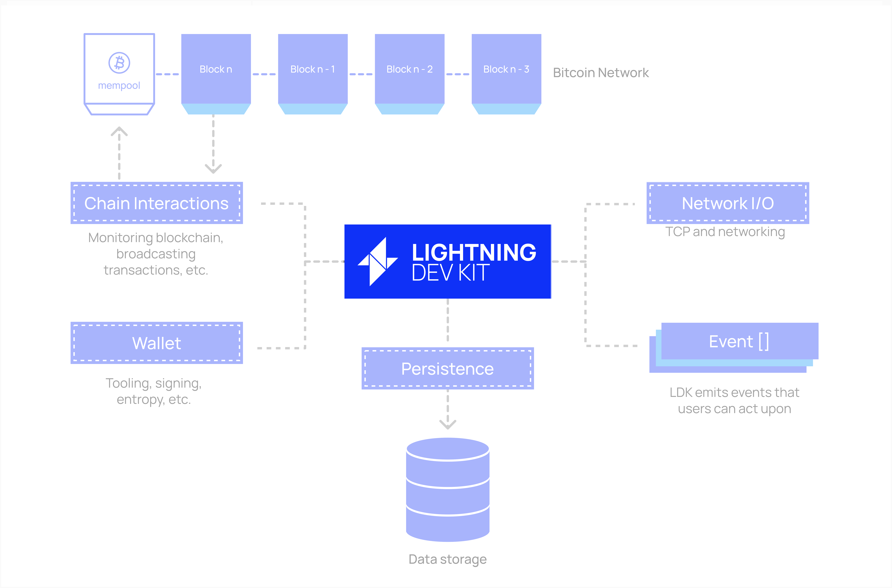
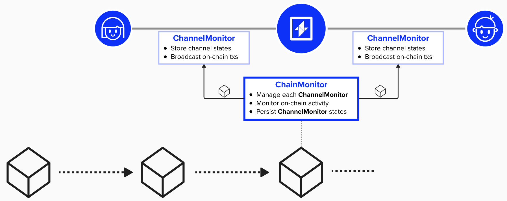
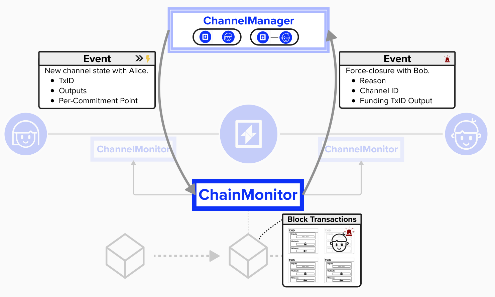

# Implementing Lightning Functionality

Wow! While it may feel like we've implemented a lot so far (we have!), we've really only scratched the surface. As of now, our Lightning node is ready to:
- Fetch new blocks
- Broadcast transactions
- Estimate transaction fees
- Manage our on-chain and off-chain wallet
- Persist data
- Connect to peers

However, we're still missing major pieces of the puzzle! We need to equip our node with the ability to perform the operations of a Lightning, including:
- Managing channel lifecycles (opening, closing, updating)
- Processing payments (sending, receiving, forwarding)
- Responding to on-chain events that affect our channels

The above functionality would be quite complex to implement ourselves, but, luckily, we don't have to. Instead, we'll simple pass some of the components we've created in the past few exercises to LDK, and LDK will do the rest for us.

<p align="center" style="width: 50%; max-width: 300px;">
  
</p>

## Chain Monitor

One important LDK component that we'll need to initialize is the **Chain Monitor**. The **Chain Monitor** will be in charge of monitoring on-chain activity. Whenever a new block is mined, it will hand it over to each **Channel Monitor** so that the **Channel Monitor** can determine if it needs to react to on-chain activity. For example, if an old commitment is published by our counterparty, the **Channel Monitor** will have all the information it needs to immediately broadcast a punishment transaction.

As you may have guessed, the **Channel Monitor** will be in charge of tracking the state of each payment channel we open. This means this object will need to hold information such as the 2-of-2 funding output, both our keys and our counterparty's keys (including their per-commitment secrets, which are used for revocation keys), payment preimages, and much more. Each Lightning channel will have its own **Channel Monitor**. It's hard to overstate the importance of this structure!

Additionally, the **Channel Monitor** will be in charge of persisting the **Channel Monitor** each time there is a state change. This is absolutely crucial, as we will need to ensure that each state is successfully persisted before we can move to our next channel state.

Together, the **Chain Monitor**  and **Channel Monitor** connect ***off-chain*** **channel management** with ***on-chain*** **transaction monitoring**

<p align="center" style="width: 50%; max-width: 300px;">
  
</p>

### Initialize a Chain Monitor

Below is how we can initialize a `ChainMonitor` for our Lightning node. To do this, we simply pass the components required by the [struct definition](https://docs.rs/lightning/latest/lightning/chain/chainmonitor/struct.ChainMonitor.html), so there is no exercise in this workbook for this step.

```rust
// Initialize the ChainMonitor
let chain_monitor: Arc<ChainMonitor> = Arc::new(chainmonitor::ChainMonitor::new(
  None,
  Arc::clone(&broadcaster),
  Arc::clone(&logger),
  Arc::clone(&fee_estimator),
  Arc::clone(&persister),
));
```

## Channel Manager

Now that we've implememnted the **Chain Monitor**, which equipt our node with the ability to monitor **on-chain** activity, let's focus on **off-chain** activity. To do this, we'll need to implement the **Channel Manager**, which is our lightning node's channel state machine, handling **off-chain** tasks such as sending, forwarding, and receiving payments.

Before proceeding, it's helpful to discuss the relationship between the **Channel Manager**, **Chain Monitor**, and **Channel Monitor** a little further. Since the **Channel Manager** focuses on off-chain activity, it's responsible for tasks such as exchanging messages with peers, opening, closing, and updating channels. When opening a new channel, it will generate a `ChannelMonitor` and when updating a channel, it will generate a `ChannelMonitorUpdate` for each change. It will then notify the **Chain Monitor** of these updates. Once the **Chain Monitor** is aware of the **Channel Monitor**, it will begin monitoring the on-chain blockchain for relevant activity. If any on-chain activity is detected - for example, broadcasting a punishment transction if a counterparty attempts to cheat, then the **Chain Monitor** will notify the **Channel Manager** that this action has taken place, and the **Channel Manager** will act accordingly and close the channel off-chain. 

The division of on-chain and off-chain activity allows for more advanced and interesting node setups. For example, you could deploy a redundant copy of the **Chain Monitor** on a different server, providing a robust backup so that you can continue to monitor the blockchain and act accoringly, even if your primary node crashes or restarts. Alternatively, if your primary node is resource constrained, you can deploy the **Chain Monitor** on a separate server to provide higher uptime and reliability. This setup is similar to a "watchtower" setup, where you outsource 24/7 blockchain monitoring to ensure you catch any suspicious on-chain activity immediately.

<p align="center" style="width: 50%; max-width: 300px;">
  
</p>

### Initialize a Channel Manager

Similar to the `ChainMonitor`, we create the `ChannelManager` by simply passing the required components specified in the [struct definition](https://docs.rs/lightning/latest/lightning/ln/channelmanager/struct.ChannelManager.html).

The notable difference is that we first check if we're starting a fresh node. If so, we create a new `ChannelManager`. If not, we read the `ChannelManager` from our storage solution.

```rust
	// Initialize the ChannelManager
	let mut user_config = UserConfig::default();
	let mut restarting_node = true;
	let (channel_manager_blockhash, channel_manager) = {
		if let Ok(f) = fs::File::open(format!("{}/manager", ldk_data_dir.clone())) {
			let mut channel_monitor_references = Vec::new();
			for (_, channel_monitor) in channelmonitors.iter() {
				channel_monitor_references.push(channel_monitor);
			}
			let read_args = ChannelManagerReadArgs::new(
				keys_manager.clone(),
				keys_manager.clone(),
				keys_manager.clone(),
				fee_estimator.clone(),
				chain_monitor.clone(),
				broadcaster.clone(),
				router,
				Arc::clone(&message_router),
				logger.clone(),
				user_config,
				channel_monitor_references,
			);
			<(BlockHash, ChannelManager)>::read(&mut BufReader::new(f), read_args).unwrap()
		} else {
			// We're starting a fresh node.
			restarting_node = false;

			let polled_best_block = polled_chain_tip.to_best_block();
			let polled_best_block_hash = polled_best_block.block_hash;
			let chain_params =
				ChainParameters { network: args.network, best_block: polled_best_block };
			let fresh_channel_manager = channelmanager::ChannelManager::new(
				fee_estimator.clone(),
				chain_monitor.clone(),
				broadcaster.clone(),
				router,
				Arc::clone(&message_router),
				logger.clone(),
				keys_manager.clone(),
				keys_manager.clone(),
				keys_manager.clone(),
				user_config,
				chain_params,
				cur.as_secs() as u32,
			);
			(polled_best_block_hash, fresh_channel_manager)
		}
	};
```

