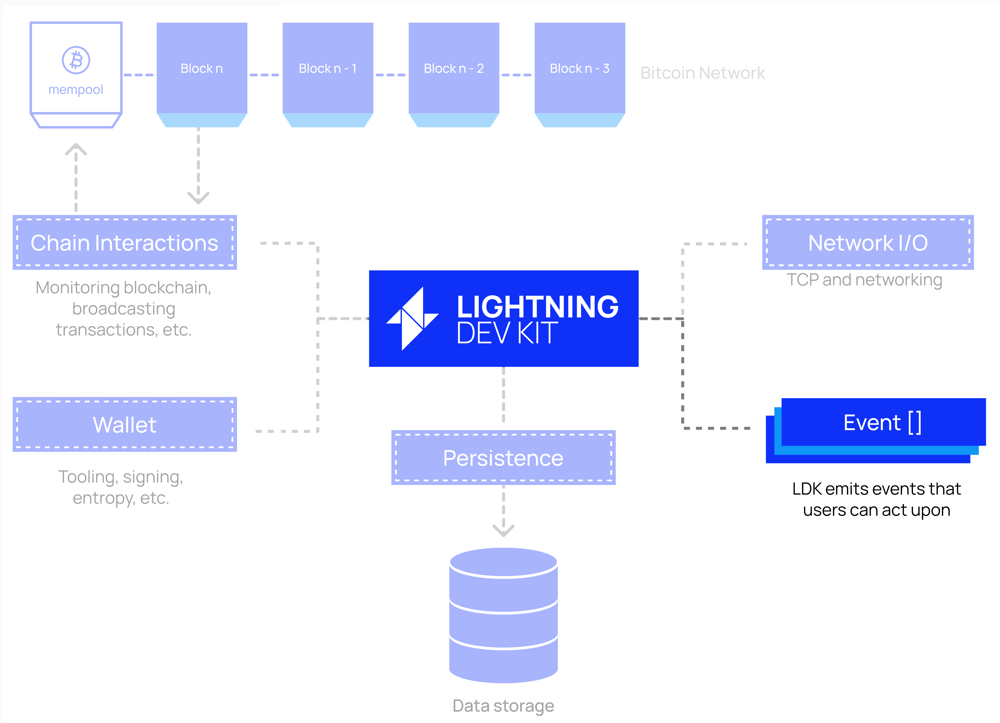
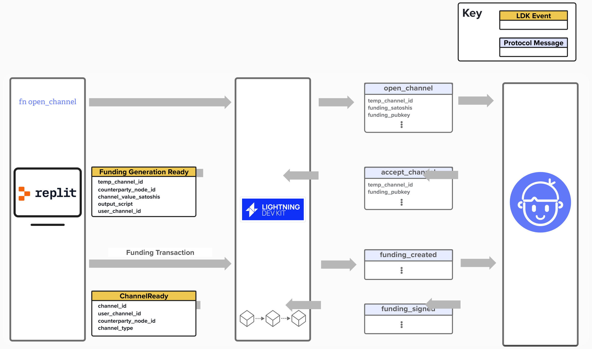

# Handling Events

The next piece we'll need to configure for our LDK Lightning node to operate effectively is event handling. As we mentioned earlier, LDK utilizes an event-drive architecture, which nicely compliments its design as an environment agnostic software development kit, allowing us to choose own own data storage, wallet, networking stack, and blockchain monitoring. 

<p align="center" style="width: 50%; max-width: 300px;">
  
</p>

## Event Handling In Action

To build our intuition for events in LDK, let's review the example of how our Replit-based Lightning node will communicate when opening channels with other nodes!

In our next exercise, we'll complete a function that initiates a channel open with another node, passing along all of the necessary information to acomlish this taks: funding amount, peer details, etc.

Under the hood, our LDK node will send an `open_channel` protocol message to our peer. If our peer response with the `accept_channel` protocol message, LDK will provide us with a `FundingGenerated` event, informing us that we need to create a funding transaction for this channel. *REMEMEBR* how we created our own BDK wallet and equiped it with the ability to fetch UTXOs and craft funding transactions? Well, we will use this function to generate a funding transaction with the information that LDK provides in the `FundingGenerated` event. Once our wallet creates that transaction, we'll will hand it back to LDK, and LDK will continue with the channel open steps by sending a `funding_created` protocol message to our peer. 

See the picture below to see this process visually.

<p align="center" style="width: 50%; max-width: 300px;">
  
</p>

#### Question: Why does LDK inform us that we need to create a fundning transaction? Why doesn't LDK do this for us?
<details>
  <summary>Answer</summary>

There are a few reasons for this.

1) **Customization:** LDK is purposefully built to allow for greater customization when building Lightning network applications. For example, in this workshop, we chose to build our on-chain wallet using the [Bitcoin Development Kit](https://bitcoindevkit.org/). However, we could have chosen to connect to Bitcoin Core for our on-chain wallet. Since this on-chain integration is left to us, LDK will let us decide how to create the funding transaction and which UTXOs to select by simply informing us that a transaction needs to be created. 

2) **Separation of Concerns**: By leaving on-chain transaction handling up to us, LDK is able to focus on implementing the Lightning protocol logic, keeping it lightweight and flexible to many different implementations.

</details>


Finally, once we receive a `funding_signed` message from our peer, LDK will broadcast the funding transaction for us and inform us, via the `ChannelReady` event, once the appropriate number of confirmations have taken place.

#### Question: Why does LDK send a `ChannelReady` event?
<details>
  <summary>Answer</summary>

There isn't necessarily a correct answer here! Instead, this question is just meant to spur our thought process towards how an application will work with an event-driven architecture.

One possible answer is that our application may want to inform the user (via a push notification, for example) that a channel is open and ready to be used.

</details>

## Setting Up Event Handling

To set up an **Event Handler**, we'll need to define a function that can process each event type that LDK will expose. You can find a complete list of them [here](https://docs.rs/lightning/latest/lightning/events/enum.Event.html), but a few have also been provided below.

Once the event handler has been created, it will be passed into our background processor to handle events as they occur.

```rust
pub enum Event {
  FundingGenerationReady {
    temporary_channel_id, // temporary channel id of channel requesting to be opened
    counterparty_node_id, // node id of counterparty requesting to open channel
    channel_value_satoshis, // channel value
    output_script, // the script to be used in the TX output
    ..
  },
  OpenChannelRequest {
    temporary_channel_id, // temporary channel id of channel requesting to be opened
    counterparty_node_id, // node id of counterparty requesting to open channel
    funding_satoshis, // channel value
    ..
  },
  ChannelPending {..},
  ChannelReady {..},
  PaymentSent {..},
  PaymentFailed {..},
  PaymentPathSuccessful {..},
  PaymentPathFailed {..},
  ProbeSuccessful {..},
  ProbeFailed {..},
  PendingHTLCsForwardable {..},
  HTLCIntercepted {..},
  PaymentForwarded {..},
  DiscardFunding {..},
}
```


### ⚡️ Implement `FundingGenerationReady` for `handle_ldk_events`

Let's go ahead and start implementing our event handler! To do this, head over to `src/events.rs`, where we'll create an asyncronous `handle_ldk_events` function. As you can see, this will have access to some of the  many of the structures that we've reviewed as part of this workshop, such as:
- ChannelManager
- BitcoinClient
- KeysManager
- PeerManager
- FileStore

To complete this function, you'll need to complete the `FundingGenerationReady` portion of the match statement. The rest of the events can be left blank.

```rust

pub async fn handle_ldk_events(
    channel_manager: &ChannelManager, 
    bitcoind_client: BitcoindClient,
    keys_manager: KeysManager, 
    peer_manager: PeerManager,
    file_store: FileStore,
    event: Event
) {
    match event {
        Event::FundingGenerationReady {
            temporary_channel_id,
            counterparty_node_id,
            channel_value_satoshis,
            output_script,
            ..
        } => {
            // Construct the raw transaction with one output, that is paid the amount of the
            // channel.
            let addr = WitnessProgram::from_scriptpubkey(
                &output_script.as_bytes(),
                Regtest)
                .expect("Lightning funding tx should always be to a SegWit output")
                .to_address();

            let mut outputs = vec![HashMap::with_capacity(1)];
            outputs[0].insert(addr, channel_value_satoshis as f64 / 100_000_000.0);

            let raw_tx = bitcoind_client.create_raw_transaction(outputs).await;

            // Have your wallet put the inputs into the transaction such that the output is
            // satisfied.
            let funded_tx = bitcoind_client.fund_raw_transaction(raw_tx).await;

            // Sign the final funding transaction and give it to LDK, who will eventually broadcast it.
            let signed_tx = bitcoind_client.sign_raw_transaction_with_wallet(funded_tx).await;

            // Give the funding transaction back to LDK for opening the channel.
            channel_manager.funding_transaction_generated(
                temporary_channel_id,
                counterparty_node_id,
                signed_tx)
        },
        Event::FundingTxBroadcastSafe { .. } => {},
        Event::PaymentClaimable { .. } => {},
        Event::PendingHTLCsForwardable { .. } => {},
        Event::SpendableOutputs { .. } => {},
        Event::ChannelReady { .. } => {},
        Event::ChannelClosed { .. } => {},
        _ => {},
    }
}
```

## Starting The Event Handler

Once we've configured our custom logic for handling LDK events, we'll need to start a **background processor**. The background processor will orchestate all of the components that we've created, glueing them together so that they can communicate with each other and process events accordingly. LDK provides a `lightning-background-processor` crate with both synchronous and asychronous background processing implementations that developers can use.

The **event handler** that we defined previously will be provided to the background processor as an input.
When processing events, LDK will first handle events itself, then it will pass those events on to our custom event handler for further processing.

For example, when payments (or probes) succeed or fail, LDK updates its internal scorer so that it can better estimate the capcaity of any given channel and optimize future routing. These events (`PaymentPathSuccessful`, `PaymentPathFailed`, `ProbeSuccessful`, `ProbeFailed`) will be processed first by LDK via the background processor, and then they will be passed on to our custom handler for, if applicable, further processing.

<details>
  <summary>Click to see how the lightning-background-processor updates the scorer</summary>

Below is a view into the `lightning-background-processor` to help build our intuition as to how it works. In this code snippet, you'll see the function `update_scorer`, which takes a `scorer`, `event`, and `duration_since_epoch` as inputs. Whenever an event is recieved that relates to payment (or probe) results, the background processor will call this function and process the event. 

```rust
/// Updates scorer based on event and returns whether an update occurred so we can decide whether
/// to persist.
fn update_scorer<'a, S: 'static + Deref<Target = SC> + Send + Sync, SC: 'a + WriteableScore<'a>>(
  scorer: &'a S, event: &Event, duration_since_epoch: Duration,
) -> bool {
  match event {
    Event::PaymentPathFailed { ref path, short_channel_id: Some(scid), .. } => {
      let mut score = scorer.write_lock();
      score.payment_path_failed(path, *scid, duration_since_epoch);
    },
    Event::PaymentPathFailed { ref path, payment_failed_permanently: true, .. } => {
      // Reached if the destination explicitly failed it back. We treat this as a successful probe
      // because the payment made it all the way to the destination with sufficient liquidity.
      let mut score = scorer.write_lock();
      score.probe_successful(path, duration_since_epoch);
    },
    Event::PaymentPathSuccessful { path, .. } => {
      let mut score = scorer.write_lock();
      score.payment_path_successful(path, duration_since_epoch);
    },
    Event::ProbeSuccessful { path, .. } => {
      let mut score = scorer.write_lock();
      score.probe_successful(path, duration_since_epoch);
    },
    Event::ProbeFailed { path, short_channel_id: Some(scid), .. } => {
      let mut score = scorer.write_lock();
      score.probe_failed(path, *scid, duration_since_epoch);
    },
    _ => return false,
  }
  true
}
```

</details>

### Initializing The Background Processor
As mentioned above, the Background Processor is a critical component that handles essential tasks like event processing, channel state persistence, and network maintenance. Below is an example of initializing an async Background Processor using Tokio, which sets up all necessary components including the persister, event handler, chain monitor, and other core LDK services. The processor runs continuously until explicitly stopped:

```rust
// Background Processing
let (bp_exit, bp_exit_check) = tokio::sync::watch::channel(());
let mut background_processor = tokio::spawn(lightning_background_processor::process_events_async(
  Arc::clone(&persister),
  event_handler,
  chain_monitor.clone(),
  channel_manager.clone(),
  Some(onion_messenger),
  GossipSync::p2p(gossip_sync.clone()),
  peer_manager.clone(),
  logger.clone(),
  Some(scorer.clone()),
  move |t| {
    let mut bp_exit_fut_check = bp_exit_check.clone();
    Box::pin(async move {
      tokio::select! {
        _ = tokio::time::sleep(t) => false,
        _ = bp_exit_fut_check.changed() => true,
      }
    })
  },
  false,
  || Some(SystemTime::now().duration_since(SystemTime::UNIX_EPOCH).unwrap()),
));
```