# Opening A Channel

At this point, our Lightning node is plugged in and ready to go! Well, at least for the purposes of this workshop. In reality, there is more setup that we'd need to do, but we'll hand wave those nuances for now - we've covered the big parts! If you'd like to dig into the nuances yourself, feel free to further explore the code to see how everything connects together.

To join the fun that is the Lightning network, we'll need to open a channel. While LDK makes opening a Lightning channel quite simple, there are still many decisions that we will have to make to ensure that the channel is optimized for our use case. To guide us through this discussion, let's use [BOLT 2](https://github.com/lightning/bolts/blob/master/02-peer-protocol.md) as our guide.

## BOLT #2

BOLT #2, titled "**Peer Protocol for Channel Management**", describes the communication protocol that peers will use to set up a channel between themselves. This protocol has the following three phases:
1) Channel Establishment
2) Channel Operation
3) Channel Closing

We'll focus on **Channel Establishment** in this section.

It's important to note that there are the following two version of channel establishment:
- **Channel Establishment v1**: This version is the original protocol for opening a channel between two channel parties.
- **Channel Establishment v2**: This is the updated channel open protocol that allows for dual-funding channel where both channel parties contribute funds to the channel. Note, you can also create single-fundeded channels with this updated protocol.

# Channel Establishment V1
For simplicity, we'll focus on **Channel Establishment v1** for this section. Also, note that, when initiating a channel, we've already authenticated ([BOLT #8](https://github.com/lightning/bolts/blob/master/08-transport.md)). and initialized ([BOLT #1](https://github.com/lightning/bolts/blob/master/01-messaging.md)) a connection with our peer. As part of initializing that connection, we'll send each other `init` messages, which will inform each other which features we support.

As a brief overview, Channel Establishment V1 will look like the below. In this protocol, there is a single **funder**, who provides the bitcoin (UTXO) to fund the channel, and a **fundee**, who is accepting/rejecting the channel. Notably, the **funder** will be responsible for the following:
- Kickstarting the negotiation by proposing the initial channel requirements, such as if this channel will be public.
- Publishing the funding transaction.
- Paying fees for both the funding and mutal close transaction.

<p align="center" style="width: 50%; max-width: 300px;">
  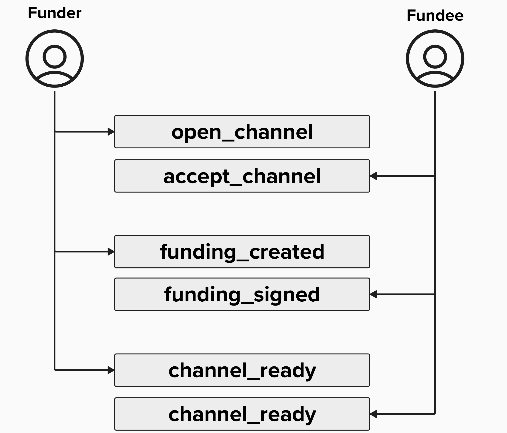
</p>

<details>
  <summary>Click to see the Establishment messages</summary>

Imagine Alice is opening a channel to Bob. Below is description of the protocol messages that Alice and Bob will send each other to open this channel. 

#### Open Channel Message

Since Alice is funding the channel (providing the input UTXO for the funding transaction), she will begin the process by sending Bob an `open_channel` message.

<p align="center" style="width: 50%; max-width: 300px;">
  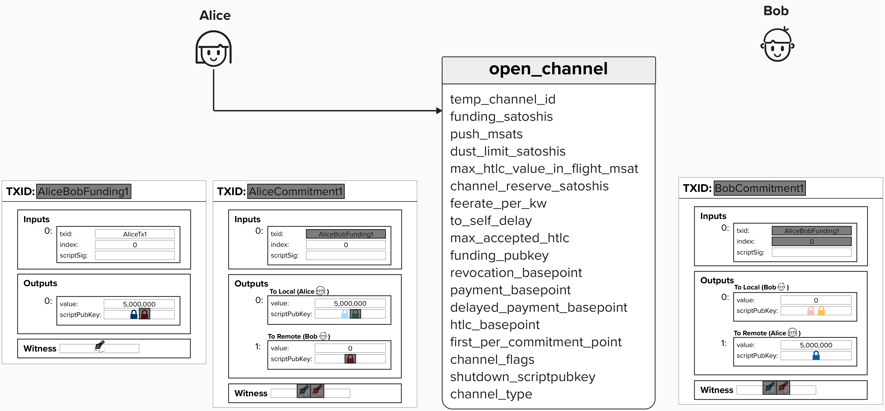
</p>

In the above picture, you'll notice that some fields have been grayed out. This is because, at this point in the channel establishment process, these fields are not yet known to Alice or Bob. For example, on Alice's side, she does not yet have Bob's **funding public key** (for the 2-of-2 multsig), so she does not yet know the transaction ID.

When Alice sends Bob the `open_channel` message, she is essentially proposing a Lightning channel contract to Bob. The contract will stipulate important features that Alice requires (or desires) to operate a channel with Bob. 

#### Accept Channel Message

If Bob agrees to Alice's channel proposition, he will send back an `accept_channel` message. His `accept_channel` message will have it's own set of requirements that Alice must agree to. For example, one field that Bob proposes is `minimum_depth`, which provides the minimum number of blocks that must be mined on top of the funding transaction before the channel is live. This parameter is provided by the node which is *not* the funder (ex: Bob) because it's meant to protect Bob against Alice double-spending the funding transaction. See below for an example for how such an attack could be carried out:
1) Alice publishes the funding transaction with a low feerate.
2) Bob see the funding transaction in the mempool and, incorrectly, assumes it's safe to start operating the channel
3) Alice sends bob a payment, updating their channel state.
4) Alice secretly creates a new transaction with a high feerate, double-spending the funds in the funding transaction (which is still not yet confirmed)

Ouch!

<p align="center" style="width: 50%; max-width: 300px;">
  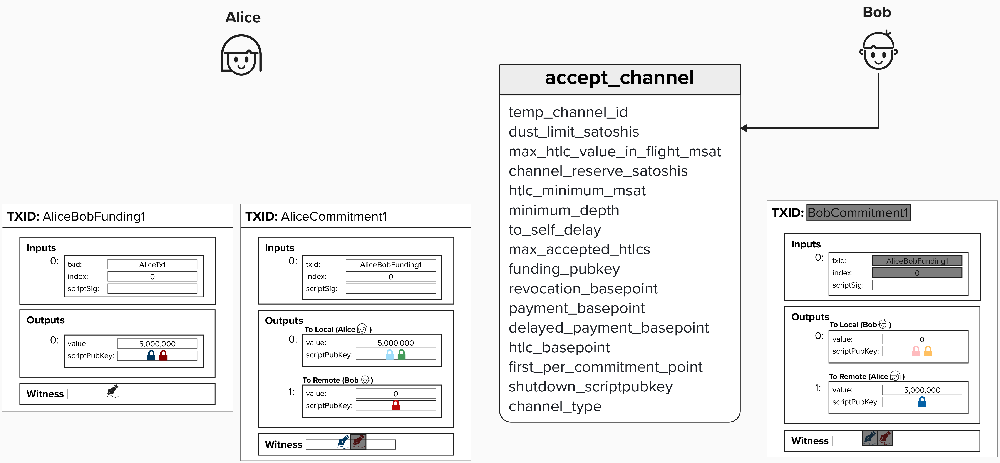
</p>

#### Funding Created Message
Assuming Alice agrees to the channel propositions proposed in Bob's `accept_channel` message, she will then send Bob a `funding_created` message. In this message, Alice will provide Bob with the information he needs to be able to complete his commitment transaction for the initial channel state - namely the funding transaction TXID, output index, and Alice's signature for Bob's first commitment transaction.

At this point, the only information needed to complete the **Channel Establishment v1** process is a signature from Bob for Alice's commitment transaction. 

<p align="center" style="width: 50%; max-width: 300px;">
  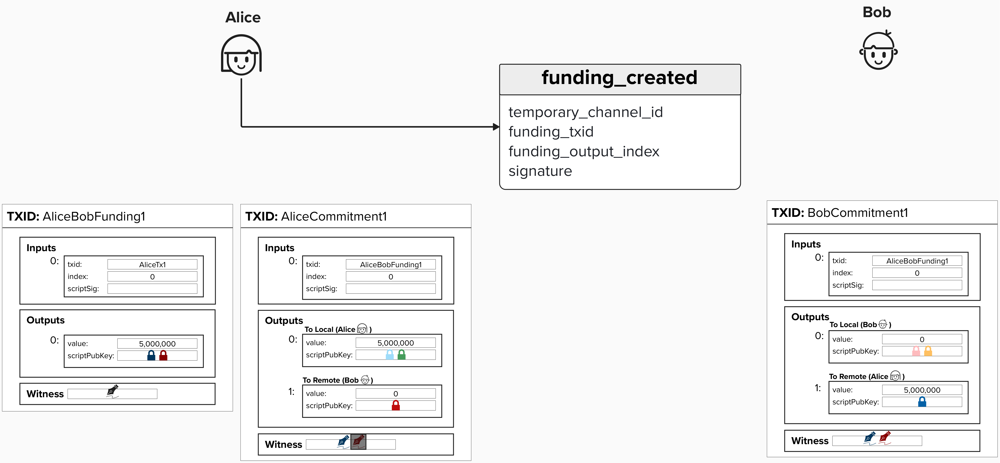
</p>

#### Funding Signed Message
Finally, in response to Alice's `funding_created` message, Bob will send Alice a `funding_signed` message. This will contain a `channel_id` and Bob's signature, Which Alice can use for her commitment transaction. Note, since Alice can theoretically have multiple channels with Bob, the `channel_id` field allows Bob to specify which channel he is sending a signature for.

<p align="center" style="width: 50%; max-width: 300px;">
  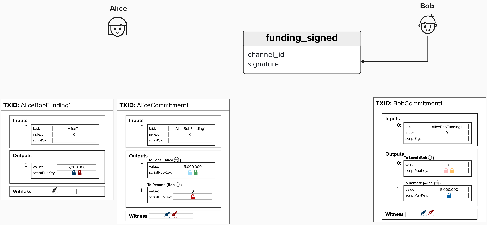
</p>


#### Channel Ready Message
After recieving Bob's `funding_signed` message, Alice is now able to broadcast the funding transaction safely. This is because, if Bob were to disapear, she can always publish her commitment transaction, which spends the funds from the multisig back to herself.

Once Alice broadcasts the funding transaction and its received sufficient confirmations, Alice will send Bob a `channel_ready` message, indicating that the channel is ready for use. Similarly, Bob will send a `channel_ready` message to Alice once he verifies himself that the funding transaction has received sufficient confirmations on-chain.

<p align="center" style="width: 50%; max-width: 300px;">
  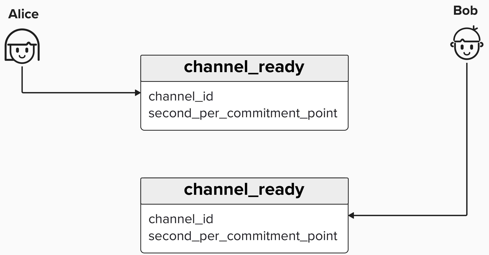
</p>

</details>


## Open Channel Negotiation
Let's continue with our example of Alice opening a channel with Bob. This time we'll play closer attention to some of the field within the `open_channel` message and build our intuition of the types of Lightning channels we can open. The three features we'll be paying close attention to in this section are **channel reserves**, **anchor outputs**, and **zero conf**.


<p align="center" style="width: 50%; max-width: 300px;">
  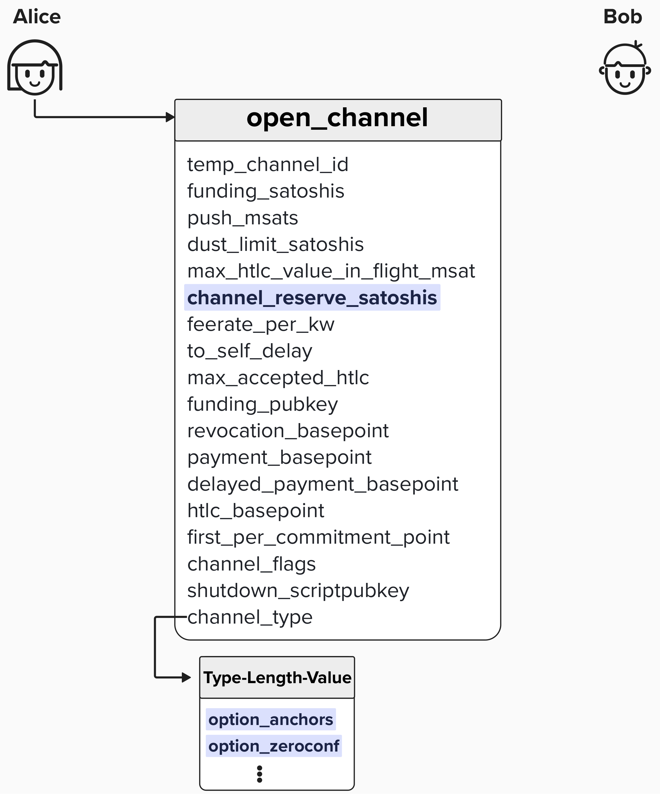
</p>

### Channel Reserve Satoshis
One option we have when opening a channel is the ability to specify the `channel_reserve_satoshis` amount. This parameter lets us specify the minimum amount of sats that our counterparty (Bob) must keep as a **direct payment to himself** during channel operation.

To make this more explicit, take a look at the diagram below. When we specify a `channel_reserve_satoshis` amount, we are specifying the minimum amount that Bob must keep in his `to_local` output.

<p align="center" style="width: 50%; max-width: 300px;">
  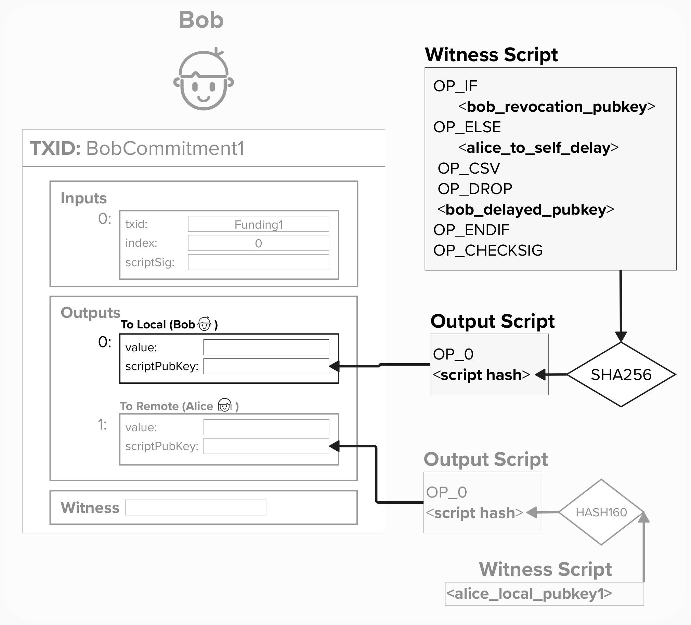
</p>

#### Question: What does requiring a minimum channel reserve protect against?

<details>
  <summary>Answer</summary>

Let's begin our answer by exploring a scenario. Imagine Alice opens a channel to Bob, they send some payments back and forth, and then Bob's balance gets to zero. Is Alice exposed to extra risk?

<p align="center" style="width: 50%; max-width: 300px;">
  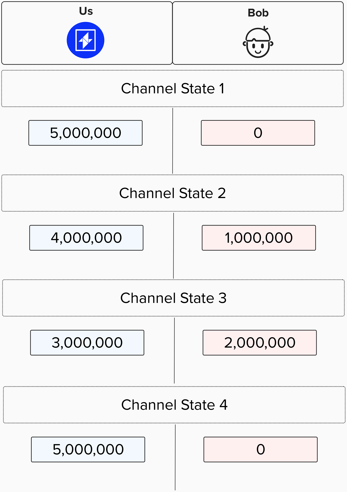
</p>

Yes! Remember, Lightning's punishment protocol hinges on you being able to punish your counterparty if they attempt to cheat! You can do this by spending their `to_local` output if they publish an old commitment state. However, if Bob's current state has zero sats, that means he doesn't have any skin in the game anymore. He may try to punish and old commitment state because he nothing to lose! 

Therefore, to mitigate this attack, we require Bob to have *some* funds in his `to_local` at all times.

</details>


#### Question: What is a reasonable channel reserve to request?

<details>
  <summary>Answer</summary>

Per BOLT #2's [rational](https://github.com/lightning/bolts/blob/master/02-peer-protocol.md#rationale-8) for the `open_channel` message, it is suggested that the channel reserve should be set to 1%. Additionally, it's noted that the reserve must be above the dust limit, ensuring it is large enough to require an output on the transaction.

It's important to recognize the trade-off between a channel reserve and liquidity. Since channel reserve's must remain on your side of the channel, you cannot use them as payment liquidity to forward to your partner. This effectively lowers the amount of capital available to you for making or forwarding payments. If you trust your channel partner, you may be in a safer position to lower the channel reserve.

</details>


### Anchor Outputs

Another choice we will have to make when opening a payment channel is whether or not our payment channel should support anchor outputs. To ensure we're properly able to contextualize this decisions, let's review why anchor outputs are an option in the first place.

Imagine Alice advances a few channel states with her counterparty, Bob, and then Bob goes offline. Alice has no choice but to close her channel by publishing the latest commitment transaction. However, what if on-chain fees have spiked since they created this commitment transaction?

<p align="center" style="width: 50%; max-width: 300px;">
  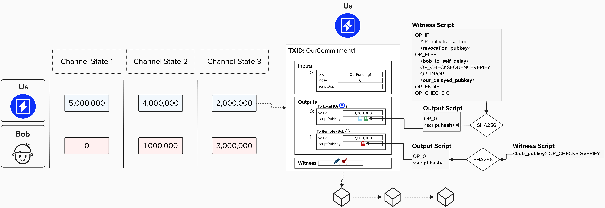
</p>


#### Question: Can Alice fee-bump this commitment transaction?

<details>
  <summary>Answer</summary>

Unfortunately, Alice can't fee-bump this transaction! There are a few reasons for this.

First, one common fee-bumping mechanism is **replace by fee**, which involves creating a new transaction that is meant to *replace* the existing transaction. Crucially, to do this, Alice would need Bob to sign this new transaction, since it's spending from their 2-of-2 multisig. Since Bob is offline, this option is not available to Alice.

Now, you may be thinking Alice could just **child-pays-for-parent** this transaction by attaching a new transaction to her `to_local` output and increasing the fees on the new transaction. Unfortunately, Alice's `to_local` output is not spendable until the `OP_CSV` timelock is satisfied! This means she will be unable to create a new transcation that spends from this output until after its been mined for `bob_to_self_delay` blocks, removing her ability to child-pays-for-parent this transaction.

For these reasons (and a few others), the Lightning protocol makes **anchor outputs** available for commitment transactions. **Anchor outputs** are essentially two additional outputs - one for the `to_local` party and one for the `to_remote`. These outputs exist so that each party is able to **child-pays-for-parent** (**CPFP**) any given committment transaction. To ensure that neither party can take advantage of mempool policies that would obstruct the CPFP process, all other outputs are timelocked by 1 CSV. For example, Bob's `to_remote` output on Alice's transaction has a 1 CSV timelock. Any HTLCs would also have this timelock.

The reason both parties have their own output is so that either party can still CPFP the transaction if their counterparty attempts to "pin" the transaction by, for example, attaching 25 low-fee child transactions to their anchor output. Since the mempool policy doesn't allow more than 25 decenants for an unconfirmed transaction, this would usually prohibit the other party from being able to attach a new transaction. However, as of Bitcoin Core 0.19, there is a [CPFP carve out rule](https://bitcoinops.org/en/topics/cpfp-carve-out/) that allows a single transaction to moderately exceed the node’s maximum package size and depth limits if that transaction only has one unconfirmed ancestor.

<p align="center" style="width: 50%; max-width: 300px;">
  
</p>

</details>

#### Question: What on-chain requirements do anchor outputs introduce?

<details>
  <summary>Answer</summary>

As we've seen, anchor outputs allow for channel parties to attach fees to commitment transactions at the time of broadcasting them.

While this undoubtedly has its benefits, which we've discussed, it also comes with additional responsibility and complexity.

Since we have to attach fees to commitment transactions via **child-pays-for-parent**, we will need to have on-chain UTXOs available!

### Reserve Strategy

Given the need for additional UTXOs, it's helpful for each Lightning node to have it's own **reserve strategy**. When creating a UTXO reserve, below are some best-practices to ensure you are able to mine commitment/HTLCs transactions in a timely manner:
- When calculating required UTXO reserve requirements (in sats), estimate your balance requirements by using conservative feerates.
- Keep at least one UTXO available for each channel to be used when adding fees to closing transactions.
- If you have pending HTLC Timeout transactions, then you may need an additional UTXO for each HTLC. This is because, if they have different timeout requirements, they cannot be aggregated together.  

</details>


### Zero-Conf Channels

Under traditional circumstances, after the channel requirements have been negotiated between both parties, Alice, **initiator**, would go ahead and publish the **funding transaction**. Once it has recieved the number of confirmations specified in the `minimum_depth` parameter, which is supplied by Bob, the **non-initiator**, then both parties will exchange `channel_ready` messages. These messages indicate that the channel is ready to use for payments.

That said, there is an option whereby the initiator can specify that they would like to open a "zero-conf" channel. Zero conf channels are exactly what they sound like - channels that are ready to make payments immediately - even before the funding transaction is confirmed!

<p align="center" style="width: 50%; max-width: 300px;">
  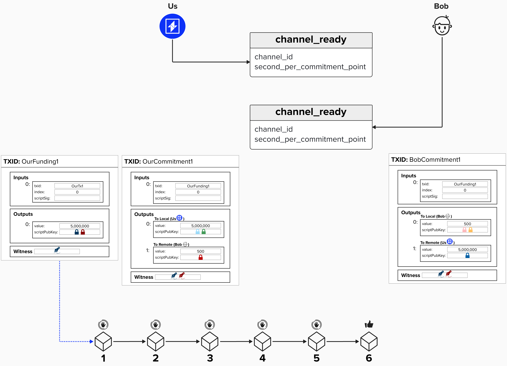
</p>

#### Question: Why is it generally considered "best practice" to wait 6 confirmations?

<details>
  <summary>Answer</summary>

In Bitcoin, "confirmations" are a way to measure the finality of a given transaction. Without getting too philosophical, transactions may never be considered "final" but, instead, probabalistically final. This is because here is always the possibility that a block reorganization (reorg) occurs, and a new blockchain (with the most accumulated proof of work) is found. If this happens, there is no guarentee that your transaction, which was mined in the previous blockchain, is now included in the new one.

Of course, reorgs become execingly rare as the number of blocks that are reorged increases. For example, there are often a few 1-block reorgs each month or so. There have even been a few dozen 2-block reorgs. However, as we increase the number of blocks, they become exedingly rare. 

By waiting for 6 block confirmations before begining channel operations, you effectively minimize the risk that a reorg will render your transaction unspent again. This is quite important if you are recieving funds on the channel or if you don't trust your counterparty.

</details>


#### Question: When should you use zero-conf channels? What can you do to increase the security of zero-conf channels?

<details>
  <summary>Answer</summary>

If you decide to leverage zero-conf channels, it's recommended to wait to use the channel until the funding transaction is included in both parties mempools. This gives each party (especially the non-initiator) the ability to verify the feerate used on the transaction. Additionally, if you run a well-connected bitcoin node, then you can be more confident that the funding transaction will be mined eventually.

So, given the extra security concerns, why choose to use zero-conf channels at all? 

Well, as the name suggests, zero conf channel are able to be used immediately (zero confirmations). If we waited until there were 6 block confirmations, then we may be waiting an hour or so before we can send any payments. That is pretty bad user experience, considering modern payment applications are often instant.

This instant payment flow can make for much better user experience and more innovative onboarding experiences.
For example, imagine you run you're own lightning node, and you currently have the following channel with a Lightning Service Provider (LSP).
- Your Balance: 1M Sats
- LSP Balance: 100K Sats

Now, let's say Bob was interested in sending you a payment for 200K sats. Unfortunately, the LSP wouldn't have sufficient "outbound liquidity" to send you 200K sats - they can only send 100K! So, are we out of luck? No!

The LSP could decide to open a zero-conf channel with you and start the channel with 200K sats on your side. By doing this, the LSP is effectively able to route the payment to you immediately via a new channel, providing a user-experience that is very similar to comparable finance apps.

The example described above described a payment protocol called **Just In Time (JIT)** payments, and it's actually already live on the Lightning network!

<p align="center" style="width: 50%; max-width: 300px;">
  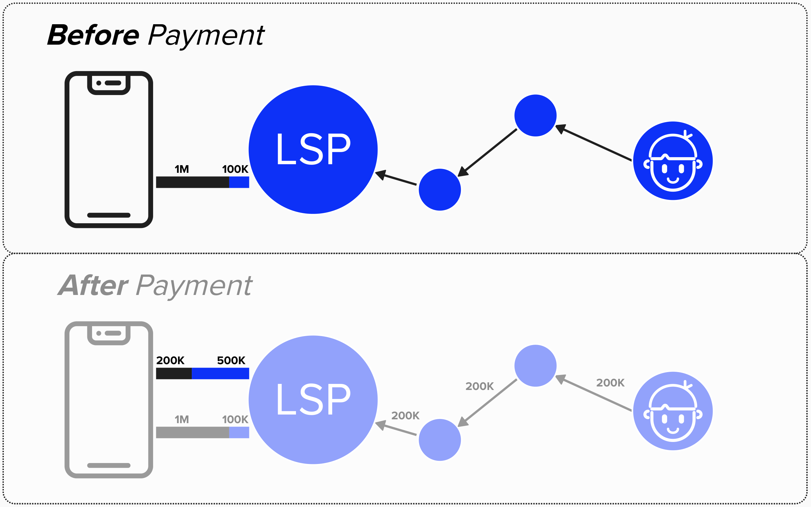
</p>

</details>

# Opening A Channel In LDK
To open a channel in LDK, we *start* by using the `create_channel` function, which is made available via the `ChannelManager`. Notice how we said "start" in the first sentence? Well, the `create_channel` function connects back to the `FundingGeneration` event that we learned about earlier. Specifically, the `create_channel` informs LDK of how we'd like to set up our channel, and this information is then formatted, per the BOLT specs, as a protocol message and sent to our peer. If they accept, then we recieve the `FundingGeneration` event, which we've already implemented functionality for!


<p align="center" style="width: 50%; max-width: 300px;">
  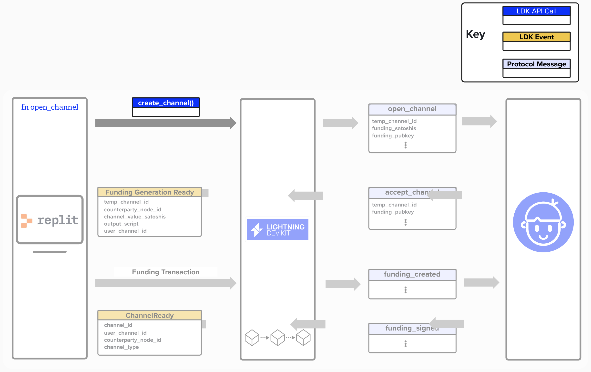
</p>

## Channel Manager create_channel()
The Channel Manager's create_channel function takes the following arguments as input:
- `their_network_key`: The public key of the peer we'd like to connect with.
- `channel_value_satoshis`: The total channel capacity. This is the amount that we're going to fund the channel with.
- `push_msat`: If we'd like to push an amount (in sats) on our channel partner's side when opening the channel, we can specify that amount here.
- `user_channel_id`: This is a mapping that we, the developers, can create when opening a channel. It has no specific use in LDK. Instead, it is passed back to us in the `FundingGenerationReady` message and allows the developer to track channels themselves with their own mapping scheme, if they would like.
- `temporary_channel_id`: If a temporary channel ID is specified, it will be used as the temporary channel ID for this channel. Otherwise, a random one will be generated.
- `override_config`: Developers can choose to implement custom channel configurations or use LDK's defaults.

```rust
pub fn create_channel(
    their_network_key: PublicKey,
    channel_value_satoshis: u64,
    push_msat: u64,
    user_channel_id: u128,
    temporary_channel_id: Option<ChannelId>,
    override_config: Option<UserConfig>,
) -> Result<ChannelId, APIError>
```

### Channel Configurations
You likely noticed that one of the parameters we pass to `create_channel` is `override_config`, which is a `UserConfig` type. This is an optional parameter, allowing us to specify custom configurations for our channel. If we don't provide it, then LDK will use default values for each parameter.

```rust
pub struct UserConfig {
    pub channel_handshake_config: ChannelHandshakeConfig,
    pub channel_handshake_limits: ChannelHandshakeLimits,
    pub channel_config: ChannelConfig,
    pub accept_forwards_to_priv_channels: bool,
    pub accept_inbound_channels: bool,
    pub manually_accept_inbound_channels: bool,
    pub accept_intercept_htlcs: bool,
    pub manually_handle_bolt12_invoices: bool,
}
```
You can read more about each component of the `UserConfig` [here](https://docs.rs/lightning/latest/lightning/util/config/struct.UserConfig.html), but below is a brief overview of the components that we'll be using for this exercise.

To start, `UserConfig` holds the following channel-specific configurations. 
- `ChannelHandshakeConfig`: Sets parameters proposed to the counterparty during channel creation, such as confirmation depth, whether the channel will be public, and our proposed delay for their `to_local` output.
- `ChannelHandshakeLimits`: Enforces minimum and maximum constraints on the counterparty's proposed channel settings, confirmation depth, channel size amounts, and the `to_self_delay` that they set for us.
- `ChannelConfig`: Configures payment and routing preferences, such as forwarding fees, CLTV deltas, and dust exposure limits.

### Example

Below is an example of how you would define a config with the following properties:
- We start by including the default values for the [`ChannelHandshakeLimits`](https://docs.rs/lightning/latest/src/lightning/util/config.rs.html#334-347) fields. These specify constraints regarding which channel parameters we will accept. For example, it specifies that our channel partner cannot request a minimum depth beyond 144 blocks.
- We then specify a few [`ChannelHandshakeConfig`](https://docs.rs/lightning/latest/src/lightning/util/config.rs.html#206) parameters. We overide some default parameters, and use the `..Default::default()` syntax to accept the default paramaters for the ones we don't specify.
- Finally, we, once again, use the `..Default::default()` syntax to accept the default paramaters for the rest of the configurable options available in the `UserConfig`.

```rust
let config = UserConfig {
  channel_handshake_limits: ChannelHandshakeLimits::default(),
  
  channel_handshake_config: ChannelHandshakeConfig {
    announce_for_forwarding: true,
    their_channel_reserve_proportional_millionths: 1_000,
    negotiate_anchors_zero_fee_htlc_tx: true,
    ..Default::default()
  },
  
  ..Default::default()
};
```

## ⚡️ Complete `open_channel`
In this exercise, you’ll implement the `open_channel` function in `src/commands.rs` to initiate a new Lightning channel with a peer in the Lightning Development Kit (LDK). The function takes a `peer_pubkey` (the peer’s public key), `channel_amt_sat` (the channel’s capacity in satoshis), `announce_channel` (whether to announce the channel for routing), `with_anchors` (whether to use anchor outputs), and a `channel_manager` (to manage channel operations). Your task is to configure the channel settings and call `channel_manager.create_channel` to open the channel, handling the result appropriately.

The function returns `Result<(), ()>`, indicating success (`Ok(())`) if the channel is initiated or failure (`Err(())`) if an error occurs. You’ll define a `UserConfig` to set channel parameters and use the `channel_manager` to create the channel, printing success or error messages to the console.

To successfully complete this function, your configurations should be the following:
- Use the default `ChannelHandshakeLimits`.
- Use the default ChannelHandshakeConfig, but ensure to override the following:
  - `announce_for_forwarding` should be what the user passes in via `announce_channel`
  - `their_channel_reserve_proportional_millionths` should be hard-coded to `1_000` (0.1%)
  - `negotiate_anchors_zero_fee_htlc_tx` should be what the user passes in via `with_anchors`
- Use the default parameters for the rest of the `UserConfig`

```rust
pub fn open_channel(
  peer_pubkey: PublicKey, channel_amt_sat: u64, announce_for_forwarding: bool,
  with_anchors: bool, channel_manager: &ChannelManager,
) -> Result<(), ()> {

  // Step 1: Define Channel Configuration
  
  // Step 2: Call create_channel
  
  // Step 3: Handle Success & Failures

}
```

Below, you’ll find step-by-step guidance to assist in completing the `open_channel` function.

<details>
<summary>Step 1: Define Channel Configuration</summary>

Let's start by defining the channel parameters for our channel negotiation. To do this, we must build a `UserConfig` instance to specify the channel’s handshake parameters, including limits and features like announcement and anchor outputs.

```rust
  let config = UserConfig {
    channel_handshake_limits: ChannelHandshakeLimits::default(),
    channel_handshake_config: ChannelHandshakeConfig {
      announce_for_forwarding: announce_channel,
      their_channel_reserve_proportional_millionths: 1_000,
      negotiate_anchors_zero_fee_htlc_tx: with_anchors,
      ..Default::default()
    },
    ..Default::default()
  };
```
- `UserConfig` is a struct that holds configuration options for channel creation.
- `..Default::default()` fills remaining fields with default values.

</details>

<details>
<summary>Step 2: Call create_channel</summary>

Once we have our channel parameters defined, we can leverage the Channel Manager's `create_channel` function to open our channel. 

Since `create_channel` returns a result, we'll use a `match` statement to handle the result, printing whether we succeed or fail to the console. We'll do this in the next step!

```rust
match channel_manager.create_channel(peer_pubkey, channel_amt_sat, 0, 0, None, Some(config))
{
    // Handle result
}
```
- `channel_manager.create_channel` initiates a channel with the specified parameters:
  - `peer_pubkey`: Our peer’s public key.
  - `channel_amt_sat`: The channel capacity in satoshis.
  - `0`: The `push_msat` (amount to push to the peer), set to 0 here..
  - `0`: The `user_channel_id`, is a field that allows the developer to assign a channel id that the application may use. This is not used by LDK for any Lightning purposes.
  - `None`: The `temporary_channel_id`. If it's None, LDK will assign one.
  - `Some(config)`: The `UserConfig` from Step 1.
- Use `match` to handle the `Ok` or `Err` cases in the next steps.

</details>

<details>
<summary>Step 3: Handle Success & Failures</summary>

If the channel creation succeeds, print a success message and return `Ok(())`. If it fails, print an error message with the error details and return `Err(())`.

```rust
match channel_manager.create_channel(peer_pubkey, channel_amt_sat, 0, 0, None, Some(config)) {
  Ok(_) => {
    println!("EVENT: initiated channel with peer {}. ", peer_pubkey);
    return Ok(());
  },
  Err(e) => {
    println!("ERROR: failed to open channel: {:?}", e);
    return Err(());
  },
}
```
- `Ok(_)` matches the successful case, ignoring the unit value (`_`).
- `return Ok(())` indicates successful channel initiation, matching the function’s return type.
- `Err(e)` matches the error case, capturing the `APIError` in `e`.
- `return Err(())` indicates failure, using the unit type as a simple error indicator.

</details>

**You should be good-to-go! Try implementing the `new` constructor in ```src/commands.rs```**! Click `Run` at the top of the Replit when you're done to see if the test `tests::programming_lightning::test_11_open_channel ...` passes.