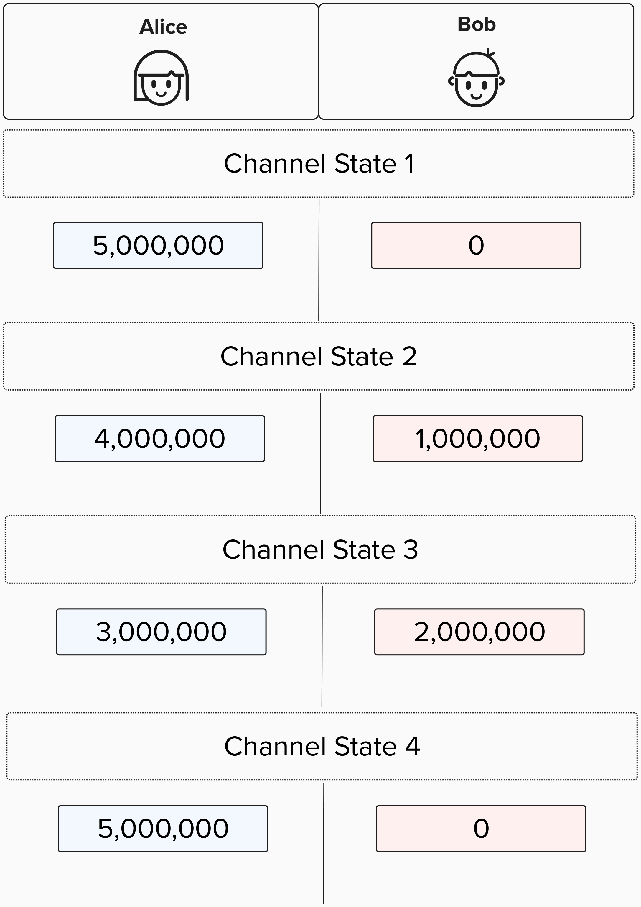
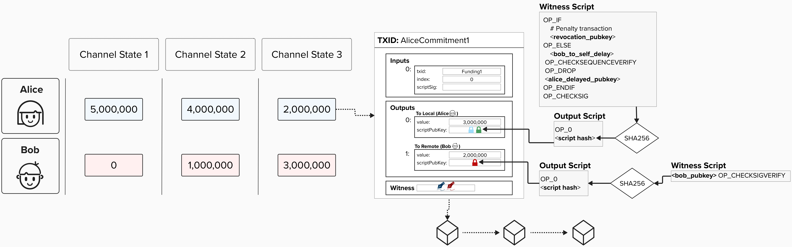
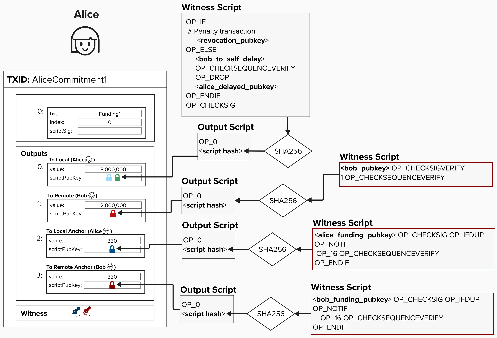
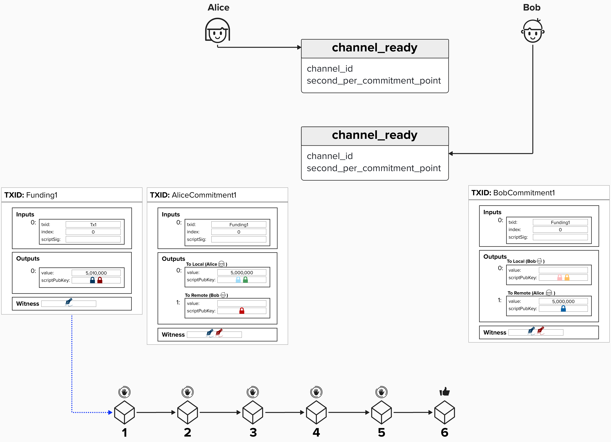

# Opening A Channel

At this point, our Lightning node is plugged in and ready to go! Well, at least for this workshop. In reality, there is more setup that we'd need to do, but we'll hand waive those nuances for now - we've covered the big parts!

To join the fun that is the Lightning network, we'll need to open a channel. While LDK makes opening a Lightning channel quite simple, there are still many decisions that we will have to make to ensure that the channel is optimized for our use case. To guide us through this discussion, let's use [BOLT 2](https://github.com/lightning/bolts/blob/master/02-peer-protocol.md) as our guide.

## BOLT #2

BOLT #2, titled "Peer Protocol for Channel Management", describes the communication protocol that peers will use to set up a channel between themselves. This protocol has the following three phases:
1) Channel Establishment
2) Channel Operation
3) Channel Closing

We'll focus on **Channel Establishment** in this section.

It's important to note that there are the following two version of channel establishment:
- **Channel Establishment v1**: This version is the original protocol for opening a channel between two channel parties.
- **Channel Establishment v2**: This is the updated channel open protocol that allows for dual-funding channel where both channel parties contribute funds to the channel. Note, you can also create single-fundeded channels with this updated protocol.

# Channel Establishment V1
For simplicity, we'll focus on **Channel Establishment v1** for this section. Also, note that, when initiating a channel, we've already autheniticated ([BOLT #8](https://github.com/lightning/bolts/blob/master/08-transport.md)). and initialized ([BOLT #1](https://github.com/lightning/bolts/blob/master/01-messaging.md)) a connection with our peer.


## Open Channel Message
Per Lightning's Channel Establishment protocol, the first step towards opening a channel is sending a `channel_open` message to the peer that you wish to open a channel with. The party that sends the `open_channel` message will be the **initiator**, and the receiving party will be the **non-initiator** (assuming they accept!).

Notably, the **initiator** will be responsible for the following:
- Kickstarting the negotiation by proposing the initial channel requirements, such as if this channel will be public
- Publishing the funding transaction
- Paying fees for either the common fields (Channel Establishment V1) or the entire funding transaction (Channel Establishment V1)
- Paying fees for the closing transaction

<p align="center" style="width: 50%; max-width: 300px;">
  
</p>

#### Question: In what situations would you want to be the initiator of a Lightning channel, and in what situations would you prefer to be the non-initiator?

<details>
  <summary>Answer</summary>

Keep in mind, the answer to this question will vary depending on if the given channel is opened via **Channel Establishment V1** or **Channel Establishment V2**. Remember, in **V1** the initiator must provide all the funding inputs. On the other hand, in **V2**, both the initiator and non-initiator can provide funding inputs. When applicable, this distinction has been noted in the answers below.

### When To Initiate
You may want to initiate the `channel_open` if you fall within one of the below categories:

1) **You need immediate outbound liquidity**: In V1 channel establishments, the initiator must supply all of the inputs. This means that, baring any use of `push_msat`, the initiator will begin the channel with all of the funds on their side. Therefore, they will only be able to send payments to their channel partner - not receieve them. In V2, both sides can supply inputs, providing some degree of outbound liquidity to both channel partners at the start. You may fall into this category if you are an active participant in the Lightning network, such as a routing node, or if you are seeking to set up a channel to make payments.
2) **You would like to set up a specific channel type**: In both V1 and V2 channel establishments, the initiator will propose the type of channel they would like to open. This involves specifying features or policies that the channel must support or comply with, such as anchor outputs, announcing publically, or how many sats to keep in the reserve. If you have specific requirements for your channels, then it may be best to initiate channel opens. That said, it is certainly worth noting that non-initiators must agree to channel features and policies, so you have some control over this even if you don't initiate the channel open.
3) **You don't mind paying fees**: In V1, the initiator pays all on-chain fees to open the channel. On the other hand, in V2, fees are split depending on the inputs and outputs provided by each party. If you'd like to pay minimal or no on-chain fees, then you'd likely prefer to not initiate channel opens.
4) **You support zero-conf**: In zero-conf channels, the channel becomes usable immediately - even if the funding transaction is not yet mined on chain. If you are the initiator of the channel, this means it's your responsibility to broadcast the funding transaction. Therefore, since you have the funding transaction, you can be sure that your counterparty will not double-spend or never broadcast the funding transaction.

### When To Not Initiate
You may want to receive (not initiate) the `channel_open` if you fall within one of the below categories:
1) **You need immediate inbound liquidity**: As we discussed above, in V1 channel establishments, the initiator must supply all of the inputs. This means, if you are the non-initiator to a V1 channel, you will start will only inbound liqduiity - the ability to recieve payments. If you are a merchant or focused on receiving/strengthening inbound liquitiy, then it may be best to accept channels from peers.
2) **You want to reduce on-chain fees**. Whether it's V1 or V2 channel establishment, the non-initiator will either always or likely spend less in on-chain fees. If you'd like to prioritize spending less fees to enter and exit the Lightning network, then you may want to be the non-initiator.

</details>

## Open Channel Negotiation
Let's imagine that we decide to open a channel to Bob. Since we're the **initiator**, we'll need to send Bob the `open_channel` message and submit our preferences and requirements for opening a channel.

To help contextualize where we're at in our "channel opening" process, take a look at the diagram below. In this diagram, you'll notice few things.

First, look at the transactions that are displayed on either side of the `channel_open` message. You'll see that a few of the public keys and transaction ID are shaded out. This is because, at this point in the process, we can't complete these portions of the transaction just yet. For example, since Bob has not yet sent us his public key and signature for the funding transaction (he hasn't agreed to the channel yet!), we cannot add them to the funding transaction and, therefore, we also cannot calculate the Tx ID yet.

Also, at this point in the channel open process, we are begining our channel *negotiation*. During the negotiation, we propose various preferences or requirements that we would like our channel to have. Our counterparty is free to agree, reject, or propose alternatives to our suggested options. To build our intuition of this process, let's explore a few options.

<p align="center" style="width: 50%; max-width: 300px;">
  
</p>

<p align="center" style="width: 50%; max-width: 300px;">
  
</p>

### Channel Reserve Satoshis
One option we have when opening a channel is the ability to specify the `channel_reserve_satoshis` amount. This parameter lets us specify the minimum amount of sats that our counterparty (Bob) must keep as a direct payment to himself during channel operation.

To make this more explicit, take a look at the diagram below. When we specify a `channel_reserve_satoshis` amount, we are specifying the minimum amount that Bob must keep in his `to_local` output.

<p align="center" style="width: 50%; max-width: 300px;">
  
</p>

#### Question: Why is it reasonable to require a minimum channel reserve?

<details>
  <summary>Answer</summary>

Let's begin our answer by exploring a scenario. Imagine we open our channel, send payments back and forth, and then let Bob's balance get to zero. Are we exposing ourselves to extra risk?

<p align="center" style="width: 50%; max-width: 300px;">
  
</p>

Yes! Remember, Lightning's punishment protocol hinges on you being able to punish your counterparty if they attempt to cheat! You can do this by spending their `to_local` output if they publish an old commitment state. However, if Bob's current state has zero sats, that means he doesn't have any skin in the game anymore. He may try to punish and old commitment state because he nothing to lose! If you steal his fund in the old channel state, that is the same outcome as closing the current commitment.

Therefore, to mitigate this attack, we require Bob to have *some* funds in his `to_local` at all times.

</details>


#### Question: What is a reasonable channel reserve to request?

<details>
  <summary>Answer</summary>

If you trust...

</details>


### Anchor Outputs

Another choice we will have to make when opening a payment channel is whether or not our payment channel should support anchor outputs. To ensure we're properly able to contextualize this decisions, let's review why anchor outputs are an option in the first place.

Imagine our we advance to a few channel states with our counterparty, Bob, and then Bob goes offline. We have no choice but to close our channel by publishing the latest commitment transaction. However, what if on-chain fees have spiked since we created this commitment transaction?

<p align="center" style="width: 50%; max-width: 300px;">
  
</p>


#### Question: Can we fee-bump this commitment transaction?

<details>
  <summary>Answer</summary>

Unfortunately, we can't fee-bump this transaction! There are a few reasons for this.

First, one common fee-bumping mechanism is **replace by fee**, which involves creating a new transaction that is meant to *replace* the existing transaction. So, in our case, we'd construct a new transaction that still distributes the correct amount of sats to us and Bob, however, we'd just add more for fees. Crucially, to do this, we'd need Bob to sign this new transaction, since it's spending from the 2-of-2 multisig. Therefore, this option is not available to us.

Now, you're probably thinking we could just **child-pays-for-parent** this transaction by attaching a new transaction to our `to_local` output and increasing the fees on that transaction. Unfortunately, our `to_local` output is not spendable until the `OP_CSV` timelock is satisfied! This means we will be unable to create a new transcation that spends from this output until after it's been mined for `bob_to_self_delay` blocks, removing our ability to child-pays-for-parent this transaction.

Not to mention, that this type of commitment transaction structure also opens the door for "pinning attacks" whereby your counterparty may take advantage of mempool policy and force you to pay exorbitant fees to get your transaction mined.

For these reasons, the LN protocl makes **anchor outputs** available for commitment transactions. **Anchor outputs** are essentially two additional outputs - one for the `to_local` party and one for the `to_remote`. These outputs exist so that each party is able to **child-pays-for-parent** (**CPFP**) any given committment transaction. To ensure that niether party can take advantage of mempool policies that would obstruct the CPFP process, all other outputs are timelocked by 1 CSV. For example, Bob's `to_remote` output on our transaction has a 1 CSV timelock. Any HTLCs would also have this timelock.

The reason both parties have their own output is so that either party can still CPFP the transaction if their counterparty attempts to "pin" the transaction by, for example, attaching 25 low-fee child transactions to their anchor output. Since the mempool policy doesn't allow more than 25 decenants for an unconfirmed transaction, this would usually prohibit the other party from being able to attach a new transaction. However, as of Bitcoin Core 0.19, there is a [CPFP carve out rule](https://bitcoinops.org/en/topics/cpfp-carve-out/) that allows a single transaction to moderately exceed the node’s maximum package size and depth limits if that transaction only has one unconfirmed ancestor.

<p align="center" style="width: 50%; max-width: 300px;">
  
</p>

</details>

#### Question: When should you use anchor outputs?

<details>
  <summary>Answer</summary>

Anchor outputs offer a variety of benefits to those opperating a Lightning channel.

The first, which is described above, is that anchor outputs enhance Lightning network security. They do this by providing a path to bump fees via **child-pays-for-parent**. They also mitigate "pinning attacks" whereby a counterparty make it either difficult or prohibitievly expensive to increase the fees of a commitment transaction.

A related, but slightly different, feature of anchor outputs is that they relieve the burden of having to conservatevly estimate fees when constructing each new commitment transaction. Before anchor outputs, counterparties were left trying to guess what fees may be at some arbitraty point in the future so that they can choose the appropriate fee for their latest commitment transaction. This is a very difficult task, so the ideal solution would be to not need to estimate fees at all and, instead, bring those fees later when fee-bumping the broadcasted commitment transaction.

</details>

#### Question: What on-chain requirements to anchor outputs introduce?

<details>
  <summary>Answer</summary>

As we've seen, anchor outputs allow for channel parties to attach fees to commitment transactions at the time of broadcasting them.

While this undoubtedly has its benefits, which we've discussed, it also comes with additional responsibility and complexity.

Since we have to attach fees to commitment transactions via **child-pays-for-parent**, we will need to have on-chain UTXOs available!

Before discussing strategy, as a motivational example, take a look at the graphic below...

<p align="center" style="width: 50%; max-width: 300px;">
  
</p>

#### Question: Assuming it is block height 190, how many UTXOs would we need to close this channel on-chain?

<details>
  <summary>Answer</summary>

We'd need three UTXO to close this channel on-chain. This is because we'd use one UTXO to add the necessary fees to close the commitment transaction. Then, we would need to use one UTXO *per HTLC*. This is because each **HTLC Timeout** transaction times out at a different block height. To ensure that we can claim the HTLC once the `cltv` timelock expires, we'll need to broadcast a claim transaction for HTLC when the timelock expires.

It's worth noting that **HTLC Success** transactions can be aggregated and claimed via one UTXO, along with the commitment transaction. Additionally, if you're closing multiple channels at once, you can use one UTXO across multiple channel closes.

</details>

### Reserve Strategy

Now, let's discuss strategy! When creating a UTXO reserve, below are some best-practices to ensure you are able to mine commitment/HTLCs transactions in a timely manner:
- When calculating required UTXO reserve requirements (in sats), estimate your balance requirements by using conservative feerates.
- Keep at least one UTXO available for each channel to be used when adding fees to closing transactions.
- If you have pending HTLC Timeout transactions, then you may need an additional UTXO for each HTLC. This is because, if they have different timeout requirements, they cannot be aggregated together.  

</details>


### Zero-Conf Channels

Under traditional circumstances, after the channel requirements have been negotiated between both parties, the *initiator** would go ahead and publish the **funding transaction**. Once it has recieved the number of confirmations specified in the `minimum_depth` parameter, which is supplied by the *non-initiator* when the accept the channel, then both parties will exchange `channel_ready` messages. These messages indicate that the channel is ready to use for payments.

That said, there is an option whereby the initiator can specify that they would like to open a "zero-conf" channel. Zero conf channels are exactly what they sound like - channels that are ready to make payments immediately - even before the funding transaction is confirmed!

<p align="center" style="width: 50%; max-width: 300px;">
  
</p>

#### Question: Why is it generally considered "best practice" to wait 6 confirmations?

<details>
  <summary>Answer</summary>

In Bitcoin, "confirmations" are a way to measure the finality of a given transaction. Without getting too philosophical, transactions may never be considered "final" but, instead, probabalistically final. This is because here is always the possibility that a block reorganization (reorg) occurs, and a new blockchain (with the most accumulated proof of work) is found. If this happens, there is no guarentee that your transaction, which was mined in the previous blockchain, is now included in the new one.

Of course, reorgs become execingly rare as the number of blocks that are reorged increases. For example, there are often a few 1-block reorgs each month or so. There have even been a few dozen 2-block reorgs. However, as we increase the number of blocks, they become exedingly rare. 

By waiting for 6 block confirmations before begining channel operations, you effectively minimize the risk that a reorg will render your transaction unspent again. This is quite important if you are recieving funds on the channel or if you don't trust your counterparty.

</details>


#### Question: When should you use zero-conf channels? What can you do to increase the security of zero-conf channels?

<details>
  <summary>Answer</summary>

If you decide to leverage zero-conf channels, it's recommended to wait to use the channel until the funding transaction is included in both parties mempools. This gives each party (especially the non-initiator) the ability to verify the feerate used on the transaction. Additionally, if you run a well-connected bitcoin node, then you can be more confident that the funding transaction will be mined eventually.

So, given the extra security concerns, why choose to use zero-conf channels at all? 

Well, as the name suggests, zero conf channel are able to be used immediately (zero confirmations). If we waited until there were 6 block confirmations, then we may be waiting an hour or so before we can send any payments. That is pretty bad user experience, considering modern payment applications are often instant.

This instant payment flow can make for much better user experience and more innovative onboarding experiences.
For example, imagine you run you're own lightning node, and you currently have the following channel with a Lightning Service Provider (LSP).
- Your Balance: 1M Sats
- LSP Balance: 100K Sats

Now, let's say Bob was interested in sending you a payment for 200K sats. Unfortunately, the LSP wouldn't have sufficient "outbound liquidity" to send you 200K sats - they can only send 100K! So, are we out of luck? No!

The LSP could decide to open a zero-conf channel with you and start the channel with 200K sats on your side. By doing this, the LSP is effectively able to route the payment to you immediately via a new channel, providing a user-experience that is very similar to comparable finance apps.

The example described above described a payment protocol called **Just In Time (JIT)** payments, and it's actually already live on the Lightning network!

<p align="center" style="width: 50%; max-width: 300px;">
  
</p>

</details>

# Opening A Channel In LDK
To open a channel in LDK, we'll *start* by using the `create_channel` function, which is made available via the `ChannelManager`. Notice how we said "start" in the first sentence? The `create_channel` function won't do everything for us. As we learned earlier, there are quite a few steps to opening a channel. Instead, this function will focus on creating an `open_channel` message for us and sending it to the desired recipient. Once it's sent, we'll have to be on the lookout for a respond from our peer. More on that soon!

When using this function, we'll have to pass in the following parameters:
- `their_network_key`: The public key of the peer we'd like to connect with
- `channel_value_satoshis`: The total channel capacity. This is the amount that we're going to fund the channel with.
- `push_msat`: If we'd like to push an amount (in sats) on our channel partner's side when opening the channel, we can specify that amount here.
- `user_channel_id`: This is an mapping that we, the developers, can create when opening a channel. It has no specific use in LDK. Instead, it is passed back to us in the `FudningGenerationReady` message and allows the developer to track channels themselves with their own mapping scheme, if they would like.
- `temporary_channel_id`: If a temporary channel ID is specified, it will be used as the temporary channel ID for this channel. Otherwise, a random one will be generated.
- `override_config`: Developers can choose to implement custom channel configurations or use LDKs defaults.

```rust
pub fn create_channel(
    their_network_key: PublicKey,
    channel_value_satoshis: u64,
    push_msat: u64,
    user_channel_id: u128,
    temporary_channel_id: Option<ChannelId>,
    override_config: Option<UserConfig>,
) -> Result<ChannelId, APIError>
```

## ⚡️ Complete `channel_open`


#
#
#
#
#
#
#
#
#
#
#
#
#
#
#

To begin our journey, let's start with the end. Imagine Alice and Bob decide to open a channel between themselves. Alice is funding this channel, so she will publish the funding transaction. Once the channel is established, we'll have the following three transactions:
- Funding Transaction
- Alice's Commitment Transaction
- Bob's Commitment Transaction

<p align="center" style="width: 50%; max-width: 300px;">
  
</p>

<p align="center" style="width: 50%; max-width: 300px;">
  
</p>

#### Question: Look at the above diagram. What information will Alice and Bob have to provide each other? For instance, Alice will create the Funding Transaction and her Commitment Transaction - what information does she need from Bob to do this?


<details>
  <summary>Answer</summary>

**Funding Transaction**
- Alice needs Bob's funding public key for the funding transaction. Since the Transaction ID is a hash of a subset of the transaction data (not the witness!), we'll also need Bob's funding public key before we can calculate this.

</details>

## Open Channel Message

Since Alice is funding the channel (providing the input UTXO for the funding transcaion), she will begin the process by sending Bob an `open_channel` message.

<p align="center" style="width: 50%; max-width: 300px;">
  
</p>

In the above picture, you'll notice that some fields have been grayed out. This is because, at this point in the channel establishment process, these fields are not yet known to Alice or Bob. For example, on Alice's side, she does not yet have Bob's funding public key, so she does not yet know the transaction ID.

When Alice sends Bob the `open_channel` message, she is essentially proposing a Lightning channel contract to Bob. The contract will stipulate important requirements information that Alice requires (or desires) to operate a channel with Bob. For example, consider the following fields in the `open_channel` message:
- `max_htlc_value_in_flight_msat`: The maximum value of *outstanding* HTLCs that Bob can offer.
- `max_accepted_htlcs`: The maximum number of *outstanding* HTLCs that Bob can offer.
- `channel_reserve_satoshis`: The minimum value that Bob must keep on his side of the channel. In other words, in outputs that pay directly to him.

Bob will then evaluate Alice's proposed channel and, if acceptable, he will send back a `accept_channel` message.

#### Question: Why would Alice request a channel reserve for Bob?

<details>
  <summary>Answer</summary>

**Funding Transaction**
- Alice needs Bob's funding public key for the funding transaction. Since the Transaction ID is a hash of a subset of the transaction data (not the witness!), we'll also need Bob's funding public key before we can calculate this.

</details>


## Accept Channel Message

If Bob agrees to Alice's channel proposition, he will send back an `accept_channel` message. His `accept_channel` message will it's own set of requirements that Alice must agree to. For example, one field that Bob proposes is `minimum_depth`, which provides the minimum number of blocks that must be mined on top of the funding transaction before the channel is live. This parameter is provided by the node which is *not* the funder (ex: Bob) because it's meant to protect Bob against Alice double-spending the funding transaction. See below for an example for how such an attack could be carried out:
1) Alice publishes the funding transaction with a low feerate.
2) Bob see the funding transaction in the mempool and, incorrectly, assumes it's safe to start operating the channel
3) Alice sends bob a payment, updating their channel state.
4) Alice secretly creates a new transaction with a high feerate, double-spending the funds in the funding transaction (which is still not yet confirmed)

Ouch!

<p align="center" style="width: 50%; max-width: 300px;">
  
</p>

#### Question: Sometimes, channel partners may agree to operate a "zero-conf" channel, where they start sending payment to eachother once the funding transaction is in both of their mempools (before it's mined). Why would they do this? What are other risks in addition to the above?

<details>
  <summary>Answer</summary>

Generally, channel partners open a zero-conf channel in circumstances where they wish to start using the channel immediately. For example, imagine you're setting up a Lightning wallet with a reputable Lightning Service Provider (LSP), and you wish to start using your wallet to send payments right away. The LSP may offer zero-conf channels so that their users have a better user experience.

Notice, an important pre-requisite to zero-conf channels is some degree of trust between the two parties. This is because the funding transaction is not solidified in the blockchain until it's been mined. Additionally, due to re-organizations, it's often recommended to wait around 6 blocks before operating a channel.

</details>


## Funding Created Message
Assuming Alice agrees to the channel propositions proposed in Bob's `accept_channel` message, she will then send Bob a `funding_created` message. In this message, Alice will provide Bob with the information he needs to be able to complete his commitment transaction for the initial channel state - namely the funding transaction TXID, output index, and Alice's signature, which Bob can use in the witness stack if he ever wishes to publish his commitment transaction.

At this point, the only information needed to complete the **Channel Establishment v1** process is a signature from Bob for Alice's commitment transaction. 

<p align="center" style="width: 50%; max-width: 300px;">
  
</p>

## Funding Signed Message
Finally, in response to Alice's `funding_created` message, Bob will send Alice a `funding_signed` message. This will contain a `channel_id` and Bob's signature, Which Alice can use for her commitment transaction. Note, since Alice can theoretically have multiple channels with Bob, the `channel_id` field allows Bob to specify which channel he is sending a signature for.

<p align="center" style="width: 50%; max-width: 300px;">
  
</p>


## Channel Ready Message
After recieving Bob's `funding_signed` message, Alice is now able to broadcast the funding transaction safely. This is because, if Bob were to disapear, she can always publish her commitment transaction, which spends the funds from the multi-sig back to herself.

Once Alice broadcasts the funding transaction and its received sufficient confirmations, Alice will send Bob a `channel_ready` message, indicating that the channel is ready for use. Similarly, Bob will send a `channel_ready` message to Alice once he verifies himself that the funding transaction has received sufficient confirmations on-chain.

<p align="center" style="width: 50%; max-width: 300px;">
  
</p>


# Opening A Channel In LDK
To open a channel in LDK, we'll *start* by using the `create_channel` function, which is made available via the `ChannelManager`. Notice how we said "start" in the first sentence? The `create_channel` function won't do everything for us. As we learned earlier, there are quite a few steps to opening a channel. Instead, this function will focus on creating an `open_channel` message for us and sending it to the desired recipient. Once it's sent, we'll have to be on the lookout for a respond from our peer. More on that soon!

When using this function, we'll have to pass in the following parameters:
- `their_network_key`: The public key of the peer we'd like to connect with
- `channel_value_satoshis`: The total channel capacity. This is the amount that we're going to fund the channel with.
- `push_msat`: If we'd like to push an amount (in sats) on our channel partner's side when opening the channel, we can specify that amount here.
- `user_channel_id`: This is an mapping that we, the developers, can create when opening a channel. It has no specific use in LDK. Instead, it is passed back to us in the `FudningGenerationReady` message and allows the developer to track channels themselves with their own mapping scheme, if they would like.
- `temporary_channel_id`: If a temporary channel ID is specified, it will be used as the temporary channel ID for this channel. Otherwise, a random one will be generated.
- `override_config`: Developers can choose to implement custom channel configurations or use LDKs defaults.

```rust
pub fn create_channel(
    their_network_key: PublicKey,
    channel_value_satoshis: u64,
    push_msat: u64,
    user_channel_id: u128,
    temporary_channel_id: Option<ChannelId>,
    override_config: Option<UserConfig>,
) -> Result<ChannelId, APIError>
```

## ⚡️ Complete `channel_open`


## Funding Generation Ready
When our counterparty responds to us, confirming that they have accepted our channel, we'll recieve a `FundingGenerationReady` `Event` from LDK. As the event name suggests, this notification informs us that our counterparty has accepted our channel, and they are ready for us to send them a `funding_created` message. However, before we can do this, we need to actually create the funding transaction so that we have the transaction ID and output index to provide to our counterparty.

To accomplish this, we'll update our **Event Handler** to properly respond when a `FundingGenerationReady` `Event` is provided to us. Specifically, we'll have to complete the following steps:
1) Use the information provided to us in the `FundingGenerationReady` event to create the funding transaction.
2) Pass the funding transaction to the channel manager via the `funding_transaction_generated` function.

```rust
match event {
  Event::FundingGenerationReady {
    temporary_channel_id,
    channel_value_satoshis,
    output_script,
    user_channel_id
  } => {
    // implement code to generate funding transaction here

    // pass to channel_manager.funding_transaction_generated()
  }
}
```
After we pass the funding transaction to `funding_transaction_generated`, LDK will take care of broadcasting the transaction for us, notifying us with a `ChannelReady` event once the funding transaction is sufficiently confirmed on-chain.


