# Sending Payments

Wow, we've come a long way! By now, you're probably itching to send some payments. After all, the real joy of Lightning is "slinging sats", as they say.

## Payment Protocols

To send payment in Lightning, we're going to have to follow one of various protocols. Just as we saw with constructing our commitment transactions earlier, these protocols are designed to make sending payments within a decentralized context possible. 

#### Question: Why do we need a payment protocol to send payments? 
<details>
  <summary>Answer</summary>

Before discussing Lightning, it may be helpful to review the concept of "languages as permissionless protocols". For example, if you would like to learn English and communicate with others using the English langauge, then you can do that *without anyone elses permission*. Of course, there may be obstacles that one has to overcome to learn this language, but there is no authority that you will need to ask for permission. Furthermore, once you decide to learn English, you won't simply make things up as you go. Instead, you will have to learn predefined words, definitions, and gramatical structures that already exist.

Lightning is very similar. You don't need anyone's persmission to enter the Lightning network. You just need to follow the rules. Following this idea, we can see how we will need a protocol.

 // write about different apps trying to post across eachother //

</details>

Lightning has a few different payment protocols. Before reviewing them, it's helpful to first split them into two categories: **BOLT-Standardized** and **Non-Standardized**.

### BOLT-Standardized Payment Protocols
**BOLT-Standardized** payment protocols are those that have a Lightning Basis of Technology (BOLT), which describes how they work. By creating standardized and detailed documentation as to how these payment protocols work, it makes it much easier for Lightning implementations to follow the specs and ensure that their applications are compliant with the protocol.
- **BOLT 11: Invoices**: BOLT 11 is the original payment protocol and, therefore, the most widely used and adopted as of early 2025. This protocol describes how one can *request* payments over lightning. This protocol is the one we'll review in this section of the workshop.
- **BOLT 12: Offers**: BOLT 12 is a newer protocol that makes some improvements on BOLT 11. For example, it introduces the concept of "offers", where an entity (ex: merchant, non-profit, individual, etc.) can post and recieve an invoice in return.

### Non-Standardized Payment Protocols
**Non-Standardized** payment protocols are simply protocols that define a payment scheme but do not have a BOLT associated with them. They can be industry innovations that were created to service existing needs in the payment space.
- **Keysend Payments**: Before BOLT 12 was implemented and popularized, entreprenurs developed a new way to send payments that did not require the recipient the generate a new invoice for each payment they were recieving. Instead, the recipient would just provide their node ID, and the payer would create the preimage *themselves* and encrypt it within the payment union such that only the recipient could decrypt it and claim the payment. This provided a few benefits, such as the sender being able to arbitrarily send any amount of bitcoin to the recipient whenever they liked. However, it also has large trade-offs, such as the sender not recieving any sort of reciept or confirmation that they were the ones who originated the payment.
- **Async Payments**: A down-side to most payment protocols on the Lightning network is that the recipient must be online when recieving the payment so that they can perform some action, such as releasing a preimage. Therefore, if they are offline when receiving the payment, they won't be able to complete. To remedy this, entreprenurs have developed asynchronous payments, whereby an intermediary routing node, such as a Lightning Service Provider (LSP), holds the Lightning payment until the recipient is online.
  
## BOLT 11
BOLT 11, the original payment standard for Lightning, defines a payment protocol whereby the recipient of a payment will provide an invoice with all of the required information needed to send a payment over the Lightning network.

For this example, let's imagine we want to send a payment to Alice for 400k sats. Since all public nodes on the Lightning network are identifiable via a public key, we know the public network graph ahead of time, so we can see there is a viable path to send To start this process, we ask Alice to send us an invoice.


<p align="center" style="width: 50%; max-width: 300px;">
  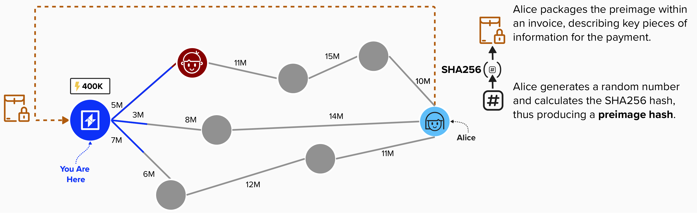
</p>

### BOLT 11 Invoice

When we recieve the invoice from Alice, it will have the following structure:
- **Human Readable Part**: The human readable part contains information that is, generally, easily to understand just by looking at it. It has the following fields:
  - **prefix**: This tells us which Bitcoin network the invoice is for. For instance, `lnbc` is for mainnet while `lnbcrt` is for regtest`.
  - **amount**: This field is optional, and it tells us the number of bitcoin that the invoice is for. There is also a multiplier provided, which is meant to be multiplied by the `amount`. The result is the actual amount that the invoice is for.
- **Data Part**: The data part is not human-readable, but it does contain vital information for the payment.
  - **timestamp**: This is the time that the invoice is generated. Note, it is NOT the expiry time.
  - **tagged data fields**: This portion of the invoice contains various data fields, such as the preimage hash, payee public key, description of payment, and exipry time (sepecified in seconds and added to `timestamp`). 
  - **signature**: Finally, a signature is provided, which allows the payee to attest to the information being sent in the invoice.

<p align="center" style="width: 50%; max-width: 300px;">
  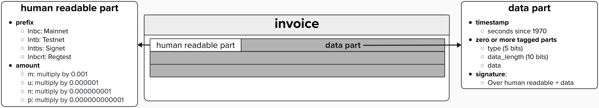
</p>

Below is an example of what a Lightning invoice may look like. Notice the following:
1) The `1` that is not highlighted in the raw version of the invoice (on the left) is called a **separator**. To the left of it is the human readable part, and to the right is the data part.
2) There is no amount specified for this invoice.
3) There is a **checksum** at the end of this invoice, which verifies the integrity of the message.

<p align="center" style="width: 50%; max-width: 300px;">
  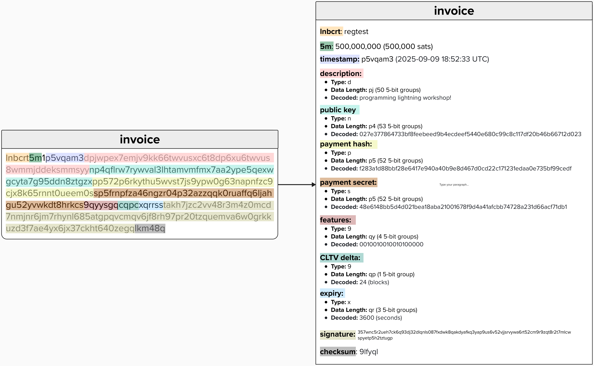
</p>

#### Question: Why shouldn't you re-use the same invoice for multiple payments?

<details>
  <summary>Answer</summary>

TLDR: You may lose your funds!

Longer Answer: Take a look at the simplified HTLC example below. Here, we can see that Alice creates an HTLC with Bob, and bob creates an HTLC with Alice. Crucially, both HTLCs are locked **to the same preimage hash**. If Alice attempted to pay this invoice twice by setting up a new HTLC with both that locked to the same preimage, then Bob wouldn't have to forward the payment to Dianne. He already has the preimage, so he can just take Alice's funds!

</details>

#### Question: When receiving an invoice, what checks should you do to determine if it's valid? Any health checks?

<details>
  <summary>Answer</summary>

Before paying a Lightning invoice, there are some best-practice checks that should be done beforehand. 

1) **Expiry**: As we learned earlier, Lightning invoices have expirys - after which, they are considered timed out and the recipient will no longer accept payment. Therefore, it's important to check that the invoice is has not yet expired before paying.
2) **Duplicate Payment**: This relates to re-using the same invoice, which we learned about above. You should **NOT** attempt to reuse the same invoice, as this will expose your funds to theft as they are routed along the Lightning Network, since the preimage has already been revealed.
3) **Fees**: The beauty of the Lightning Network is that invoices are routed privately. However, each node will likely request some fee for this service. Therefore, a crucial part of pathfing involves estimating fees for various possible routes. If one finds that fees are too high, it might not make sense to route this payment. For example, when on-chain fees are very low, it may be cheaper to send on-chain Bitcoin, if you're sending a large enough amount.
4) **Pathfinding**:
5) **Checksum**: Each invoice will have a signature and checksum. The signature will prove that the the sender of the invoice has the private key associated with the Lightning network node's public key. It along with the checksum can be used to verify the integrity of the invoice and ensure it was not altered before reaching us.

</details>


### Routing Our Payment

Great, we've verified the integrity of the invoice! Can we simply send Alice 400,000 sats? Not so fast! If we look at our channel graph, which includes all public nodes and any private connects we have, we can see that we don't have a direct path with Alice. So, we'll have to identify the ideal route to send this payment through.

Finding the ideal path to route a payment through is actually quite complex. In fact, some students do their entire PhD on pathfinding algorithms within the Lightning Network. Why is it so complex? Well, the Lightning Network was designed with privacy in mind. One property of the network is that **channel balance distributions** are not publicly known. So, while the overall **channel balance** is publically known, we don't know how those sats are distributed among channel particpants. This can make it quite difficult to find routes that have sufficient liquidity to route payments from us to the recipient (Alice, in this case.).

<p align="center" style="width: 50%; max-width: 300px;">
  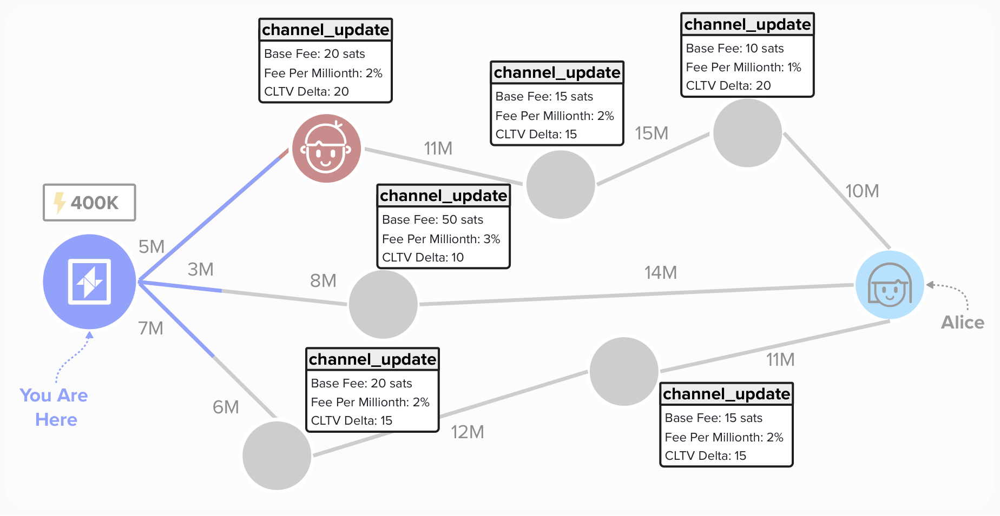
</p>

<details>
  <summary>Click to learn what CLTV Delta is...</summary>

The CLTV Delta is actually quite important (and potentially confusing!), so it's important to spend a moment discussing how this works.

First, let's review HTLC outputs. If we were to route a payment *through* Bob, we'd have to set up an HTLC output with him. Additionally, ever HTLC has a timeout clause. For the **HTLC Offerer**, it is present within the HTLC Timout 2nd Stage transaction. For the **HTLC Receiver**, it is present within the HTLC witness script in the commitment transaction.

<p align="center" style="width: 50%; max-width: 300px;">
  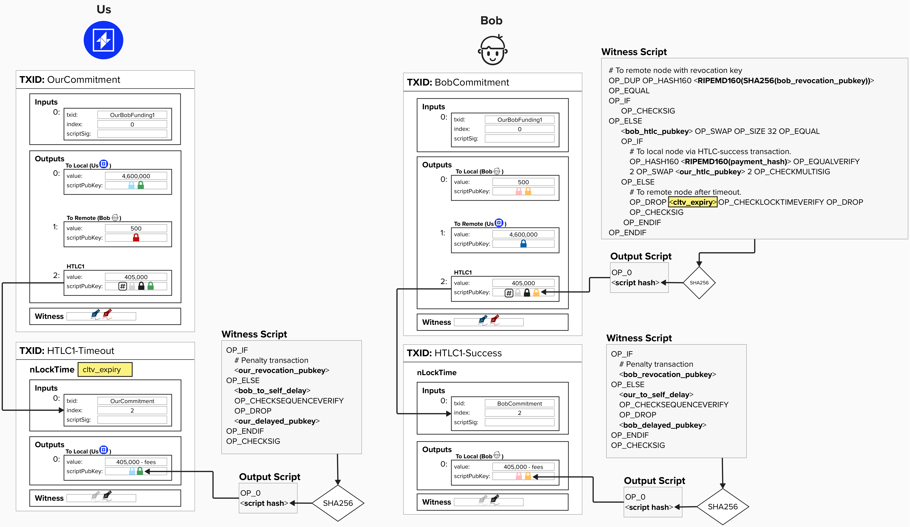
</p>

Since each HTLC in the route will have an absolute timelock on the HTLC, we need to be mindful of what each HTLC timeout is set to. For instance, below is a very simple HTLC payment from Us -> Bob -> Alice. In this example, both HTLC are timelocked to block 200. The issue here is that Alice could wait until the right before block 200 to claim the HTLC from Bob. At the same time, we could expire our HTLC with Bob by spending from the refund path at block 200. In this case Bob would lose the 400k sats!

To mitigate this issue, Bob (and others) will stipulate a **CLTV Delay**, which specifies the number of blocks he would like to have between the following timeouts:
- Us & Bob HTLC Timout
- Bob & Alice HTLC Timeout

For example, if Bob says his **CLTV Delay** is 15 blocks, then Bob and Alice's HTLC will timeout at block height 185, leaving 15 blocks of time before Our HTLC with Bob times out.

<p align="center" style="width: 50%; max-width: 300px;">
  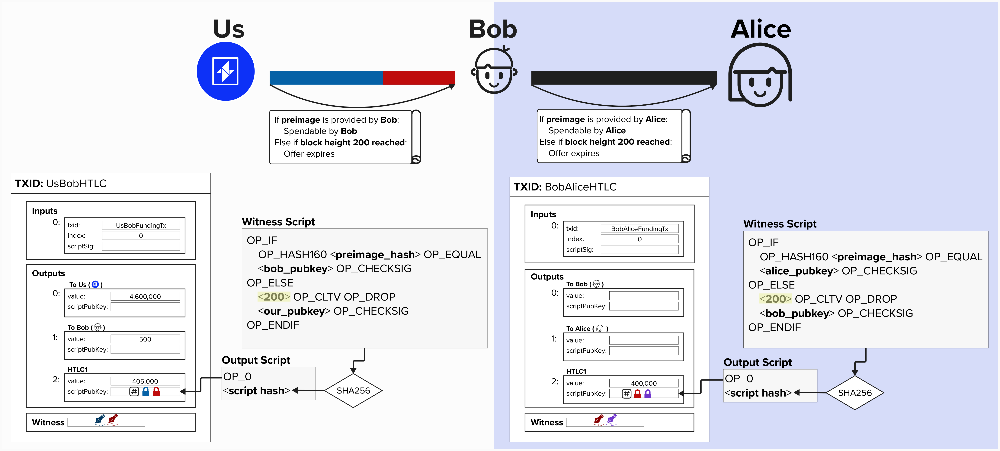
</p>

</details>


### ✍️ Route-Finding Exercise 

<details>
  <summary>Click here for a route-finding exercise...</summary>

Let's change things up! Instead of coding the function to determine the best route, let's put pen to paper and do things the old fashioned way.

In the above diagram, there are three different paths we can take to route a payment to Alice. To select the ideal path, we have to take into account things such as fees, timelocks, and much more. We'll touch on the "much more" aspect shortly, but let's take a moment to really dig into the weeds and understand fees and timelocks.

Below, you will see a diagram for each route available to us. The total fees and timelocks for the first two routes (called "Route 1" and "Route 2") have been provided for you. You task is the following:
1) **Complete "Route 3" and calculate the total fees and timelocks for this path.**
2) **Decide which is the best path to route this payment, given the available information.**
3) **Brainstorm what additional information you would like to better optimize route-finding.**

### Route 1

We'll walk through Route 1 together so that it's clear how we go about calcuating fees and timelocks.

#### Fees
First and foremost, we must *start at the end*. Take a second to look at the diagram to see if you can tell *why* we need to start at the end...

The reason we start at the end is because we need to know how many sats to send across all channels such that, once fees are taken by each routing node, the recipient still gets the amount they asked for. For instance, if we simply sent Bob 400,000 sats, then, by the time the payment was routed to Alice, it would be less than the 400,000 she asked for!

When calculating fees on the Lightning network, there are two types of fees to be aware of. Both fees are advertised in each node's `channel_update` protocol message.
1) **Base Fee**: This is a *flat* fee that is charged, regardless of the amount being sent over this channel.
2) **Fee Per Millionth**: This is a *proportional* fee, and it specifies the total number of sats that will be charged for every 1,000,000 sats that are routed over the channel.

The key to calculating fees is that, at each hop along the route, you must calculate the fee according to the total amount of sats that you are forwarding. Therefore, Bob, the first node in the route, will be charging a fee on all of the sats, even the sats that will subsequently be taken by later nodes for their own fees.

#### HTLC Timelocks
Similarly to fees, timelock calculation also starts at the end of the route. However, unlike fees, not all of the timelock information is available in the `channel_update` message. Alice will provide her timelock delta in the invoice's `min_final_cltv_expiry_delta` field when she sends it to us. All other timelocks will be provided in each node's `channel_update` message. 

To calculate the necessary HTLC timelocks, we...
1) Start by taking the current block height and adding the final node's (Alice's) timelock delta. This will be the timelock on the HTLC that Alice recieves.
2) Next, we start making our way towards us, the sender, and, for each hop, we add that node's **CLTV Delta** to the prior node's timelock. By doing this, we ensure that each node gets it's requested HTLC delay and has ample time to safely unwind the HTLC. For example, if a downstream node decides to close the channel on-chain, any the preceding node has plently of time to identify the on-chain transaction, retrieve the preimage, and continue unwinding the channel.

<p align="center" style="width: 50%; max-width: 300px;">
  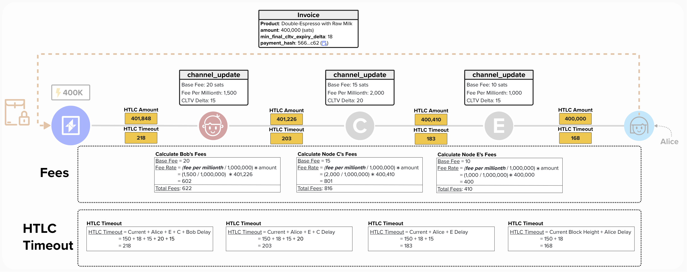
</p>

### Route 2

In the below diagram, we also calculate the fees and timelocks for Route 2.
<p align="center" style="width: 50%; max-width: 300px;">
  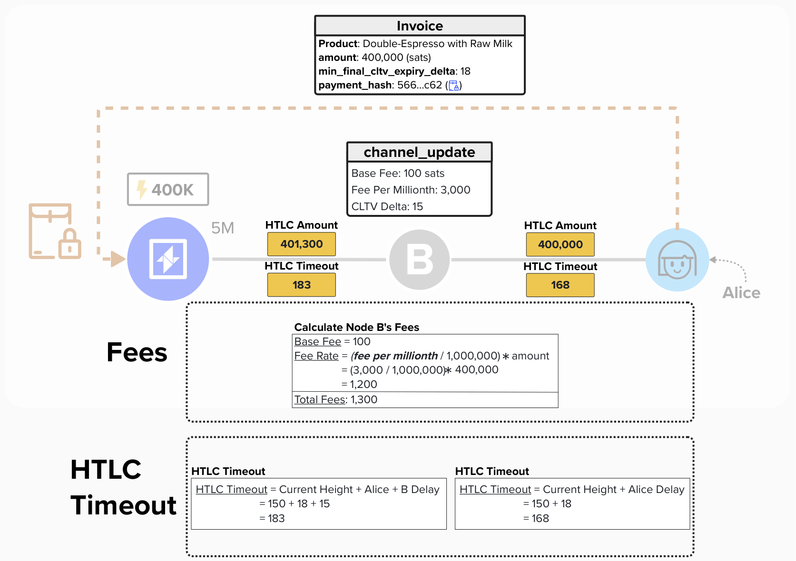
</p>


### Route 3

Now that we've seen how to calculate the fees and timelocks for all HTLCs along the route, go ahead and see if you can calculate them for Route 3. As a reminder, these are the questions you should answer after calculating the fees:
- **Decide which is the best path to route this payment, given the available information.**
- **Brainstorm what additional information you would like to better optimize route-finding.**

<p align="center" style="width: 50%; max-width: 300px;">
  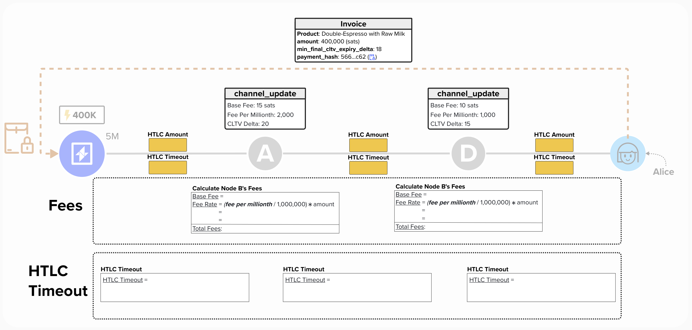
</p>


<details>
  <summary>Click here to see the answer once you calculate the fees and timeouts...</summary>

<p align="center" style="width: 50%; max-width: 300px;">
  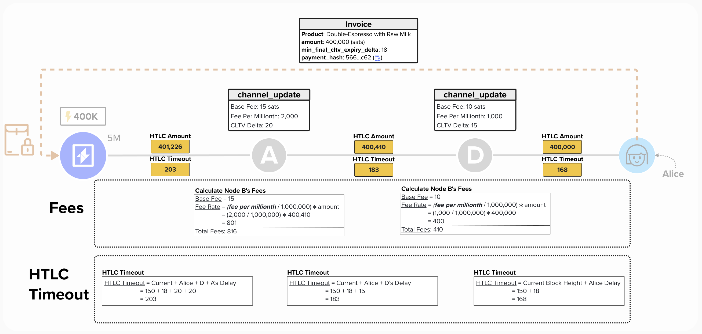
</p>

</details>


</details>


### Optimizing Route-Finding
Now that we've reviewed a basic path-finding example where we focused on minimizing fees and timelocks, let's review a ways that we can enhance our operations.

#### Probing
In our last example, we took it as a given that each channel in our graph had enough liquidity to forward our payment. However, that's not a safe assumption we can make in the real world!

In reality, we can only be sure of the channel balance distribution for nodes that we are directly connected with. For all other channels in the Lightning Network, we only know the **total channel capacity**, which we're able to verify by looking up the on-chain UTXO that is publicized in the `channel_announcement` message.

Therefore, to enhance our payment routing functionality so that we can identify which paths are viable options, we'll need a way to estimate channel balance **distributions**. Probing is one way of doing this!

Put simply, probing is the act of sending an **invalid** payment to a given node. The payment is purposefully invalid so that it fails, ensuring you do not lose funds in the process. By doing this we can learn very valuable things. For example, if a payment fails, the failing channel will send an error message to the sender, informing them of a temporary channel failure. On the other hand, if the final node sends an error message informing the sender that the payment hash was unrecognizable, then we've learned that a payment for this amount *would have suceeded*. By sending many fake payments in this manner, we can begin to estimate the channel balance distributions for channels we're aware of.

For example, in the below diagram, we have the following path: Us -> Bob -> Node Orange -> Alice. We only know the channel distribution for our channel with Bob, but we can estimate the channel distribution by sending probes...
- Perhaps we start by assuming channel balance is equally distributed in the following channels
  - Bob -> Node Orange
  - Node Orange -> Alice
- We send a 2M sat probe to Alice, and we see that it fails on the **Bob -> Node Orange** channel. With this new information, we update our estimates to 1M sats on Bob's side and 10M sats on Node Orange's side.
- We send a 1M sat probe to Alice, and we see that is successfuly reaches her, though this still means it fails via an invalid payment hash error message! Now, we update our estimates to 1.5M sats on Bob's side and 9.5M sats on Node Orange's side. We've also learned that Node Orange has at least 1M sats on their side with their channel to Alice, but we already estimate that they have 5M sats on their side of the channel, so we haven't learned too much new information here.

<p align="center" style="width: 50%; max-width: 300px;">
  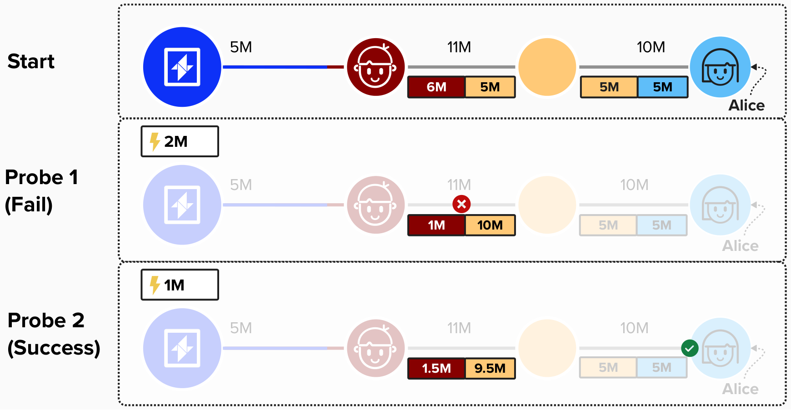
</p>

### Informing Peers How To Set Up Channels 

As mentioned above, when sending payments, we (the originator of the payment) will need to wrap payment information, called a **payload**, up for each hop in the route. These payloads will provide vital pieces of information, such as the `cltv_expiry` that each HTLC along the route must have. Payload are communicated within the `upate_add_htlc` message, which is a message that peers will send to each other when deciding the advance their channel state by adding a new HTLC output.

The payloads are a special field within the `upate_add_htlc` message. This is because this onion originates from  be wrapped such that each layer is encrypted. At each hop, the recipient of the payload will only be able to read the outer layer, which only they can decrypt. This is because each layer is encrypted using a shared secret that is created using the public node id that the given recipient broadcasts to the larger network as part of the gossip protocol. Since (hopefully!) only the recipient knows the private key to their public key, they will be the only ones who will be able to compute the shared secret the decrypts the payment instructions. 

<p align="center" style="width: 50%; max-width: 300px;">
  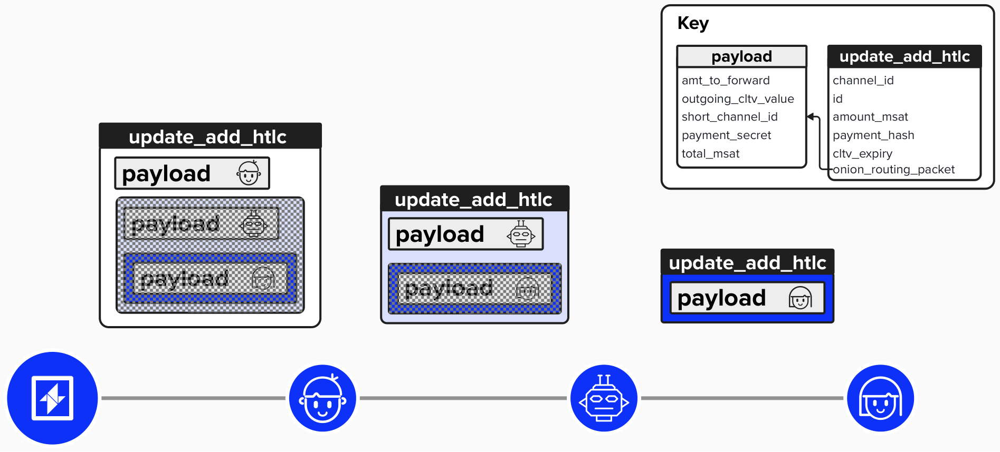
</p>

### Persistance

Recall, LDK is a software development kit that focuses on implementing Lightning protocol-level functionality. Therefore, it does not take care of higher-level application logic, such as payment tracking.

To ensure that our application is able to track payments correctly, especially if our application were to crash and be offline for a short period of time, we'll implement a structure to hold our outbound payment information in.

<p align="center" style="width: 50%; max-width: 300px;">
  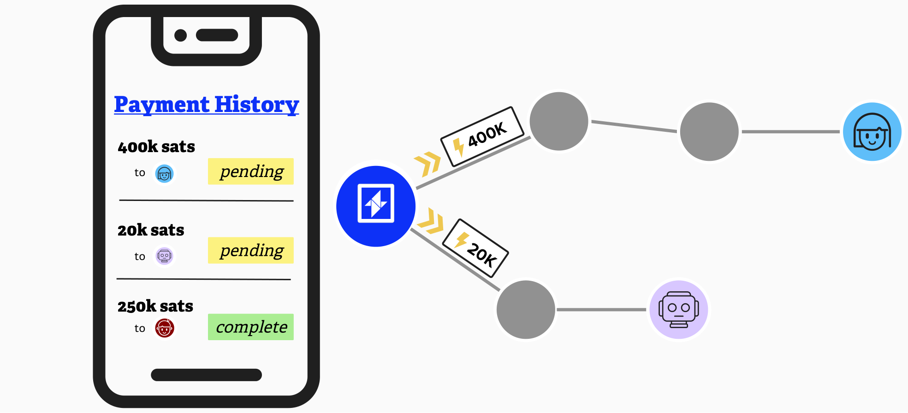
</p>

#### ⚡️ Define `OutboundPaymentInfoStorage` Structure

For this exercise, we'll define a structure to hold all output payment information. For each payment, we'll create a new data entry to track relevant pieces of information, such as the **Payment Preimage**, **Payment Secret**, **Payment Status**, and **Payment Amount**.

To start, let's define a structure to hold all the above information. We'll call it `Payment Info`.


### Sending A Payment In LDK
To send a payment in LDK, we use the `send_payment` function, which is made available via the `ChannelManager`. LDK will then take this information and convert it to the protocol messages, defined in [BOLT #2: Peer Protocol for Channel Management](https://github.com/lightning/bolts/blob/master/02-peer-protocol.md), and communicate with our peer that we'd like to route a payment through them and add an HTLC to our channel.

Once the payment is attempted, there are a variety of LDK events that we may recieve, depending on the status of the payment. You can see a list of them below:
- `PaymentSent`: Indicates an outbound payment we made succeeded (i.e. it made it all the way to its target and we got back the payment preimage for it).
- `PaymentFailed`: Indicates an outbound payment failed. Individual `Event::PaymentPathFailed` events provide failure information for each path attempt in the payment, including retries.
- `PaymentPathSuccessful`: Indicates that a path for an outbound payment was successful.
- `PaymentPathFailed`: Indicates an outbound HTLC we sent failed, likely due to an intermediary node being unable to handle the HTLC.


<p align="center" style="width: 50%; max-width: 300px;">
  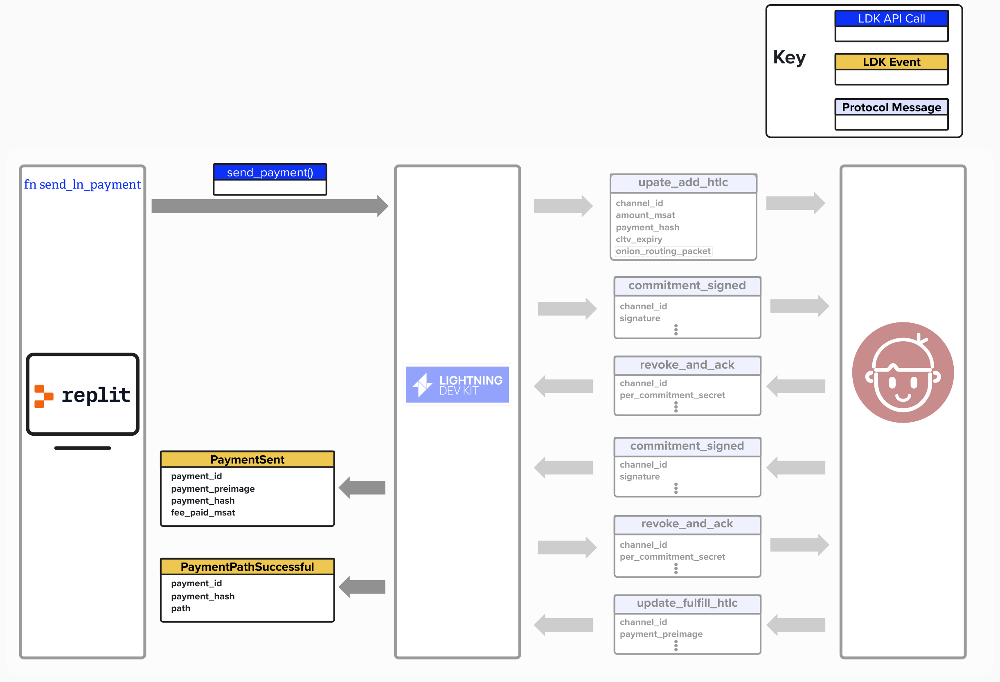
</p>

To initiate a payment with LDK, we can use the `send_payment` function within the `ChannelManager`. This function will take the following parameters as inputs:

- `payment_hash`: This is the hash of the payment preimage. This needs to be included in each HTLC that is set up along the payment path. If the payment is successful, the recipient will reveal the preimage that, when hashed, equals the `payment_hash`.
- `recipient_onion`: This is the encrypted payloads for each hop in the route.
- `payment_id`: This is a *user-provided* identifier for payments in LDK. While it is not a protocol identifier, LDK will use it to ensure it does not send payments with the same `payment_id`, and it can be helpful if the developer would like to implement their own tracking methodology for payments.
- `route_params`: These are configurations we can pass to LDK's routing algorithm, such as the maximum amount of fees we'd like to pay and any failed channels that we've tried in the past for this payment.
- `retry_strategy`: Finally, we can pass a retry strategy, which informs LDK of what we'd like to do if our payment fails. For example, we can specify that we'd like to retry the payment for a maximum of 3 attempts.

This function will return either of the following two:
- `Ok()`: The payment has succeeded.
- `RetryableSendFailure`: The payment failed for one of the following reasons: `PaymentExpired`, `RouteNotFound`, `DuplicatePayment`, `OnionPacketSizeExceeded`.

```rust
pub fn send_payment(
    channel_manager: &ChannelManager,
    invoice: &Bolt11Invoice,
    required_amount_msat: Option<u64>,
    outbound_payments: &mut OutboundPaymentInfoStorage,
    fs_store: FileStore,
) {
    // Step 1: Generate payment ID and secret
  
    // Step 2: Extract payment parameters
  
    // Step 3: Record payment attempt
  
    // Step 4: Send payment and handle result
}
```
Below, you’ll find step-by-step guidance to assist in completing the `send_payment` function.

<details>
<summary>Step 1: Generate Payment ID and Secret</summary>

Create a `PaymentId` from the invoice’s payment hash and extract the payment secret.

```rust
let payment_id = PaymentId((*invoice.payment_hash()).to_byte_array());
let payment_secret = Some(*invoice.payment_secret());
```
- `invoice.payment_hash()` returns the `Sha256` hash of the payment, used to identify it.
- `.to_byte_array()` converts the hash to a 32-byte array for `PaymentId`.
- `PaymentId(...)` constructs the unique identifier for tracking the payment.
- `invoice.payment_secret()` returns the `PaymentSecret` (a 32-byte value) for the invoice.
- `Some(*...)` wraps the secret in an `Option`, as required by `PaymentInfo`.

</details>

<details>
<summary>Step 2: Extract Payment Parameters</summary>

Extract payment parameters (hash, onion routing data, and route parameters) from the invoice, handling errors if parsing fails.

```rust
let pay_params_opt = payment_parameters_from_invoice(invoice);
let (payment_hash, recipient_onion, route_params) = match pay_params_opt {
    Ok(res) => res,
    Err(e) => {
        println!("Failed to parse invoice: {:?}", e);
        print!("> ");
        return;
    },
};
```
- `payment_parameters_from_invoice(invoice)` parses the invoice, returning a `Result` with a tuple `(Sha256, RecipientOnion, RouteParameters)`.
- `match pay_params_opt` handles the result:
  - `Ok(res)` binds the tuple to `res`, which is unpacked into `payment_hash`, `recipient_onion`, and `route_params`.
  - `Err(e)` prints an error message with the failure reason and returns early, exiting the function.
- These parameters are used in `send_payment` to route the payment correctly.

</details>

<details>
<summary>Step 3: Record Payment Attempt</summary>

Store the payment details in `outbound_payments` and persist the updated storage to `fs_store`.

```rust
outbound_payments.payments.insert(
    payment_id,
    PaymentInfo {
        preimage: None,
        secret: payment_secret,
        status: HTLCStatus::Pending,
        amt_msat: MillisatAmount(invoice.amount_milli_satoshis()),
    },
);
fs_store.write("", "", OUTBOUND_PAYMENTS_FNAME, &outbound_payments.encode()).unwrap();
```
- `outbound_payments.payments.insert` adds a new entry to the payment map:
  - `payment_id`: The ID from Step 1.
  - `PaymentInfo`: Contains `preimage: None` (no preimage yet), `secret` (from Step 1), `status: HTLCStatus::Pending`, and `amt_msat: MillisatAmount(invoice.amount_milli_satoshis())` (the invoice amount in millisatoshis).
- `fs_store.write` persists the updated `outbound_payments` to a file named `OUTBOUND_PAYMENTS_FNAME`:
  - `outbound_payments.encode()` serializes the storage to bytes.
  - `.unwrap()` assumes the write succeeds (handle errors in production).
- This ensures the payment attempt is recorded before sending.

</details>

<details>
<summary>Step 4: Send Payment and Handle Result</summary>

Call `channel_manager.send_payment` to initiate the payment and handle the result, updating the payment status on failure.

```rust
match channel_manager.send_payment(
    payment_hash,
    recipient_onion,
    payment_id,
    route_params,
    Retry::Timeout(Duration::from_secs(10)),
) {
    Ok(_) => {
        let payee_pubkey = invoice.recover_payee_pub_key();
        let amt_msat = invoice.amount_milli_satoshis().unwrap();
        println!("EVENT: initiated sending {} msats to {}", amt_msat, payee_pubkey);
        print!("> ");
    },
    Err(e) => {
        println!("ERROR: failed to send payment: {:?}", e);
        print!("> ");
        outbound_payments.payments.get_mut(&payment_id).unwrap().status = HTLCStatus::Failed;
        fs_store.write("", "", OUTBOUND_PAYMENTS_FNAME, &outbound_payments.encode()).unwrap();
    },
};
```
- `channel_manager.send_payment` sends the payment with:
  - `payment_hash`, `recipient_onion`, `route_params` from Step 2.
  - `payment_id` from Step 1.
  - `Retry::Timeout(Duration::from_secs(10))` for a 10-second retry timeout.
- `match` handles the `Result`:
  - `Ok(_)`: Print a success message with the payee’s public key (`invoice.recover_payee_pub_key()`) and amount (`invoice.amount_milli_satoshis().unwrap()`), then print a prompt.
  - `Err(e)`: Print an error message, update the payment status to `HTLCStatus::Failed` in `outbound_payments`, persist the change with `fs_store.write`, and print a prompt.
- `.unwrap()` on `get_mut` and `fs_store.write` assumes success (handle errors in production).

</details>