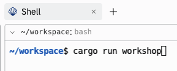
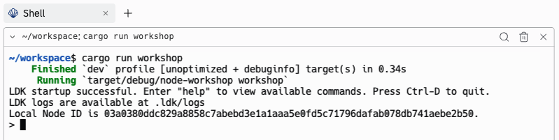

# Running Your Lightning Node

Nice job! You've put in the proof of work! Now it's time to start up your Lightning node, make some connections over the Lightning network, and send some payments!

## Start Your Node

Let's begin by starting up your Lightning node. Open up a **Shell** in a new tab. Once you do this, go ahead and run the following command in the Shell.


<p align="center" style="width: 50%; max-width: 300px;">
  
</p>

```
cargo run workshop
```

When your node is up-and-running, you should see something like the below. Note, your Node ID will be different than what is seen in the image.

<p align="center" style="width: 50%; max-width: 300px;">
  
</p>

## Familiarize Yourself With The Command Line
For this workshop, we'll be interacting with our node using the command line. If you're curious to learn more about what's going on under the hood, check out `src/cli.rs`.

To see which commands are available to you, type the below command in your **Shell**.

```
help
```

You should see a variety of command options appear, informing you how you can perform operations both on-chain and off-chain.

## Preparing To Open A Lightning Channel

Let's get our node ready to open a channel! To begin, type the below command in your **Shell**.

```
getbalance
```

#### Question: Are you ready to open a channel on the Lightning Network?
<details>
  <summary>Answer</summary>

Not really! Though, the exact answer here is a little more nuanced.

If you want open a V1 channel (without dual-funding), you will have to provide the funds. Since you have no on-chain bitcoin, you won't be able to open a V1 channel. Someone else could open a channel *to you*, but then you'd still want some on-chain UTXO's so that you can fee-bump Lightning transactions, if the need arises.

Let's get you some on-chain bitcoin so that you can open a channel!

</details>

Go ahead and type the following command in the **Shell** so that you can get an on-chain address. This command will return an on-chain address for the BDK wallet that we implemented earlier in this workbook! Send that address to your workshop facilitator, and they will send you some on-chain regtest bitcoin that you can use to open a channel.

```
getaddress
```

Once you workshop faciltator sends you some bitcoin, try checking your on-chain balance again. You should find that things have changed!

## Connecting To A Peer
Now, before you open a channel, you must connect to the peer you wish to open a channel with. If you look at the commands available to you, you'll see that one of them, listed under the **Peers** section, is: `connectpeer pubkey@host:port`. Remember, these ingredients are how we identify and connect with nodes on the Lightning Network.

Unfortunately, you won't be able to connect to peers in the workshop because Replit does not expose an IP Address for your Repl to use. However, you workshop facilitator will be running a node and exposing their IP address so that you can connect to them. Once multiple people are connected to the facilitator, you'll be able to send eachother payments by routing *through* the facilitator.

Try running the below command in your **Shell** to form a connection with your workshop facilitator. Once complete, you should see a SUCCESS message!
```
connectpeer 027e377864733bf8feebeed9b4ecdeef5440e680c99c8c117df20b46b66712d023@3.tcp.ngrok.io:21935
```

To confirm the connection worked, you can always use the `listpeers` command, which will inform you which peers your node is connected to.

## Opening A Channel
Now that you're connected to a peer (the facilitator), let's open a channel. To do this, the following command is available to you:

```
openchannel pubkey@host:port <amt_satoshis> [--public] [--with-anchors]
```

<details>
  <summary>These configurations should look familiar! Click to see why.</summary>

The options should look familar, since, in the `open_channel` exercise, we configured our node to be able to take `channel_amt_sat`, `announce_for_forwarding`, and `with_anchors` as inputs! Now we can see how those inputs are exposed to the user.

```rust
pub fn open_channel(
  peer_pubkey: PublicKey, channel_amt_sat: u64, announce_for_forwarding: bool,
  with_anchors: bool, channel_manager: &ChannelManager,
)
```
</details>

For this workshop, there are some constraints you'll have to work within to successfully open your channel and make payments:
- The `amt_satoshis` cannot be greater than 16777215 (~$19,000). This is because our node does not, by deafult, accept channels larger than this. To do so, we'd have to adjust the configurations in the `ChannelHandshakeLimits` when we open a channel. An exercise for another day!
- You will need to make sure you channel is public so that we can route payments to eachother (through the facilitator). If your channel is private, other workshop participants won't know about it and, thus, won't be able to identify a route to it.
- Whether or not your node supports anchor outputs is up to you! 

```
openchannel 027e377864733bf8feebeed9b4ecdeef5440e680c99c8c117df20b46b66712d023@3.tcp.ngrok.io:21935 16777215 --public=true --with-anchors=true 
```

Once you successfuly start the open channel process, you should see two EVENT messages that look like the below:

```
EVENT: initiated channel with peer 027e377864733bf8feebeed9b4ecdeef5440e680c99c8c117df20b46b66712d023. 

EVENT: Channel 0ecc13a325dad891fa7191b2315ee81123b080eb294d603c208232c156f63376 with peer 027e377864733bf8feebeed9b4ecdeef5440e680c99c8c117df20b46b66712d023 is pending awaiting funding lock-in!
```

Now we have to wait for 6 block confirmations so that we can start using our channel. If your impatient, tell your facilitator to hurry up! After all, this workshop is taking place on a private regtest environment that the facilitator has control over. Once your channel is read, you should see the below message.

```
EVENT: Channel 0ecc13a325dad891fa7191b2315ee81123b080eb294d603c208232c156f63376 with peer 027e377864733bf8feebeed9b4ecdeef5440e680c99c8c117df20b46b66712d023 is ready to be used!
```

<details>
  <summary>Click here to check the status of your channel</summary>

If you'd like to check the status of any of your channels, you can use the below command.

```
listchannels
```

This will print out important informatino about your channel. If you do this now, you'll see something like the below. If six blocks have already passed since your funding transaction was broadcasted, then `is_channel_ready` should be set to `true`.

```
{
    channel_id: 0ecc13a325dad891fa7191b2315ee81123b080eb294d603c208232c156f63376,
    funding_txid: 7733f656c13282203c604d29eb80b02311e85e31b29171fa91d8da25a313cc0e,
    peer_pubkey: 027e377864733bf8feebeed9b4ecdeef5440e680c99c8c117df20b46b66712d023,
    peer_alias: 
    short_channel_id: 273778395381761,
    is_channel_ready: true,
    channel_value_satoshis: 16777215,
    outbound_capacity_msat: 16609443000,
    available_balance_for_send_msat: 16609443000,
    available_balance_for_recv_msat: 0,
    channel_can_send_payments: true,
    public: true,
}
```

</details>

## Sending A Payment
At this point, you should have a channel open with your workshop facilitator!

#### Question: If somone else wanted to pay you, routing through the facilitator, are you able to receive a payment?
<details>
  <summary>Answer</summary>

Nope! Do you know why? If you don't take a look at the output of your `listchannels` message again. It should look something like this.

```rust
{
    channel_id: 0ecc13a325dad891fa7191b2315ee81123b080eb294d603c208232c156f63376,
    funding_txid: 7733f656c13282203c604d29eb80b02311e85e31b29171fa91d8da25a313cc0e,
    peer_pubkey: 027e377864733bf8feebeed9b4ecdeef5440e680c99c8c117df20b46b66712d023,
    peer_alias: 
    short_channel_id: 273778395381761,
    is_channel_ready: true,
    channel_value_satoshis: 16777215,
    outbound_capacity_msat: 16609443000,
    available_balance_for_send_msat: 16609443000,
    available_balance_for_recv_msat: 0,
    channel_can_send_payments: true,
    public: true,
}
```

<details>
<summary>Click here to learn why you cannot receive a payment yet</summary>

At of now, you can't receive payments yet because your only channel has **no inbound liquidity**. In other words, all of the channel funds are on your side of the channel, so the facilitator has no funds to forward to you if someone where to try to make a payment.

You can see this very clearly in the following field of the `listchannels` output.

```
available_balance_for_recv_msat: 0,
```

</details>

</details>

To send a payment, we'll use the following command. As you can see, this payment will take either a BOLT 11 invoice or BOLT 12 Offer, along with an optional amount field. The amount field is optional because it is often specified in the invoice itself, so you don't need to specify it. However, sometimes it is not specified, so the payer can provide the amount when they make the payment.

```
sendpayment <invoice|offer> [<amount_msat>]
```

Ask your facilitator to send you a Lightning invoice. Below is an example of how you can pay the invoice.

```
sendpayment lnbcrt5m1p5vxg8sdpjwpex7emjv9kk66twvusxc6t8dp6xu6twvus8wmmjddeksmmsyynp4qflrw7rywval3lhtamvmfmx7aa2ype5qexwgcyta7g95ddn8ztgzxpp5msphgr8alf83s073hdm3gnpvj2s4h7gw8e7dj8hytdn2cm0mz0gssp5kswxg6clrfxzfq3qyktujanjzga29j3yka746hcrlfh6j3e7tpgs9qyysgqcqpcxqrrssm00wjryw38n5vvgmxynw6puygt8v2xwfkemjks0xyhmjy5q0zcm33c5uyaaqsnnd7vw8ryn5zxqzaj4l0zdrvh5d8quexh7gcq0n2tsp7ujfug
```

If it is sent successfully, you should see something like the below:

```
EVENT: initiated sending 500000000 msats to 027e377864733bf8feebeed9b4ecdeef5440e680c99c8c117df20b46b66712d023

EVENT: successfully sent payment of 500000000 millisatoshis (fee 0 msat) from payment hash dc03740cfdfa4f183fd1bb77144c2c92a15bf90e3e7cd91ee45b66ac6dfb13d1 with preimage 43690881ab3527dcbb6751962bb699b73fbd67464faa430ef3453ed61bd5f003
```

Try entering the `listchannels` command again. You should see that you now have some inbound capacity!

## Generating An Invoice & Receiving A Payment
You're now ready to recieve a payment from another participant in the workshop! To generate an invoice, you can use the `getinvoice` command, which takes the following parameters:
- `amt_msat`: This, as expected, is the amount (in milli-satoshis) that you'd like to recieve. 
- `expiry_secs`: This is the expiration of the invoice. After this time has passed, the invoice will no longer be valid. Per BOLT 11, the default value for this field is 3,600 seconds (1 hour).

<details>
<summary>Click here for a Pro Tip</summary>

One road bump that students someitmes run into is that they generate an invoice for an amount that is so large that it would force their counterparty to go below their channel reserve. For example, they might see that their counterparty has 1,000,000 sats on their side of the channel. However, if their channel reserve is 10,000 sats, then they can really only send up to 990,0000 sats. 

If you'd like ensure you generate an invoice for an amount that your counterparty can pay, then make sure it's below the `available_balance_for_recv_msat` that is provided in the `listchannels` output. 

</details>

Below is an example of how you can generate an invoice for 500,000 milli-satoshis.

```
getinvoice 500000 3600
```

Once you get the invoice, try sending it to someone else in the workshop! If you encounter an error, make sure to remind the other person that they need to have outbound capacity!

If the payment succeeds, you should see something like the below:

```
EVENT: received payment from payment hash 0ea6490ef5a0a2cc562624e3c6f061f5e8c3b358a4a9f1a8d9c5a93f1fa55ccb of 500000 millisatoshis

EVENT: claimed payment from payment hash 0ea6490ef5a0a2cc562624e3c6f061f5e8c3b358a4a9f1a8d9c5a93f1fa55ccb of 500000 millisatoshis
```
