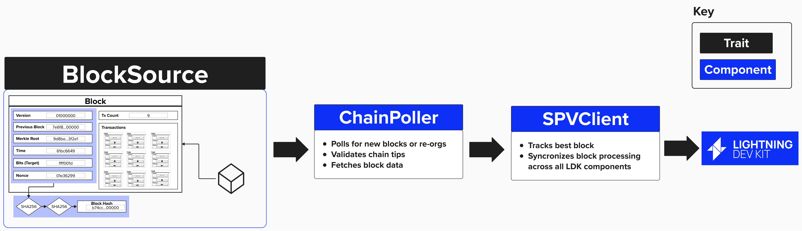

# Fetching Blockchain Data

Regardless of how your Lightning node retrieves data from the Bitcoin blockchain (ex: Bitcoin Core, Esplora, Electrum, etc.), it's going to need to be notified when new transactions are mined. This way, it can ensure that our counterparty is not attempting to cheat us by publishing an old channel-state.

From an LDK perspective, there are different architectural approaches that are required, depending on if we are sourcing our blockchain data from a block-oriented interface (ex: Bitcoin Core) or a transaction-oriented interface (ex: Esplora, Electrum).

### Block-Oriented Interace
If we're conntecting our node to a block-centric interface, we will need to implement the `BlockSource` trait. This trait defines methods to fetch the following information from a given block source.
1) Block Height
2) Block Data (Header + Transactions)
3) Block Hash

Once we've implemented a `BlockSource`, we can pass that information to the below components, which LDK provides. These components will take care of processing new blocks and informing each relevant LDK component of any new transactions so that each component can act accordingly.
- `ChainPoller`: The `ChainPoller` takes a `BlockSource` as an input and contains functionality to validate new blocks.
- `SpvClient`: The `SpvClient` takes a `ChainPoller` as an input, along with the various LDK components that need to be notified of new blocks, and ensures proper orchestration across all components in LDK.

<p align="center" style="width: 50%; max-width: 300px;">
  
</p>

### Transaction-Oriented Interace
(to-do!)

## Updating Our BitcoinClient
Since our Lightning node will connect the the bitcoin core node running in the background of our Repl, we'll be retrieving block-oriented data. Therefore, we'll need to implment the `BlockSouce` interface!

The `BlockSource` interface, with its required methods, can be seen below. As we learned earlier, these functions will be called privately within the `ChainPoller`, which is subsequently passed into our `SpvClient`.

```rust
pub trait BlockSource: Sync + Send {
    fn get_header<'a>(
        &'a self,
        header_hash: &'a BlockHash,
        height_hint: Option<u32>,
    ) -> AsyncBlockSourceResult<'a, BlockHeaderData>;

    fn get_block<'a>(
        &'a self,
        header_hash: &'a BlockHash,
    ) -> AsyncBlockSourceResult<'a, BlockData>;

    fn get_best_block<'a>(
        &'a self,
    ) -> AsyncBlockSourceResult<'_, (BlockHash, Option<u32>)>;
}
```

Since our Lightning node is retrieving blockchain data from Bitcoin Core, we'll complete these functions by fetching and returning the required data by querying Bitcoin Core's JSON RPC interface.

To keep things organized, we’ll encapsulate the `BlockSource` functionality inside our `BitcoinClient` struct. This way, all interactions with Bitcoin Core (fetching blocks, broadcasting transactions, etc.) live in one place.

In Rust, we define these behaviors using the `impl` keyword, which lets us attach methods to our `BitcoinClient`. 

```rust
impl BlockSource for BitcoinClient {
    fn get_header(header_hash: BlockHash, height_hint: Option<u32>) {
        // implement here
    }

    fn get_block(header_hash: BlockHash) {
        // implement here
    }

    fn get_best_block() {
        // implement here
    }
}
```

One this is completed, these functions will be available within the `BitcoinClient` structure. So, for example, you could obtain the best block's chain hash using:

```rust
let bitcoin_rpc_client = BitcoinClient::new(host, port, rpc_user, rpc_password, network).await.unwrap();
let best_block = bitcoin_rpc_client.get_best_block();
```


## ⚡️ Implement `BlockSource` For Our `BitcoinClient`
Complete the implementation of `BlockSource` for `BitcoinClient` in `src/ch2_setup/bitcoin_client.rs`. You'll need to implement:

1. `get_header`: Fetches a block header by its hash
2. `get_block`: Fetches a complete block by its hash
3. `get_best_block`: Fetches information about the most recent block

```rust
impl BlockSource for BitcoinClient {
    fn get_header<'a>(
        &'a self, header_hash: &'a BlockHash, height_hint: Option<u32>,
    ) -> AsyncBlockSourceResult<'a, BlockHeaderData> {
        Box::pin(async move { 
            let header_hash = serde_json::json!(header_hash.to_string());
            Ok(self.bitcoind_rpc_client.call_method("getblockheader", &[header_hash]).await?)
        })
    }

    fn get_block<'a>(
        &'a self, header_hash: &'a BlockHash,
    ) -> AsyncBlockSourceResult<'a, BlockData> {
        Box::pin(async move {
            // your code here
        })
    }

    fn get_best_block(&self) -> AsyncBlockSourceResult<(BlockHash, Option<u32>)> {
        Box::pin(async move { 
            // your code here
        })
    }
}
```

### Available Methods

Remember, `self.bitcoind_rpc_client` is an `RpcClient`, so it provides some RPC methods that we can utilize:
- `get_header(header_hash, height_hint)` - Returns block header data
- `get_block(header_hash)` - Returns full block data
- `get_best_block()` - Returns the latest block info

Note, the first method, `get_header` had been provided for you. You can use this to guide your completion of the rest of the methods. Also, you'll notice that the following code has been provided for you within each function:

```rust
Box::pin(async move { 
    // your code here
})
```
This is included because our function is asynchronous, and at compile time, we don’t know the size of the data it will eventually return. To handle this, we **“box”** the future to give it a fixed size and **“pin”** it in on the heap to ensure its memory location remains stable.

While understanding this concept is important for asynchronous programming in Rust, it’s not essential for completing this workshop. Therefore, this code has been provided for you.

## Adding Additional Methods To `BitcoinClient`

If you recall from above, we mentioned that all of the functionality we implement will fall into one of two categories:
1) Required by LDK.
2) Not required by LDK, but necessary for our Lightning application.

The `BlockSource` functionality is required by LDK. However, we'll need to implement other functionality for our Lightning node that LDK may not explicity require. For example, when creating funding transaction for a Lightning channel, we'll need to fetch a UTXO to use as an input. LDK doesn't have a UTXO interface that needs to be implemented. Instead, it leaves that to us.

Since we're using Bitcoin Core for our on-chain wallet, let's add the ability to fetch UTXOs to our `BitcoinClient`. To get a feel for what we're going to need to implement, go ahead and execute the below command in your **shell**.

```
bcli getblockchaininfo
```

You should see something that looks like this...

```
{
  "chain": "regtest",
  "blocks": 157,
  "headers": 157,
  "bestblockhash": "0b3efe7458d38e6ac7ad2f2ef316afd4761943d10723906106536bc7446c9570",
  "difficulty": 4.656542373906925e-10,
  "time": 1742416168,
  "mediantime": 1742416168,
  "verificationprogress": 1,
  "initialblockdownload": true,
  "chainwork": "000000000000000000000000000000000000000000000000000000000000013c",
  "size_on_disk": 70450,
  "pruned": false,
  "warnings": ""
}
```

## ⚡️ Implement `list_unspent` For Our `BitcoinClient`

For this exercise, we'll implement `list_unspent` for our `BitcoinClient`. To do this, we'll use another `impl` block in our Rust codebase, though, in reality, this would have likely been added underneath the `new` constructor we created previously.

To help with this exercise, another RPC method, `get_blockchain_info`, has been provided for you. These methods utilize the `call_method` available within our `self.bitcoind_rpc_client`, executing whichever command we pass in - along with any arguments we supply. In this case, `get_blockchain_info` makes and an RPC call to get blockchain info, passing in an empty vec, which indicates we are *not* providing any additional arguments.

Try to implement `list_unspent`. Note: you'll have to cast the response to a `ListUnspentResponse` type. For guidance on how to do this, check our `get_blockchain_info`. In this function, we cast the `getblockchaininfo` RPC call to a `BlockchainInfo` struct by specifying it in between `call_method::` and the method we are calling.

```rust
impl BitcoinClient {
    pub async fn get_blockchain_info(&self) -> BlockchainInfo {
        self.bitcoind_rpc_client
            .call_method::<BlockchainInfo>("getblockchaininfo", &vec![])
            .await
            .unwrap()
    }
    
    pub async fn list_unspent(&self) -> ListUnspentResponse {
        // implement here
    }
}
```

<details>
  <summary>
    Click here to learn more about ListUnspentResponse
</summary>

Just in case you're curious, the `ListUnspentResponse` is a custom type that wraps a `ListUnspentUtxo` struct, which you can see defined below.

This essentially formats the JSON response that we recieve from the `listunspent` RPC call we're making into a Rust type that we can use within our program.

```rust
pub struct ListUnspentUtxo {
    pub txid: Txid,
    pub vout: u32,
    pub amount: u64,
    pub address: Address,
}

pub struct ListUnspentResponse(pub Vec<ListUnspentUtxo>);

impl TryInto<ListUnspentResponse> for JsonResponse {
    type Error = std::io::Error;
    fn try_into(self) -> Result<ListUnspentResponse, Self::Error> {
        let utxos = self
            .0
            .as_array()
            .unwrap()
            .iter()
            .map(|utxo| ListUnspentUtxo {
                txid: Txid::from_str(&utxo["txid"].as_str().unwrap().to_string()).unwrap(),
                vout: utxo["vout"].as_u64().unwrap() as u32,
                amount: bitcoin::Amount::from_btc(utxo["amount"].as_f64().unwrap())
                    .unwrap()
                    .to_sat(),
                address: Address::from_str(&utxo["address"].as_str().unwrap().to_string())
                    .unwrap()
                    .assume_checked(), // the expected network is not known at this point
            })
            .collect();
        Ok(ListUnspentResponse(utxos))
    }
}
```

</details>


## ⚡️ Implement `BroadcasterInterface` On Our `BitcoinClient`
To enable our Lightning node to broadcast transactions, we need to implement the `BroadcasterInterface` trait. Since we’ve already defined a `BitcoinClient` structure to manage our RPC connection to Bitcoin Core, we’ll extend its functionality by implementing the `BroadcasterInterface` trait for it.

We can do that by using the below notation:

```rust
impl BroadcasterInterface for BitcoindClient {
    fn broadcast_transactions(&self, txs: &[&Transaction]) {
        // loop over transactions
            // convert Transaction to hex
            // send raw transaction
}
```

### Hints & Helpful Information

### ○ For Loops
For this exercise, you will need to iterate over the array of `Transaction`s and broadcast each one. To iterate over an array in Rust, you can use the following syntax:

```rust
for num in arr {
  println!("{num}"); 
}
```

### ○ Convert `Transaction` to Hex
Before passing the `Transaction` into `sendrawtransaction`, you will need to convert it to Hex (string). You can do that by passing the transaction into the `serialize_hex` method provided in the **rust bitcoin** crate’s `encode` module.

```rust
let tx_hex = encode::serialize_hex(tx);
```

### ○ `sendrawtransaction` Helper Function
The below helper function has been provided to you. As you can see, it takes a transaction, represented as a hexadecimal string, converts it to JSON, and passes it as a parameter to the method `sendrawtransaction`.

Under normal circumstances (outside of a workshop setting), a developer would ikely write the below code within the `broadcast_transactions` function. However, this function makes use of some more complicated Rust components such as spawning asyncrhonous tasks, error handling, and cloning variables. We'll learn more about these later, but this helper function is meant to remove these complexities for those who do no come from a Rust background. 


Below is a helper function provided for you. It takes a transaction as a hexadecimal string, wraps it in JSON (as required by Bitcoin Core’s RPC), and sends it to the `sendrawtransaction` method to broadcast the transaction to the network.

Normally, a developer might write this logic directly inside the `broadcast_transactions` function, but that would involve trickier Rust concepts like asynchronous tasks, error handling, and cloning variables. We’ll cover some of those later in the workshop. For now, this helper simplifies things - especially if you’re new to Rust - so you can focus on the basics.


```rust
impl BitcoindClientExercise {
    fn sendrawtransaction(&self, tx_hex: String) {
        let bitcoind_rpc_client = self.bitcoind_rpc_client.clone();
        self.handle.spawn(async move {
            let tx_json = serde_json::json!(tx_hex);

            if let Err(e) = bitcoind_rpc_client
                .call_method::<serde_json::Value>("sendrawtransaction", &[tx_json])
                .await
            {
                eprintln!("Failed to broadcast transaction: {}", e);
            } else {
                println!("Successfully broadcasted transaction: {}", tx_hex);
            }
        });
    }
}
```

You can you `sendrawtransaction` by simply passing in a tx hex string like this:

```rust
self.sendrawtransaction(hex_string);
```